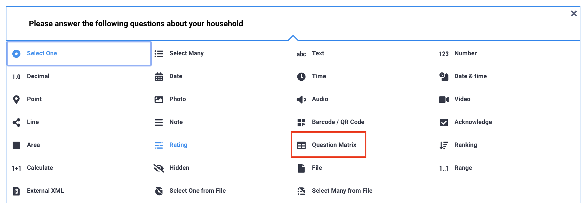
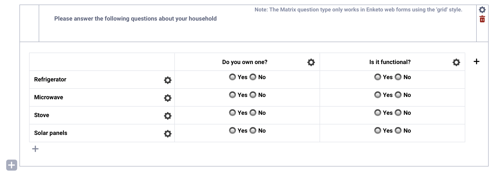
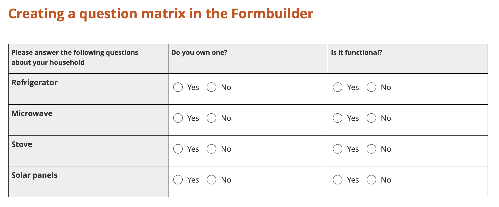
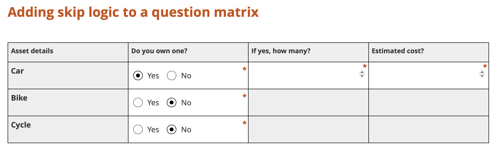

# Creating a question matrix in the Formbuilder
**Last updated:** <a href="https://github.com/kobotoolbox/docs/blob/784c60cd2a63d7a35a80474cd0451b25329534cb/source/matrix_response.md" class="reference">21 Mar 2026</a>

The **Question Matrix** question type allows you to create a structured table of questions, where each column represents a question and each row represents an item. Instead of creating multiple separate questions, you can group them into a single matrix to make your form more organized and efficient for data collection.

This article explains how to add and configure a question matrix in the Formbuilder, how it appears during data collection, and how to apply advanced logic using XLSForm when needed.

<strong>Note:</strong> Question matrices are supported only in <a href="https://support.kobotoolbox.org/enketo.html">Enketo web forms</a> with the <a href="https://support.kobotoolbox.org/alternative_enketo.html">Grid theme</a> enabled. They are not supported in KoboCollect.

## Adding a question matrix in the Formbuilder

To add a question matrix to your form:

1. Click the <i class="k-icon-plus"></i> button.
2. Enter an overarching instruction as the question label.
3. Click **+ ADD QUESTION.**
4. Choose the <i class="k-icon-qt-question-matrix"></i> **Question Matrix** question type. 

### Configuring the question matrix

In your question matrix:

- Each **column** represents a separate question that will be repeated for every item listed in the rows.
- Each **row** represents an item that the column questions will be asked about.

To configure your question matrix, for each column:

1. Click the <i class="k-icon-settings"></i> **Settings** icon.
2. Select the **Response Type.**
    -  Available types include **Select One**, **Select Many**, **Text**, and **Number.**
    -  You can use different question types within the same matrix.
3. Enter a **Question Label.**
4. Enter a **Data Column Suffix.** This suffix will be appended to the variable names for each item in the rows and must follow the [standard rules for data column names](https://support.kobotoolbox.org/question_options.html#important-considerations-for-data-column-names).
5. If using **Select One** or **Select Many**, add the answer choices and their [XML values](https://support.kobotoolbox.org/question_types.html#setting-xml-values-for-option-choices).
6. Set the question as [required](https://support.kobotoolbox.org/question_options.html#mandatory-response), if needed.
7. To add another column, click the <i class="k-icon-plus"></i> icon to the right of the last column.

<strong>Note:</strong> You can add up to 12 columns to a question matrix. However, each additional column reduces the width available for the others, which may affect readability on smaller screens.

To configure each row:

1. Click the <i class="k-icon-settings"></i> **Settings** icon.
2. Enter a **Label** for the item.
3. Enter a **Data Column Prefix.** This prefix will be added to the variable names for all column questions related to this item and must follow the [standard rules for data column names](https://support.kobotoolbox.org/question_options.html#important-considerations-for-data-column-names).
4. To add another row, click the <i class="k-icon-plus"></i> icon below the last row.

## Collecting data from a question matrix

Question matrices are supported only in Enketo web forms and require the [Grid theme](https://support.kobotoolbox.org/alternative_enketo.html) to be enabled. They are not supported in KoboCollect.

The question matrix is displayed as a table, with each column representing a question and each row representing an item.

<strong>Note:</strong> When exporting data or viewing submissions in the data table, question matrix variables are converted to standard XLSForm structure. Each cell in the matrix becomes an individual variable, and the final variable names are created by combining the row’s <strong>data column prefix</strong> and the column’s <strong>data column suffix</strong>. As a result, the exported variable names may differ slightly from how the matrix appears in the Formbuilder.

## Advanced question matrices

You cannot add validation criteria, calculations, or certain advanced question options, such as repeating a question matrix or defining a custom constraint message, directly within a question matrix **using the Formbuilder.**

To apply these settings, [download your form](https://support.kobotoolbox.org/xlsform_with_kobotoolbox.html#downloading-an-xlsform-from-kobotoolbox) as an XLSForm and add [constraints](https://support.kobotoolbox.org/constraints_xls.html), [calculations](https://support.kobotoolbox.org/calculations_xls.html), and other [question options](https://support.kobotoolbox.org/question_options_xls.html) in the XLSForm directly.

For an example of adding constraints and calculations to a question matrix, see this <a href="https://support.kobotoolbox.org/_static/files/calculations_constraints_matrix/calculations_constraints_matrix.xlsx">sample XLSForm</a>. For an example of repeating a question matrix as a repeat group, see this <a href="https://support.kobotoolbox.org/_static/files/calculations_constraints_matrix/repeating_matrix_question.xlsx">sample XLSForm</a>.

### Adding skip logic to a question matrix

Similarly, skip logic cannot be added directly to a question matrix in the Formbuilder. However, you can [download your form](https://support.kobotoolbox.org/xlsform_with_kobotoolbox.html#downloading-an-xlsform-from-kobotoolbox) as an XLSForm and add skip logic in the XLSForm directly.

When exported to XLSForm, a question matrix is structured as a group of questions using [w-values](https://support.kobotoolbox.org/form_style_xls.html#setting-up-an-xlsform-for-theme-grid) from the Grid theme. You can [apply skip logic](https://support.kobotoolbox.org/skip_logic_xls.html) to the entire matrix by adding it to the entire group, or apply it to individual rows within the matrix.

Be aware that adding skip logic to individual cells may affect the visual layout of the matrix, as hidden questions can disrupt the table structure. To preserve the formatting, consider adding **Note** questions with skip logic that display a message in place of the hidden question, as done in this [sample XLSForm](https://support.kobotoolbox.org/_static/files/adding_skip_to_matrix/adding_skip_to_a_matrix_question.xls). This approach maintains the matrix layout while preventing input in specific cells.

