# Migrating Projects Between Servers Using ODK Briefcase

Depending upon the nature of your work, KoboToolbox provides
[two different public servers](server.md), one for humanitarian use
([OCHA server](https://kobo.humanitarianresponse.info)) and the other for
non-humanitarian use ([Kobo server](https://kf.kobotoolbox.org)). Data is not
shared between these servers and therefore you will need to use an intermediate
application, such as [ODK Briefcase](https://docs.getodk.org/briefcase-intro/),
if you would like to migrate projects from one to the other. The same is true if
you wish to migrate data from other compatible data collection services (ODK
Aggregate, Formhub, ONA, etc.) to the KoboToolbox platform.

The steps outlined below show the migration of a project from the
_non-humanitarian_ server to the _humanitarian_ server. You can also follow
these steps to migrate a project from any platform compatible with KoboToolbox.

**Step 1: Confirm the project details from your origin server**

In our example, the origin server here refers to the _non-humanitarian server_
aka the _Kobo server_. Confirm the project name and total submissions for the
project you wish to migrate. The project for this support article has 5
submissions.

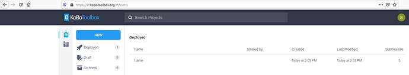

**Step 2: Download the latest version of ODK Briefcase**

Download the latest version of _ODK Briefcase_ (from
[here](https://github.com/getodk/briefcase/releases)) to your personal computer.

**Step 3: Configure the Storage Location of ODK Briefcase**

Double click the _ODK Briefcase_ that you just downloaded. You should be able to
see a dialogue box as shown below:

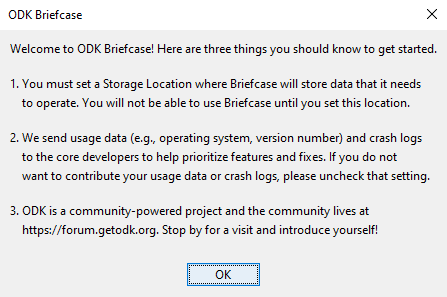

Press **OK** to continue. You will then be directed to _ODK Briefcase_
application as shown below:

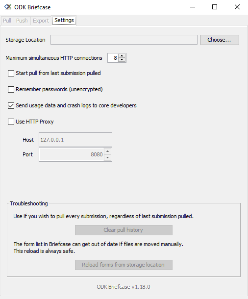

Configure the **Storage Location** as per your convenience by pressing **Choose
…**. You should now see something similar as shown below _(here you will notice
that once you configure your **Storage Location**, ODK Briefcase application
activates the **Pull**, **Push** and **Export** tabs)_:

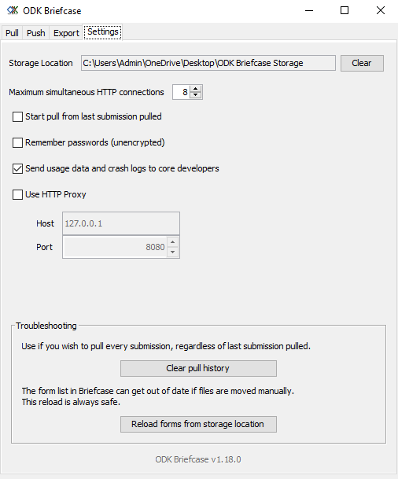

**Step 4: Configure the Pull settings of ODK Briefcase**

Select the **Pull** tab. You should now see a similar screen as shown below:

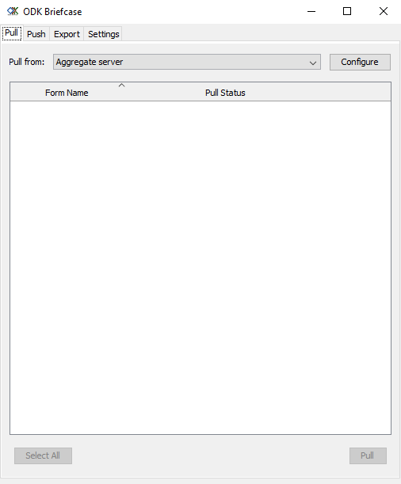

Select **Configure**. You should see a dialogue box as shown below:

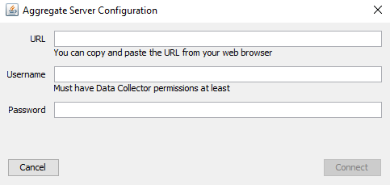

Fill up the **URL** and login credentials (**Username** and **Password**) from
your _non-humanitarian server (Kobo server)_ as you wish to migrate a project
from this server to the _humanitarian server (OCHA server)_. You could do it as
shown in the image below:

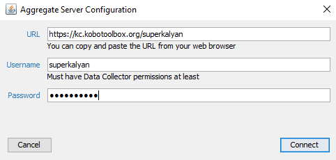

You will need to replace the username `superkalyan` with your own KoboToolbox
username. Please note that you will need to use this URL format
`https://kc.kobotoolbox.org/username` where the `username` should be your
KoboToolbox username. _ODK Briefcase_ will fail to pull the data from your
server if you fail to use the URL format advised above.

**Step 5: Pulling the project to ODK Briefcase storage**

Once the **Pull** configuration settings are done, you should be able to see the
following screen as shown below:

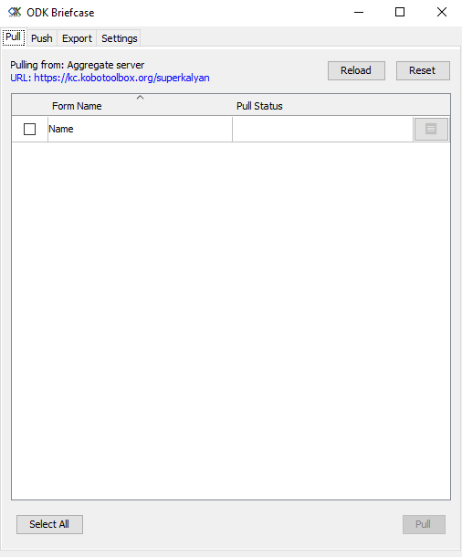

Now check the project that you wish to pull to your _ODK Briefcase_ storage.
Then select **Pull** located at the right end corner of the dialogue box. You
should see **Success** under the **Pull Status** as shown below:

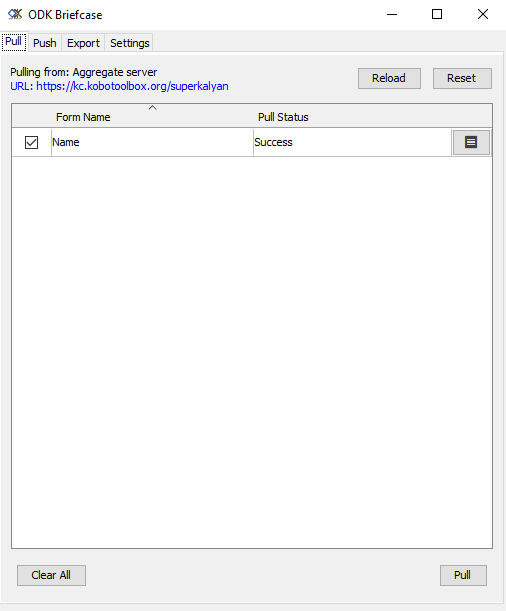

This means that your project was successfully pulled to your _ODK Briefcase_
storage.

**Step 6: Configure the Push settings of ODK Briefcase**

Select the **Push** tab. You should now see a similar screen as shown below:

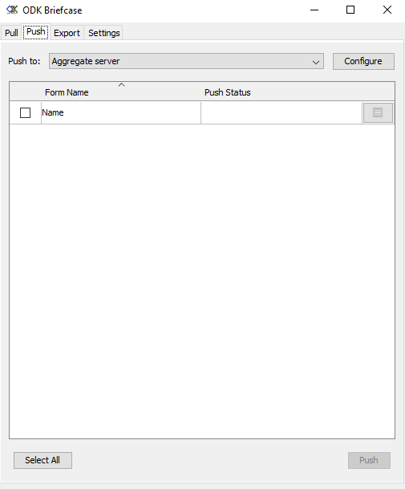

Select **Configure** and fill up the dialogue box with the **URL** and login
credentials (**Username** and **Password**) from your _humanitarian server (OCHA
server)_ as you wish to migrate everything to this server now (as shown in the
image below):

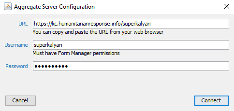

You will need to replace the username `superkalyan` with your own KoboToolbox
username. Please note that you will need to use this URL format
`https://kc.humanitarianresponse.info/username` where the `username` should be
your KoboToolbox username. The _ODK Briefcase_ will fail to push the data to
your server if you fail to use the URL format advised above.

**Step 7: Pushing the project from ODK Briefcase storage to the destination
server**

Once the **Push** configuration settings are done, you should be able to see the
following screen as shown below:

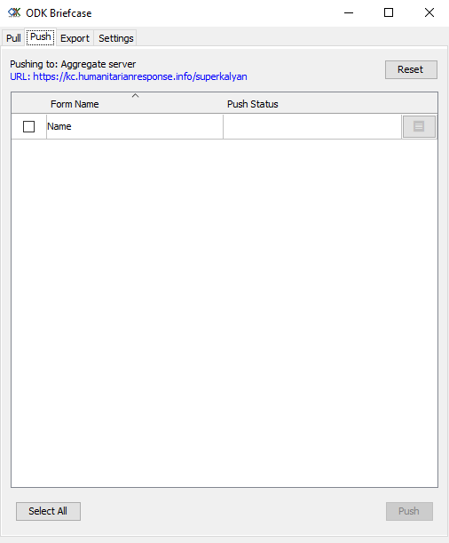

Now check the project that you wish to push to your other KoboToolbox server.
Then select **Push** located at the right end corner of the dialogue box.

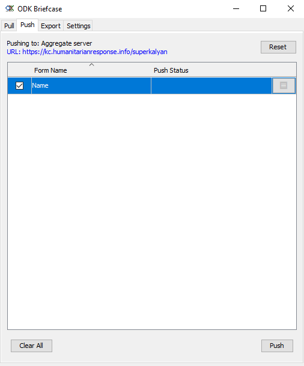

You should see **Success** under the **Push Status** as shown below:

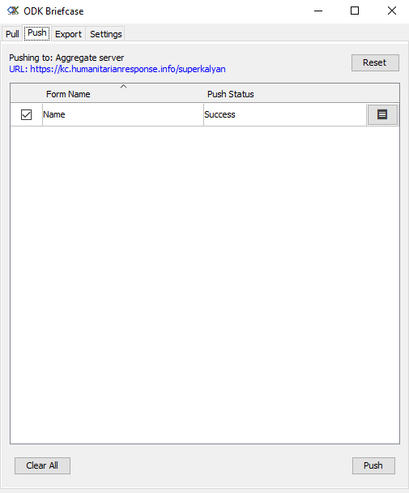

This means that your project was successfully pushed to the desired KoboToolbox
server (i.e., to your destination account). Your destination server here refers
to the _humanitarian server_, also known as the _OCHA server_.

**Step 8: Ensure that the project has been successfully migrated in your
destination server**

Once the push is successful through the _ODK Briefcase_, ensure that the project
has been migrated to your server (in this case the _humanitarian server_, also
known as the _OCHA server_). You should still see that the submissions are not
present in the KPI as shown below:

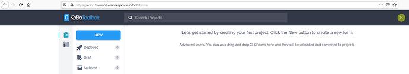

Go to the legacy UI by selecting the legacy icon located at the left down corner
as shown below:

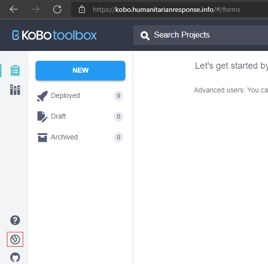

You should now see the migrated project along with its data in the legacy UI.

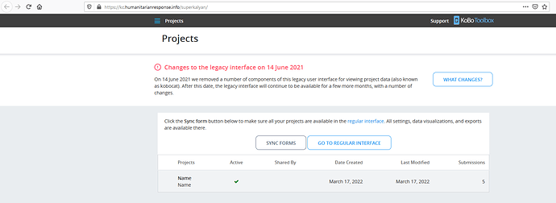

To further access the data, select the project name. You should be able to
download the project data by clicking **Download data** or view the gallery by
clicking **View gallery** or download the project media by clicking **Download
all photos**, as shown below:

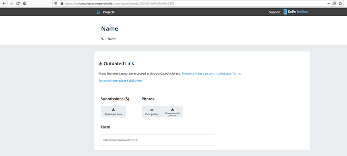

  You should still be able to continue data collection for this project that you
  have recently migrated to the destination server.

## Limitations:

-   The migrated project should have the same limitations that the legacy UI
    should have.

-   Data for the migrated projects can only be collected through the
    _KoboCollect Android App_. Collecting data with _Enketo_ is not supported
    for such projects.

-   The migrated projects can only be managed (_Download data_, _View gallery_,
    _Download all photos_) through the legacy UI. Managing the same through the
    KPI UI is not supported.

-   You should only be able to download the project data from the migrated
    project. The system does not support downloading the survey form (XLSForm).

-   Syncing a migrated project from the legacy UI to the KPI UI is not
    supported.
