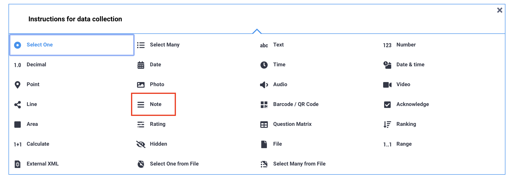
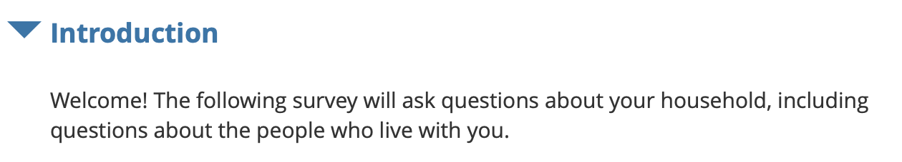

# Note questions in KoboToolbox

Note questions are used to display information within your form without collecting a response. Although they are listed as a question type, note questions do not store any data. Instead, they are used to **provide instructions, context, or additional details** that help respondents or enumerators understand and complete the form correctly.

You can use note questions to introduce a new section, explain why certain questions are being asked, provide guidance on how to respond, [display media](https://support.kobotoolbox.org/media.html), or show the results of [hidden calculations](https://support.kobotoolbox.org/calculate_questions.html) or [previous responses](https://support.kobotoolbox.org/form_logic.html#question-referencing). 

This article explains how to add a **Note** question in the Formbuilder and how to add styling to your note text.

## Adding a note question in the Formbuilder

To add a note question to your form:

1. Click the <i class="k-icon-plus"></i> button. 
2. Enter your question label.
3. Click **+ ADD QUESTION.** 
4. Choose the [Note](#appearances-of-note-questions) question type.

## Appearances of note questions

By default, note questions appear as simple text in your form.

| Enketo web form | KoboCollect |
|:----------------|:------------|
|  |  |

### Advanced appearances 

When adding notes to your form, you can use Markdown and HTML to **style text, add emphasis** with bold or italics, **create headers** of different sizes, **change fonts and colors**, and **add clickable web links.**

<strong>Note:</strong> Text styling can also be applied to questions and choice labels.

Text styling features in the Formbuilder include:

| Feature        | Formatting |
|:---------------|:-----------|
| Italics        | `*italics*` or `_italics_` |
| Bold           | `**bold**` or `__bold__` |
| Hyperlink      | `[name of link](url)` |
| Headers        | `# Header 1` (biggest) to `###### Header 6` (smallest) |
| Emojis         | For example, 🙂 😐 🙁 😦 😧 😩 😱 |
| Superscript    | `100 m2` turns into 100 m² |
| Subscript      | `H2O` turns into H₂O |
| Colored text   | `orange` turns into orange  `red` turns into red |
| Font           | `cursive` turns into cursive  `red and cursive` turns into red and cursive|
| Align center   | `
Centered label
` centers the text on the screen |

<strong>Note:</strong> Additional formatting features, such as paragraph support, bullet lists, and numbered lists, are available only when <a href="https://support.kobotoolbox.org/form_style_xls.html#styling-text">building your form in XLSForm</a>.

