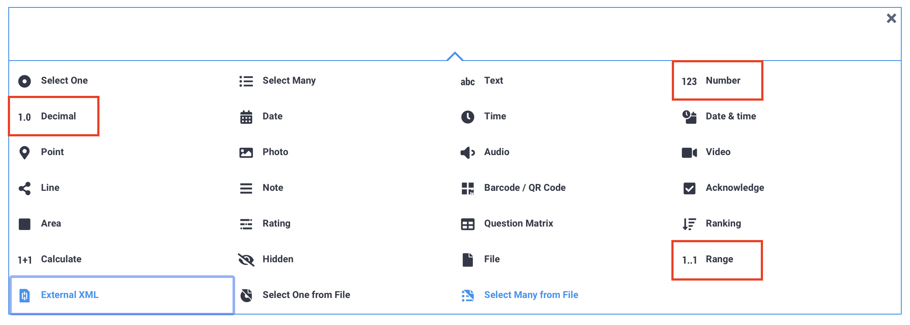
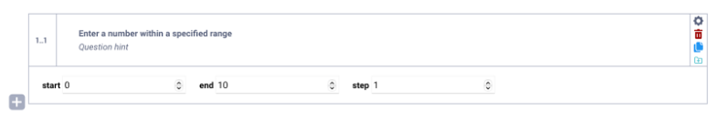
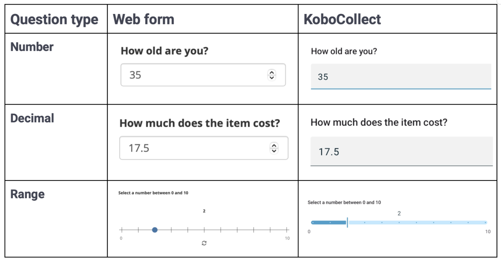
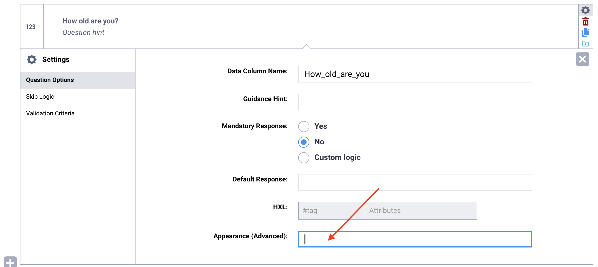
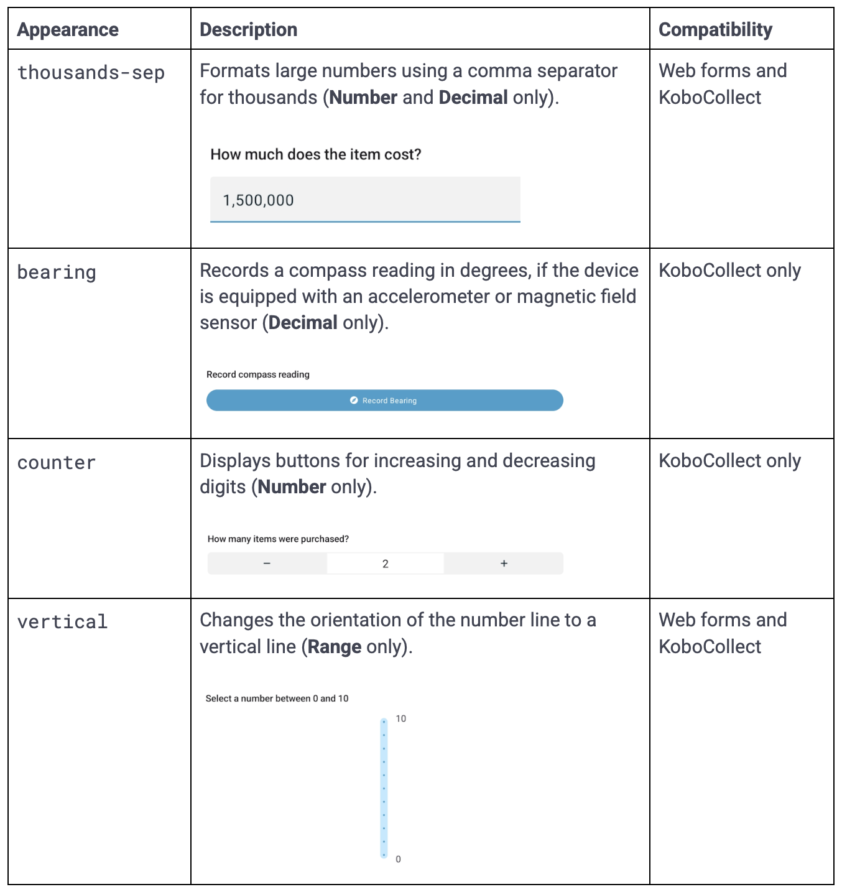
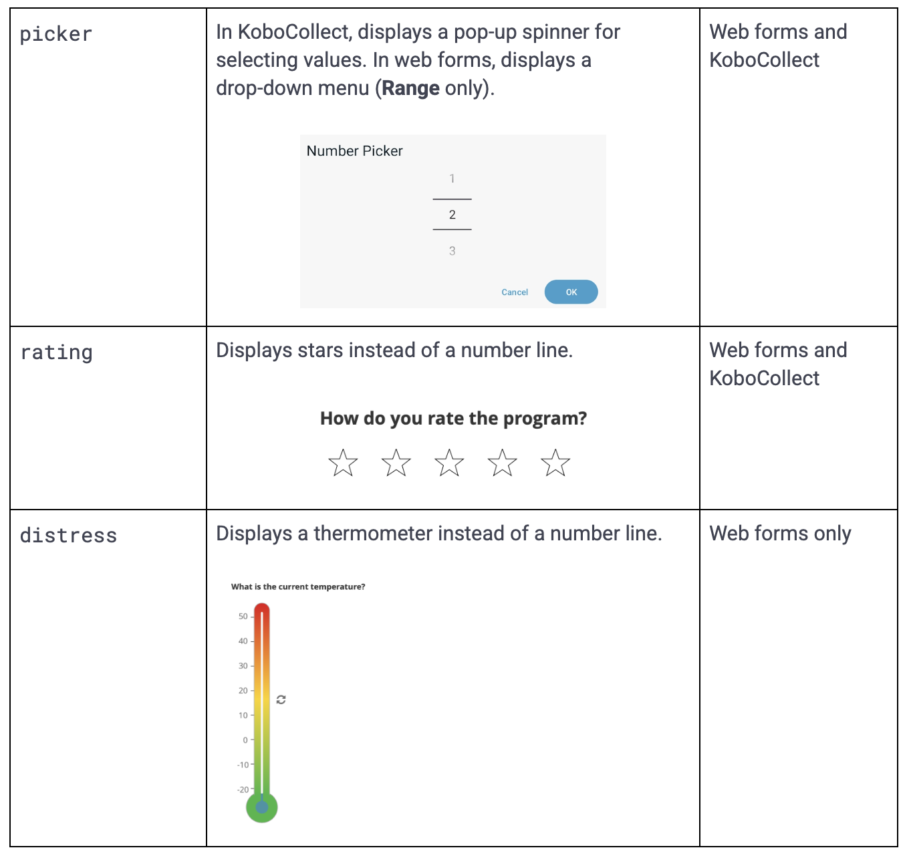

# Numeric questions in KoboToolbox
**Last updated:** <a href="https://github.com/kobotoolbox/docs/blob/b864270945d76de336b9618ba9ad7b74c6645165/source/number_decimal_range.md" class="reference">21 Mar 2026</a>

Numeric questions are used to collect quantitative data such as counts, measurements, prices, or ratings. They help ensure that responses are entered in a numeric format, which supports accurate calculations, validations, and analysis. 

KoboToolbox provides several numeric question types to accommodate different data collection needs, including **whole numbers, decimal values,** and **responses within a defined range.**

This article explains the available numeric question types, how to add and configure them in the Formbuilder, the appearance options you can apply, and important platform-specific limits to consider when collecting numeric data.

## Numeric question types

The following question types are available in the Formbuilder for respondents to input numeric data:

| Question type | Description |
|:---|:---|
| <i class="k-icon-qt-number"></i> Number &emsp; &emsp; | Allows respondents to input whole numbers (e.g., age or number of participants). |
| <i class="k-icon-qt-decimal"></i> Decimal | Allows respondents to input numbers that may contain decimal points (e.g., land size, price). |
| <i class="k-icon-qt-range"></i> Range | Allows respondents to select a numeric value within a specified range constrained by minimum and maximum values. |

## Adding a numeric question in the Formbuilder

To add a numeric question to your form:

1. Click the <i class="k-icon-plus"></i> button. 
2. Enter your question label.
4. Click **+ ADD QUESTION.** 
5. Choose the appropriate question type. 

### Setting up Range questions

**Range** questions are used to collect numeric responses within a defined interval. They display a numbered sliding scale that allows respondents to select values between a minimum and maximum value.

This question type is useful when collecting scaled responses, such as satisfaction ratings from 1 to 5 or scores within a fixed range.

After adding a **Range** question in the Formbuilder, configure the following components:
- **start**: The minimum numeric value in the range.
- **end**: The maximum numeric value in the range.
- **step**: The interval between each number in the range.

## Appearances of numeric questions

The table below displays the default appearances for numeric questions:

### Advanced appearances 

You can apply advanced appearances to numeric questions to modify how they display and behave in your form.

To add an advanced appearance:
1. Open the question settings by clicking <i class="k-icon-settings"></i> **Settings** to the right of the question. This will take you to the **Question Options** tab.
2. In **Appearance (Advanced)**, type the name of the appearance in the text box, exactly as written below.

The following advanced appearances are available for numeric questions:

## Limits for numeric questions

Numeric questions have platform-specific limits that may affect how responses are entered, stored, and exported. It is important to understand these limits when designing your form, especially if you expect large numbers or identification codes.

### Numeric limits in KoboCollect

In KoboCollect:

- **Number** questions are limited to 9 characters.
- **Decimal** questions are limited to 15 characters.
- Negative signs and decimal points count toward the character limit.

If a value exceeds these limits, it cannot be entered. This restriction applies at the time of data entry and prevents saving longer numbers.

### Numeric limits in Enketo web forms

Enketo web forms allow respondents to enter longer numbers, but there are limits to how they are stored:

- Up to **17 digits** are recorded completely.
- From **18 to 21 digits**, additional digits are replaced with zeros, and any decimal portion is removed.
- At **22 digits or more**, the value is automatically stored in scientific notation.
- Negative signs do not count toward the digit limit.

### Collecting long numeric values

If you need to collect numeric values that exceed these limits, use a **Text** question instead of a Number or Decimal question.

In the Text question’s **Appearance (Advanced)** settings, select `numbers`. This displays a numeric keypad in KoboCollect during data collection while storing the value as text.

Use this approach when:

- The number may exceed platform limits
- The value must not be altered or rounded
- The number begins with a zero, such as a phone number or bank account number

Storing long numeric values as text ensures that all digits, including leading zeros, are preserved exactly as entered.

   To learn more about using Text questions with the <code>numbers</code> appearance, see <a href="https://support.kobotoolbox.org/text_questions.html#advanced-appearances">Text questions in KoboToolbox</a>. 

