# Overview of creating and managing projects in KoboToolbox

Once you’ve logged in to your KoboToolbox account, you can start building your data collection project right away with our easy-to-use formbuilder. This article gives you a quick overview of how you can create a data collection project, add questions and deploy a form for data entry. 

These guidelines are a basic introduction to developing and deploying forms in KoboToolbox. Visit the articles linked throughout this overview to learn more about each of these steps.

## Creating your first form

Upon logging in to your account, click the big blue **NEW** button at the top. You will be presented with the “Create a project: choose a source” dialog box.

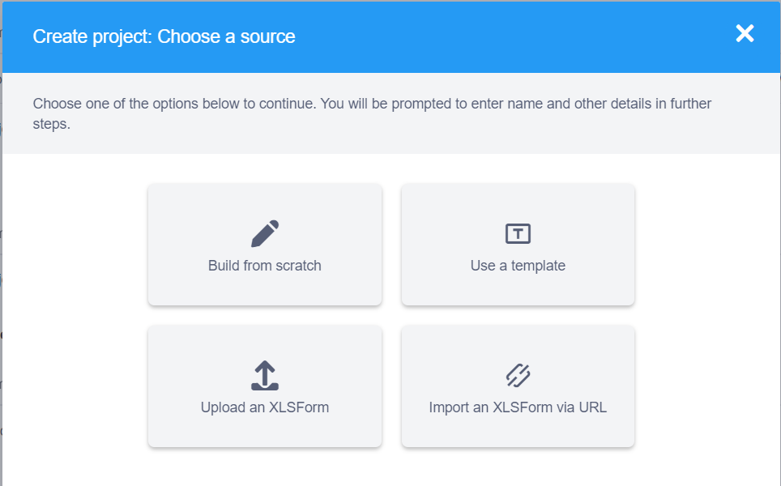

| Option                    | Description                                                                                                           |
| ------------------------- | --------------------------------------------------------------------------------------------------------------------- |
| Build from scratch        | Build a form using the **KoboToolbox** <a href="formbuilder.html" class="reference">formbuilder</a>                   |
| Use a template            | Build a form using a template from the <a href="add_questions_library.html" class="reference">question library</a>.   |
| Upload XLSForm            | Upload an <a href="https://xlsform.org" class="reference">XLSForm</a> file where you have defined your questions.     |
| Import an XLSForm via URL | Upload an XLSForm file <a href="xls_url.html" class="reference">from an online source such as Google Drive or Dropbox |

-   Click **Build from scratch** to start creating your form using the
    formbuilder.
-   On the ‘Project details’ dialog box that opens up, enter the relevant information about your project and then click **CREATE PROJECT**

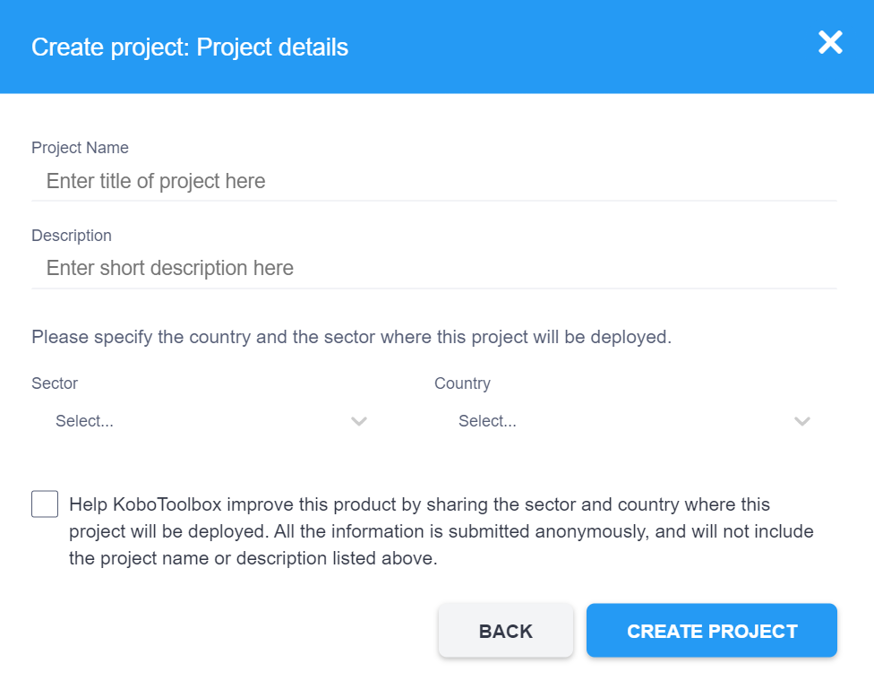

| Field                   | Description                                                       |
| ----------------------- | ----------------------------------------------------------------- |
| Project Name (required) | The title of your project                                         |
| Description (optional)  | A descriptive paragraph to make it easy to identify your project  |
| Sector (optional)       | The sector in which the data collection project is being deployed |
| Country (optional)      | The country where the data collection project will be deployed    |

  You can check the last option to anonymously share the sector and country
  information with <strong>KoboToolbox</strong>. The data is used to help
  improve the <strong>KoboToolbox</strong> platform.

## Adding questions

Once the formbuilder opens up, you can start adding your questions.

  **1.** Click the <i class="k-icon k-icon-plus"></i> button below the message that says “This form is empty”.
    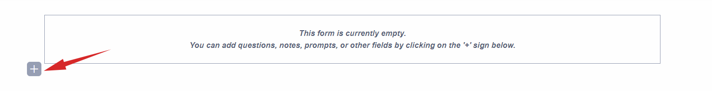
**2.** Type in your question text.

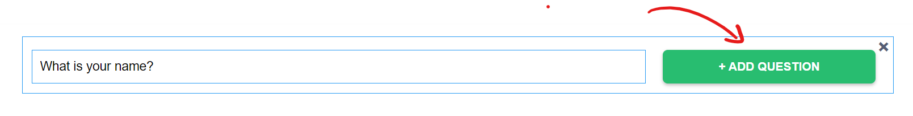

**3.** Press **ENTER** or click the **ADD QUESTION** button.

A list of question types will be shown. To learn more about question types, [read the linked article](https://support.kobotoolbox.org/question_types.html). 

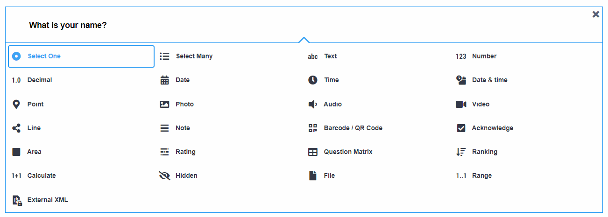

**4.** Finally, select the [question type](question_types.md) from the list (see the example below)

  <strong>KoboToolbox</strong> has functionality that allows you to define
  <a class="reference" href="skip_logic.html">skip logic</a>,
  <a class="reference" href="validation_criteria.html">validation criteria</a>,
  <a class="reference" href="calculate_questions.html">perform calculations</a>,
  <a class="reference" href="language_dashboard.html">add translations</a> and
  more.

---

### Try if for yourself

Let’s add the following questions:

-   _What is your name?_
-   _How old are you?_
-   _Gender_: _Male_; _Female_; _Nonbinary_; _Prefer not to say_

**Steps:**

-   **1.** Click the <i class="k-icon k-icon-plus"></i> button to add a new
    question
-   **2.** Type: _What is your name_
-   **3.** Press **ENTER** or click **ADD QUESTION**
-   **4.** Choose the **Text** question type
-   **5.** To add the second question, click the
    <i class="k-icon k-icon-plus"></i> button just below the question you just
    added
    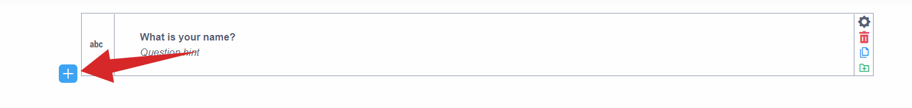
-   **6.** Type: _How old are you?_
-   **7.** Press **ENTER** or click **ADD QUESTION**
-   **8.** Choose the **Number** question type
-   **9.** Finally, click the <i class="k-icon k-icon-plus"></i> button just
    below the second question you added
-   **10.** Type: _Gender_
-   **11.** Press **ENTER** or click **ADD QUESTION**
-   **12.** Choose the **Select one** question type
    -   On Option 1, type: _Male_.
    -   On Option 2, type: _Female_
-   **13.** Click **Click to add another response** and type: _Nonbinary_
-   **14.** Click **Click to add another response** and type: _Prefer not to
    say_
-   **15.** Click the **SAVE** button at the top right of the formbuilder

The form will look as follows:

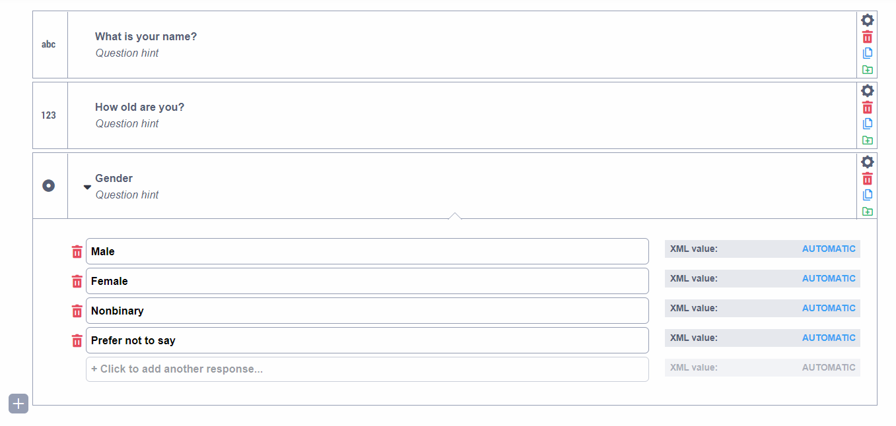

---

## Previewing the form

Previewing periodically while developing the form is helpful to ensure the
outcome is what you expected and there there are no errors in your form or
calculations before deployment and data collection.

  Only the web form preview is available from the formbuilder, there is
  currently no preview feature for <strong>KoboCollect</strong>.

Click the <i class="k-icon k-icon-view"></i> preview icon on the grey toolbar to open a preview of your form.

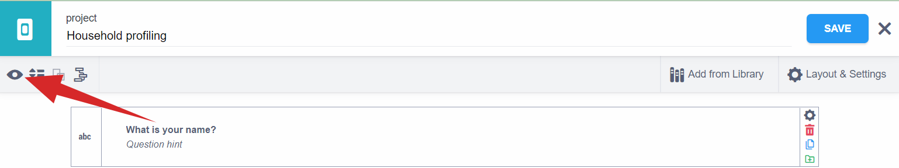

The form we created in the [Adding questions](#adding-questions) section above will display as follows:

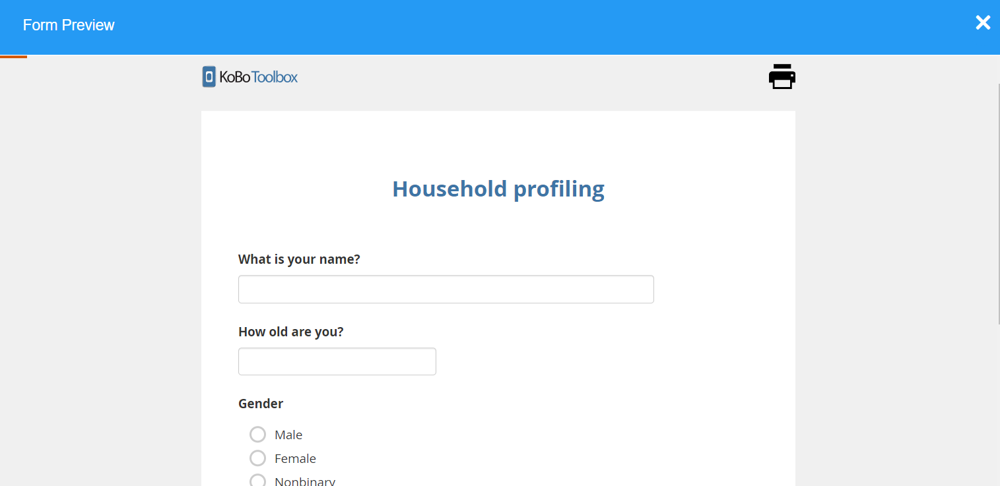

You can press the **Escape** key (Esc) on the keyboard to return to the formbuilder (or click the <i class="k-icon k-icon-close"></i> close button on the _Form Preview_ window).

## Deploying the form

Once you have finished developing the form, you need to deploy it to start data
collection.

**1.** Make sure you have saved all the changes you have made to the form
    (If there is a **\*** symbol on the **SAVE** button, you have changes that need to be saved before exiting).
**2.** Click the <i class="k-icon k-icon-close"></i> close button next to the **SAVE** button at the top.

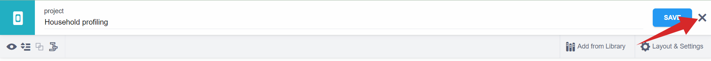

-   **3.** Click the **DEPLOY** button.

If you don’t have any errors, a “deployed form” message will appear at the
bottom left corner.

The screen will refresh to show you the current version of the
form and options for data collection.

## Entering data using the web form

To enter data using the web form:

-   **1.** Choose a data entry method from the drop down list below the heading
    **Collect data**. For the sake of this article, we will leave the default
    “Online-Offline multiple submission” (learn more about the [other
    options](data_through_webforms.md) and [configuring
    KoboCollect](kobocollect_on_android_latest.md)). This option opens up the
    **Enketo Web Form**, and allows you to enter multiple submissions, even
    while you are offline.

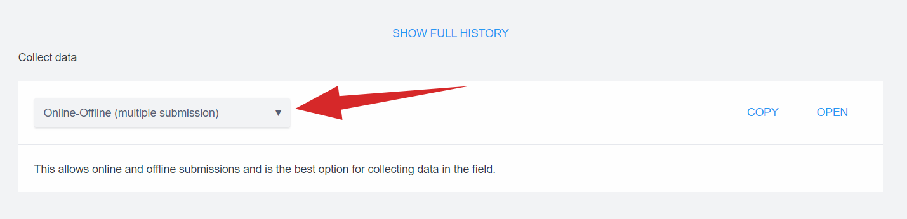

-   **2.** Click **OPEN** and a new window will open with your web form.

-   **3.** Enter data and click **SUBMIT** when you are finished.

## Viewing the data

After entering some records using the web form:

-   **1.** Navigate back to the **KoboToolbox** interface.
-   **2.** Refresh the browser window.

You will see the number of records that has been submitted on the top right of
the screen:

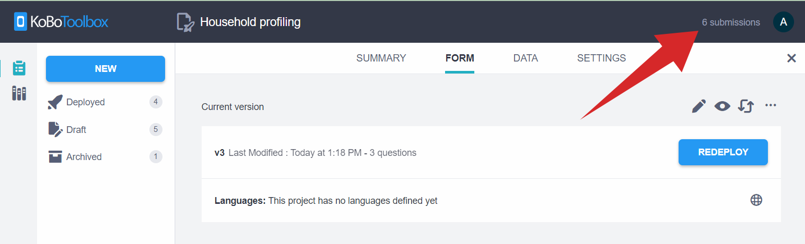

-   **3.** To view the data submitted, click the **DATA** tab in the top menu.

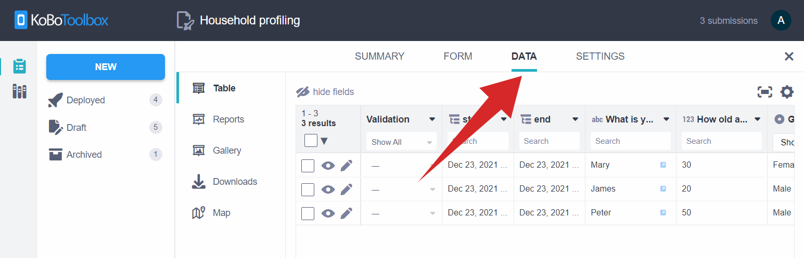

## Downloading the data

While you are on the **DATA** tab:

-   **1.** Click on **Downloads** in the left menu.

-   **2.** Click **EXPORT** to generate an **XLS** (Excel) file using the
    default settings.
-   **3.** Once the file is generated and shown under the **Exports** table,
    click the **Download** button.

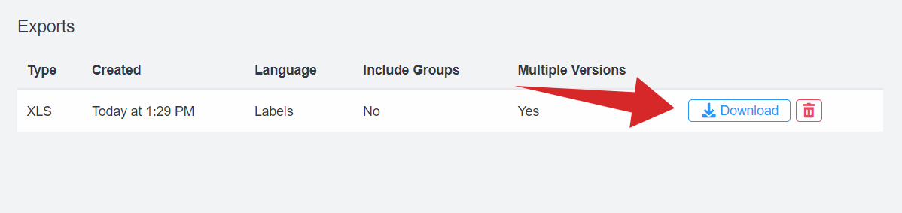

You can now open your downloaded file.

Note that clicking on the trash icon will delete the export with its settings, not the original data.

  Learn more about exporting and downloading your data in
  <a class="reference" href="export_download.html">this support article</a>.

