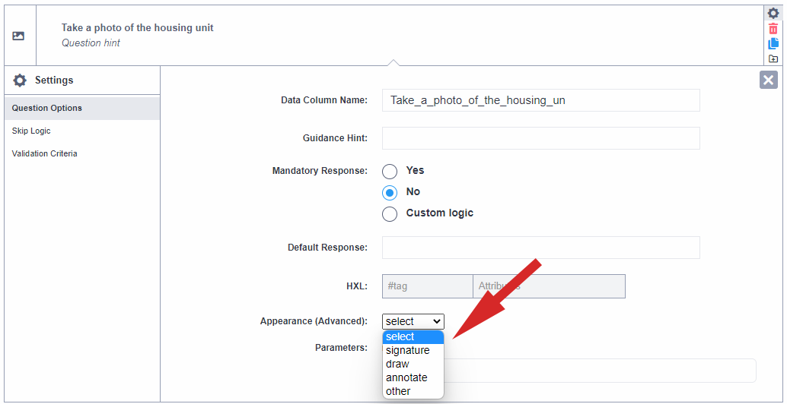
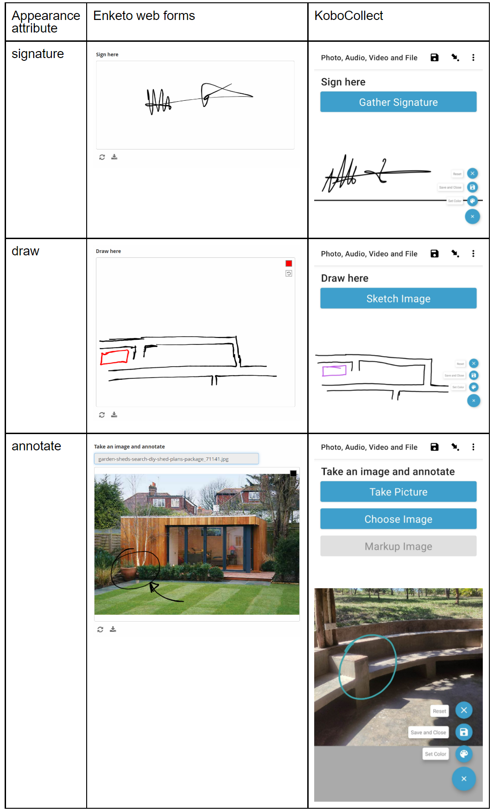

# "Photo", "Audio", "Video" and "File" question types
<a href="fr/photo_audio_video_file.html">Lire en français</a> | <a href="es/photo_audio_video_file.html">Leer en español</a> | <a href="ar/photo_audio_video_file.html">اقرأ باللغة العربية</a>
**Last updated:** <a href="https://github.com/kobotoolbox/docs/blob/27c3e37a283d79de0cbecebbf3a41d5b6ba6d7df/source/photo_audio_video_file.md" class="reference">11 Sep 2023</a>

With KoboToolbox, you can collect different types of media as part of your data
collection project.

When you want to capture images as part of your submissions, use the "Photo"
question type.

If a question requires that you record or attach an audio file, such as when a
long explanation is expected from the respondent, use the "Audio" question type.
The latest version of KoboCollect allows you to record audio within the app
itself without opening a separate app.

With the "Video" question type, you will be able to record a video using the
device's camera or attach a video file.

If a question requires that you attach a file such as a PDF, you can use the
"File" question type.

## How to set up "Photo", "Audio", "Video" and "File" question types

### Setting up in the formbuilder

Adding media questions is simple:

- Click the <i class="k-icon k-icon-plus"></i> button to add a new question
- Type the question text, for example "Take a picture of the housing unit", then
  click **ADD QUESTION** or press ENTER on your keyboard
- Choose the question type

### Setting up in XLSForm

To add media questions in XLSForm, use the `image`, `audio`, `video`, or `file`
question types as shown in the following example:

| type   | name        | label                                                       | hint            |
| :----- | :---------- | :---------------------------------------------------------- | :-------------- |
| image  | house_photo | Take a photo of the housing unit                            |                 |
| audio  | impact      | What has been the impact of the project on your household?  | Record as audio |
| video  | preparation | Record video of the respondent as they prepare the VitaMeal |                 |
| file   | CV          | Attach your CV                                              |                 |
| survey |

## Appearance of "Photo", "Audio", "Video" and "File" question types

### Default appearance

### Advanced appearances for "Photo" question type

When adding the "Photo" question type, you can choose from a number of
appearances (under the question settings). Appearances change the way the
question is displayed in web forms and KoboCollect.

### Adding advanced appearances in XLSForm

You can specify advanced appearances of the "Photo" question in XLSForm under
the appearance column as shown in the following example:

| type   | name       | label                      | appearance |
| :----- | :--------- | :------------------------- | :--------- |
| image  | sign       | Sign here                  | signature  |
| image  | drawing    | Draw here                  | draw       |
| image  | annotation | Take an image and annotate | annotate   |
| survey |

## Background audio recording

You can record audio in the background when you open the form in KoboCollect.
This can be useful in several data collection scenarios including focus group
discussions and key informant interviews.

Turn on background audio recording in the formbuilder by clicking on **Layout &
Settings** and enabling the feature.

  Background audio recording is only available in KoboCollect and
  <strong>not</strong> in Enketo web forms.

In XLSForm, you can enable background recording with the `background-audio`
question type. This is considered a "meta" question type and therefore no
`label` is required, only a `name`. Audio quality can be configured under the
`parameters` column, as explained [here](recording-interviews.md).

| type             | name             | label |
| :--------------- | :--------------- | :---- |
| background-audio | background_audio |       |
| survey           |

  It is not possible to record audio using "Audio" question type while
  background audio recording is underway on the form. When background audio
  recording is on, all "Audio" question types are deactivated.

You can read more about background audio recording
[here](recording-interviews.md).

## Lowering the file size of collected media

If you are collecting a lot of media in your project, you might have challenges
uploading them to KoboToolbox depending on the speed of your internet
connection. If you are using the [Global Server or European Union Server](creating_account.md), then you
are also limited to only 1GB of free storage. It is a good idea to manage the
file sizes of collected media files such as images, audio and videos.

You can define the maximum size of images you collect using the "Photo" question
type by going to the question settings and setting the "max-pixels" setting in
the formbuilder.

In XLSForm, you can do the same by adding "max-pixels" in the `parameters`
column as follows:

| type   | name  | label         | parameters     |
| :----- | :---- | :------------ | :------------- |
| image  | photo | Capture photo | max-pixels=480 |
| survey |

In KoboCollect, you can also choose the video quality and photo size through the
Form Management section of the project settings.

You can read more about how to lower file sizes [here](lower_file_size.md).

## Limiting accepted file types for "File" question type

All file types are accepted by default for the "File" question type. In the
formbuilder you can restrict this by doing the following:

- Go to the settings of the "File" question
- Under the "Accepted Files" box, enter the file extensions of the files you
  would like to allow, separated by a comma e.g. ".doc, .pdf, .xlsx"

In XLSForm, you can limit the accepted file types by specifying file extensions
in the `body::accept` column as follows:

| type   | name | label          | body::accept |
| :----- | :--- | :------------- | :----------- |
| file   | CV   | Attach your CV | .pdf, .doc   |
| survey |

  Download an XLSForm with examples from this article
  <a
    download
    class="reference"
    href="./_static/files/photo_audio_video_file/media_question_types.xlsx"
    >here</a
  >.

