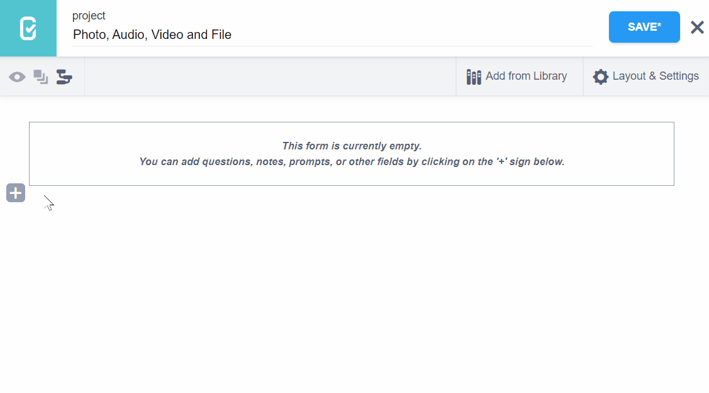
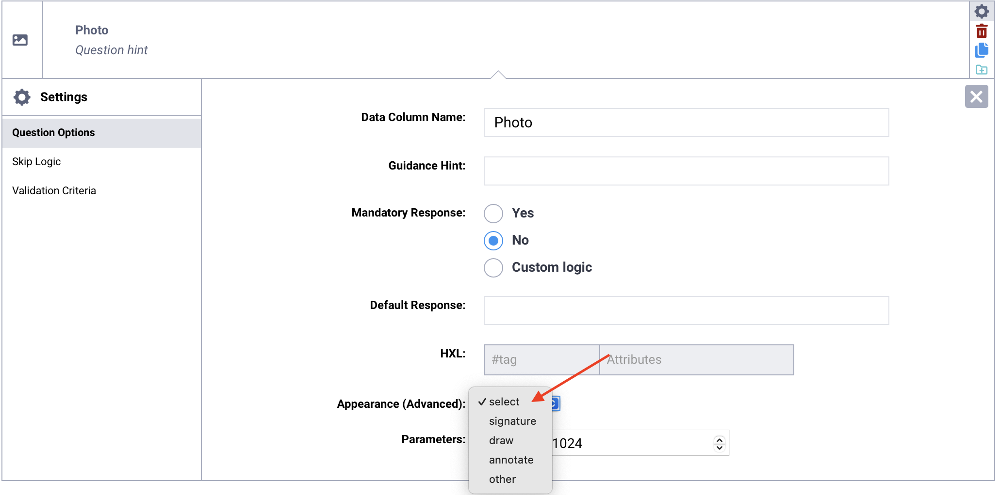
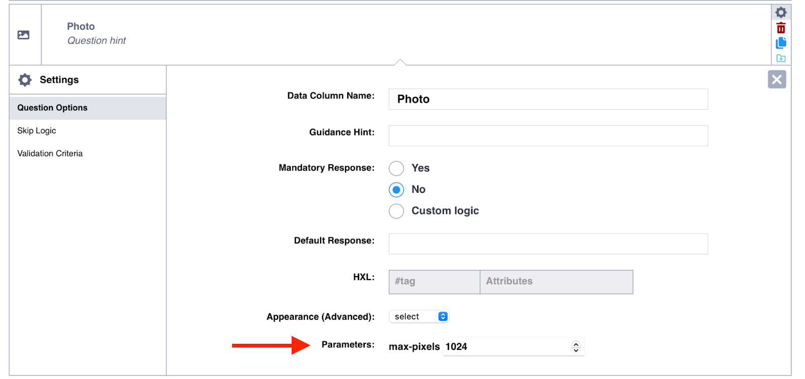
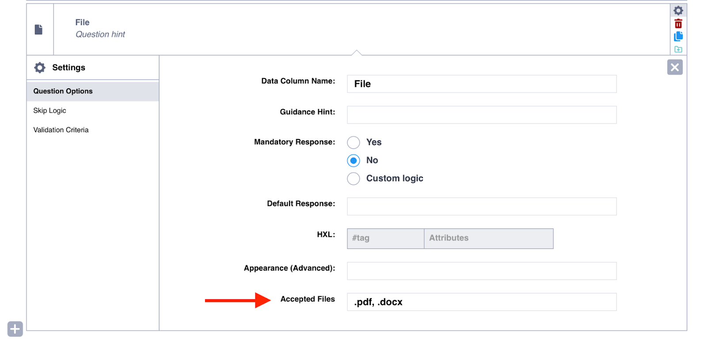

# Media question types
**Last updated:** <a href="https://github.com/kobotoolbox/docs/blob/28f369e652f725c3819e193cfb84c18752116385/source/photo_audio_video_file.md" class="reference">22 Jan 2026</a>

Many data collection projects require more than just quantitative data. KoboToolbox allows you to capture various media files from respondents, including photos, audio recordings, videos, and files, to provide key qualitative information and add visual and auditory depth to your datasets.

The following media question types are available in the KoboToolbox Formbuilder:

| Question type | Description                     |
|:---------------|:---------------------------------|
| Photo         | Capture or upload an image      |
| Audio         | Record or upload an audio file  |
| Video         | Record or upload a video file   |
| File          | Attach a file (e.g., .pdf, .docx) |

The method of capturing or uploading media depends on whether you are using [KoboCollect](https://support.kobotoolbox.org/kobocollect_on_android_latest.html) or [Enketo web forms](https://support.kobotoolbox.org/enketo.html) for data collection. In KoboCollect, you can either upload or record media files directly within the app. With Enketo, you can upload any media file, and record audio directly within the forms.

<strong>Note:</strong> KoboToolbox also supports background audio recordings for entire interviews or focus group discussions. When background audio recording is active on a form, <strong>Audio</strong> question types <strong>in KoboCollect</strong> are deactivated, as it is not possible to record audio using both features simultaneously. For more information, see <a href="https://support.kobotoolbox.org/recording-interviews.html">Recording interviews with background audio recording</a>. 

This article covers the following topics:
- Adding media questions in the Formbuilder
- Default and advanced appearances of media questions
- Parameters for media questions

## Adding media questions in the Formbuilder

To add media questions:
1. Click the <i class="k-icon-plus"></i> button to add a new question.
2. Type the question text and click **+ ADD QUESTION.**
3. Choose the desired question type (Photo, Audio, Video, or File).

## Appearances of media questions

Media questions can display differently depending on whether you are using Enketo web forms or KoboCollect. You can also change the default appearance of media questions. This section details how each question type appears across both platforms, including default and advanced appearance options.

### Default appearances

The table below shows how media questions are displayed by default in Enketo web forms and KoboCollect.

### Advanced appearances 

Only the **Photo** question type supports advanced appearances. These appearances alter how the question behaves in web forms and KoboCollect, enabling users to do more than just upload or capture images. With advanced appearances, you can draw sketches, add signatures, annotate images, and take selfies. 

Available appearances include:

| Appearance   | Description |
|:--------------|:-------------|
| signature    | Allows the user to capture a signature by signing directly on the device's screen (e.g., for forms that require a digital signature for verification). |
| draw         | Enables users to sketch or create drawings directly on the device’s screen (e.g., to capture illustrations or hand-drawn maps). |
| annotate     | Allows the user to annotate an image by drawing or writing on it. |
| new          | Prompts the user to take a new picture using the device camera (only available when using KoboCollect). |
| new-front    | Prompts the user to take a new picture using the device's front-facing camera (only available when using KoboCollect). |

To add an advanced appearance:
1. Open the question settings by clicking <i class="k-icon-settings"></i> **Settings** to the right of the question. This will take you to the **Question Options** tab.
2. In **Appearance (Advanced)**, choose the desired appearance. 
    
    - If the appearance is not listed, select **Other** and type the name of the appearance in the text box, exactly as written above.

## Parameters for media questions

Beyond their basic function, media questions also offer advanced parameters that allow you to manage file sizes and restrict accepted file types.

<strong>Note:</strong> Each file uploaded by a respondent can be up to 10 MB in size, with a maximum total of 100 MB per submission.

### Lowering image sizes

If your project involves collecting a significant amount of media, you might encounter difficulties uploading files to KoboToolbox, depending on your internet speed. Users of the [Community Plan](https://www.kobotoolbox.org/pricing/) are also limited to 1GB of free file storage. Therefore, it is advisable to manage the file sizes of the media files you collect.

To define the maximum size of images collected using the **Photo** question type:
1. Open the question settings by clicking <i class="k-icon-settings"></i> **Settings** to the right of the question. This will take you to the **Question Options** tab.
2. Set the **max-pixels** parameter to the value of your choice (e.g., 1000).

<strong>Note:</strong> You can also configure video resolution and image size in <a href="https://support.kobotoolbox.org/kobocollect_settings.html#form-management-settings">KoboCollect settings</a>.

## Restricting accepted file types

By default, the **File** question type accepts all file types. To restrict the type of files this question accepts:
1. Open the question settings by clicking <i class="k-icon-settings"></i> **Settings** to the right of the question. This will take you to the **Question Options** tab.
2. In the **Accepted Files** text box, list the file extensions that you would like to allow, separated by a comma (e.g., .doc, .pdf, .xlsx)

## Troubleshooting

  
<strong>Collecting multiple images or media files</strong>

  Media question types only support uploading one file at a time. To allow users to upload multiple files, you can place the media question within a repeat group, or duplicate the media question in the form as many times as needed. You can use <a href="https://support.kobotoolbox.org/skip_logic.html">skip logic</a> to display subsequent media questions only if the previous one is not blank.

 

  
<strong>Audio recording in Enketo prevents access to other questions</strong>

  When a user records an audio question in Enketo, other questions are locked until the recording is complete. This ensures that the audio is fully captured before the user proceeds with the rest of the form.

