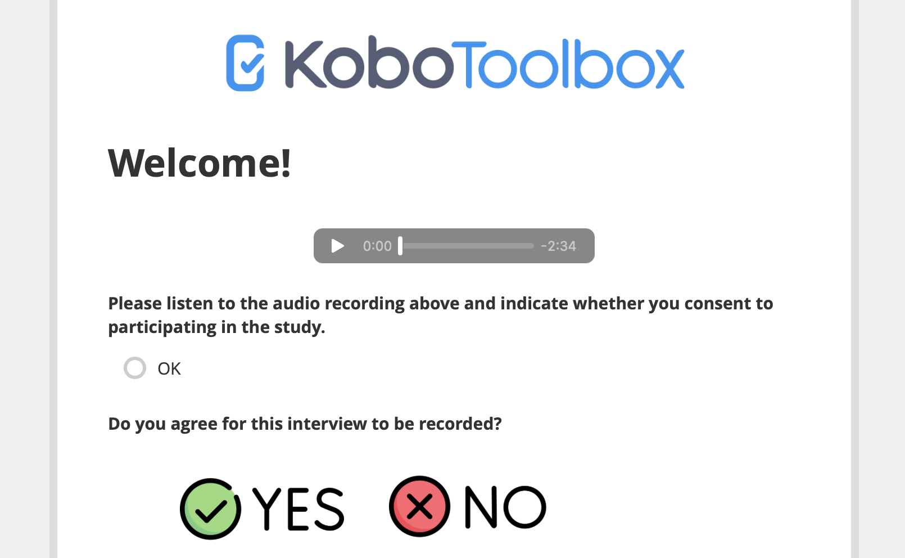

# Project files and media overview
**Last updated:** <a href="https://github.com/kobotoolbox/docs/blob/d9b44de6b0f7192771a9f7bf86edf271321f398b/source/project_files_media.md" class="reference">27 Jan 2026</a>

A KoboToolbox project may include files and media added at different stages of the data collection process. 

During form development, you can:

- **Attach media files** to enhance your form with images, audio, or video.
- **Attach external data files** to manage large choice lists or pull data into your form. 

During data collection, respondents can **submit their own files and media** as part of their responses. 

These two categories are handled differently within a project.

<strong>Note:</strong> Only media and files submitted by respondents count toward your plan’s storage limits.

This article provides an overview the following topics:
- Adding media attachments and data files to your form
- Uploading files and media to KoboToolbox
- Collecting files and media from respondents
- Viewing, downloading, and deleting media from respondents

## Attaching external files and media to your form

KoboToolbox allows you to **upload media files** to your form, such as images, audio recordings, and videos, to help respondents better understand questions and reduce the need for follow-up clarification.

KoboToolbox also allows you to **attach external CSV files** to your form to manage large choice lists or support form logic. Using external files makes it easier to reuse and update datasets without editing the form itself, therefore reducing ongoing form maintenance and supporting consistent, high-quality data.

The sections below provide an overview of these features and link to the relevant support articles.

### Adding media to your form

Including images, videos, or audio recordings in your form’s notes, questions, and choices can help make forms **more engaging and accessible.** This can especially be useful for users with visual impairments or literacy barriers.

To include media in your form, you must use XLSForm and then [upload the XLSForm](https://support.kobotoolbox.org/xlsform_with_kobotoolbox.html) to KoboToolbox. The KoboToolbox Formbuilder does not currently support adding media files directly within the form editor. 

  To learn how to include images, videos, or audio recordings in XLSForm, see <a href="https://support.kobotoolbox.org/media.html">Adding media to an XLSForm</a>.

### Attaching external data files to your form

In addition to uploading media files, KoboToolbox supports attaching external data files to your forms to retrieve or reference external data during data collection.

There are two main ways to connect your form to external files:

- The `pulldata()` function **pulls information from an external data file** while a form is being completed. This is useful for referencing existing datasets and reducing repeated data entry by enumerators.

<strong>Note:</strong> The <code>pulldata()</code> function uses external files as its data source. If you want to reference data from another KoboToolbox project instead of a CSV file, you can use <a href="https://support.kobotoolbox.org/dynamic_data_attachment.html">dynamic data attachments</a>.

- The `select_one_from_file` and `select_multiple_from_file` question types allow you to **define choice lists in an external file** rather than directly in the form. Using external files for choice lists makes long lists easier to manage, reuse across forms, and update over time.

Supported file formats for these features include CSV, XML, and GeoJSON.

  To learn how to attach external datasets to your form, see <a href="https://support.kobotoolbox.org/pull_data_kobotoolbox.html">Pulling data from an external CSV</a> and <a href="https://support.kobotoolbox.org/select_from_file_xls.html">Selecting options from an external file</a>.

### Uploading files and media to KoboToolbox

After adding media references or external files to your form, you must upload those files to your project. This is done in your project’s **SETTINGS > Media** page.

  To learn how to upload files and media to KoboToolbox, see <a href="https://support.kobotoolbox.org/upload_media.html">Uploading media files to a project</a>.

The following types of files are currently supported for upload to KoboToolbox:

| Media | Types |
|:-----|:------|
| Image | .jpeg, .png, .svg |
| Audio | .aac, .aacp, .flac, .mp3, .mp4, .mpeg, .ogg, .wav, .webm, .x-m4a, .x-wav |
| Video | .3gpp, .avi, .flv, .mov, .mp4, .ogg, .qtff, .webm, .wmv |
| File  | .csv, .xml, .zip, .geojson |

<strong>Note:</strong> The maximum file size for uploads is 100 MB. Files larger than this must be reduced in size before uploading.

## Collecting files and media from respondents

In addition to including media in your form, you can collect files and media directly from respondents during data collection. This includes **images, audio recordings, videos, and other file types.** Collecting media allows you to capture qualitative information that adds visual or audio context to your data.

<strong>Note:</strong> Each file uploaded by a respondent can be up to 10 MB in size, with a maximum total of 100 MB per submission.

The following media question types are available in KoboToolbox:

| Formbuilder question type | XLSForm question type | Description |
|:--------------------------|:----------------------|:------------|
| Photo | `image` | Capture or upload an image. Can also be used to collect [drawings, annotated images, and signatures](https://support.kobotoolbox.org/photo_audio_video_file.html#advanced-appearances). |
| Audio | `audio` | Record or upload an audio file. |
| Video | `video` | Record or upload a video file. |
| File  | `file`  | Attach a file (e.g., .pdf, .docx). |

KoboToolbox also supports background audio recording for entire interviews 
or focus group discussions. 

  To learn more about collecting media from respondents, see <a href="https://support.kobotoolbox.org/photo_audio_video_file.html">Media question types</a>. To learn more about background audio recording, see <a href="https://support.kobotoolbox.org/recording-interviews.html">Recording interviews with background audio recording</a>.

### Viewing respondent media files

All media files submitted by respondents can be viewed from the data table. Images can also be viewed in the **Gallery** view of your project. 

  To learn more about viewing media from respondents, see <a href="https://support.kobotoolbox.org/managing_media_responses.html#viewing-media-files">Viewing media files</a>.

### Downloading respondent media files

You can download media files either individually from the data table, or in bulk from the **Downloads** page.

When you export your data in CSV or XLS format, the exported file also includes hyperlinks that open the associated media files in a web browser, as long as the default option to **Include media URLs** is selected.

  To learn more about exporting your media files, see <a href="https://support.kobotoolbox.org/managing_media_responses.html#downloading-media-files">Downloading media files</a>.

### Deleting respondent media files

Finally, you may need to delete media files to **manage storage, protect confidentiality, or correct submission errors.** Media files can be deleted individually or in bulk.

Once a file is deleted, it is marked as *Deleted* in the data table and cannot be recovered.

  To learn about different methods for deleting media files, see <a href="https://support.kobotoolbox.org/managing_media_responses.html#deleting-media-files">Deleting media files</a>.

