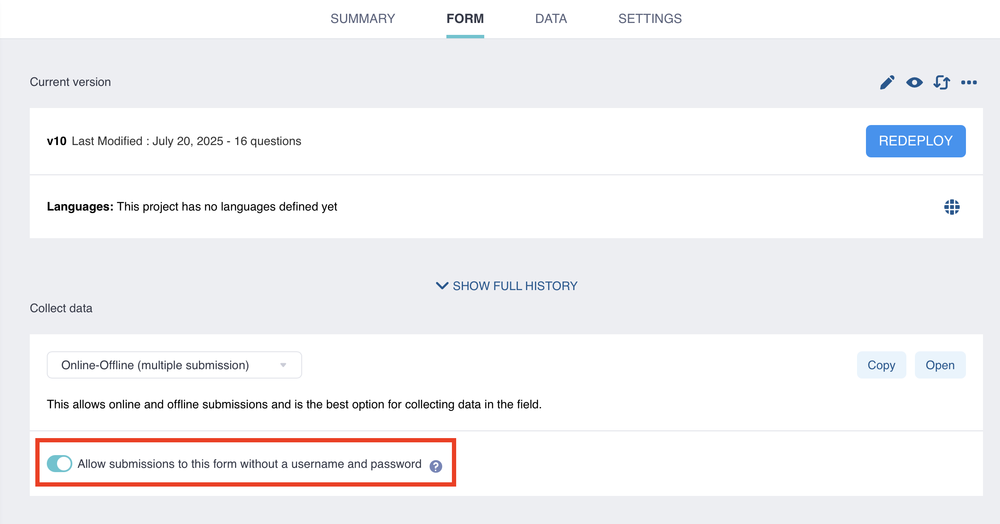

# Sharing projects with project-level settings 
**Last updated:** <a href="https://github.com/kobotoolbox/docs/blob/03c0981e6da0be6aec3385dfe68b2ebb0f71b2f8/source/project_sharing_settings.md" class="reference">5 Sep 2025</a>

<iframe src="https://www.youtube.com/embed/vRuAan0aSfY?si=FbKeyjF9XitYdUWC" style="width: 100%; aspect-ratio: 16 / 9; height: auto; border: 0;" title="YouTube video player" frameborder="0" allow="accelerometer; autoplay; clipboard-write; encrypted-media; gyroscope; picture-in-picture; web-share" allowfullscreen></iframe>

KoboToolbox allows you to customize sharing settings based on project needs. This article explains KoboToolbox’s **project-level privacy and sharing controls**, including allowing submissions without authentication, making a project public, transferring ownership, and removing shared projects.

  To learn more about managing what <strong>specific users</strong> can do within a project, see <a href="https://support.kobotoolbox.org/managing_permissions.html">Sharing your project with user-specific permissions</a>.

## Allowing submissions without authentication

By default, KoboToolbox requires a username and password to submit data, manage projects, and access submissions. When a new project is deployed, authentication is required to access the form and send submissions. Only users with whom you have [shared the form](https://support.kobotoolbox.org/managing_permissions.html) and granted **Add submissions** permission will be able to access the form and submit data.

In some cases, you may wish to enable data entry for anyone who has the URL. This allows individuals with the form URL to send submissions without signing into a KoboToolbox account.

To allow data entry for anyone with the form URL:
1. Open the project in KoboToolbox and go to the **FORM** section
2. Under **Collect Data**, enable "Allow submissions to this form without a username and password".

You can also change this setting by going to the **Sharing** tab in the **SETTINGS** page of your project and toggling the default setting to enable “Allow submissions to this form without a username and password”.

  <strong>Note:</strong> Setting forms to require authentication is now available as a per-project setting. This privacy feature replaces the previous account-level setting to “Require authentication to see forms and submit data”. With this update, new projects require authentication by default. Existing projects inherit your previous account-level settings as they were at the time of this update.

## Making your project public

In addition to sharing your project with specific KoboToolbox users, you can also make your form and/or project data public. To do this: 

1. Go to the **SETTINGS** page of your data collection project
2. Open the **Sharing** tab
3. Select the options “Anyone can view this form” and/or “Anyone can view submissions made to this form”

  <strong>Note:</strong> When selecting “Anyone can view submissions made to this form”, the “Anyone can view this form” option is also selected by default.

A URL will be displayed that you can share to provide access to the form and/or project data without requiring a KoboToolbox account sign-in. Users with the link will be able to perform the following actions:

| **Option**    | **Actions allowed**                                |
| :----------------- | :--------------------------------------------- |
| Anyone can view this form              | <ul><li>Access the <strong>FORM</strong> page</li> <li>Preview the form</li> <li>Download the form as XLS or XML</li></ul> |
| Anyone can view submissions made to this form      | <ul><li>Access the <strong>DATA</strong> page</li><li>View the data in the <strong>Table</strong> view</li><li>View and print <strong>Reports</strong></li><li>View the <strong>Gallery</strong></li><li><strong>Download</strong> the project data</li><li>View the data in the <strong>Map</strong> view</li></ul> |

## Transferring ownership of a project

You can transfer project ownership from your account to a different user account. Both accounts must be on the same KoboToolbox server.

To transfer a project:
1. Go to the **SETTINGS** page of your data collection project.
2. Open the **Sharing** tab.
3. In the **Transfer project ownership** section, click **Transfer**.
4. Enter the username of the account you wish to transfer the project to.
5. Click **Transfer project**.
   
An email will be sent to the user receiving the project. To accept the transfer, the recipient must click on the link in the email while signed in to their KoboToolbox account. When they click on the link, a confirmation dialog box will be displayed. The recipient must click **Accept** for the project transfer to be completed.

  <strong>Note:</strong> After accepting the transfer, it may take a few minutes to complete. The new project owner may see the project in their project list right away, but the data table view may take longer to update.

## Removing shared projects from your account

To remove a project that another user shared with you:

1. Open the project and go to the **FORM** page.
2. Click <i class="k-icon-more"></i> **More actions** in the top right corner.
3. Select **Remove shared project**.
4. Confirm by clicking **REMOVE**.

<iframe src="https://www.youtube.com/embed/EZyj0tQXtzA?si=EmE0bahqxFAW2Fqm" style="width: 100%; aspect-ratio: 16 / 9; height: auto; border: 0;" title="YouTube video player" frameborder="0" allow="accelerometer; autoplay; clipboard-write; encrypted-media; gyroscope; picture-in-picture; web-share" allowfullscreen></iframe>

