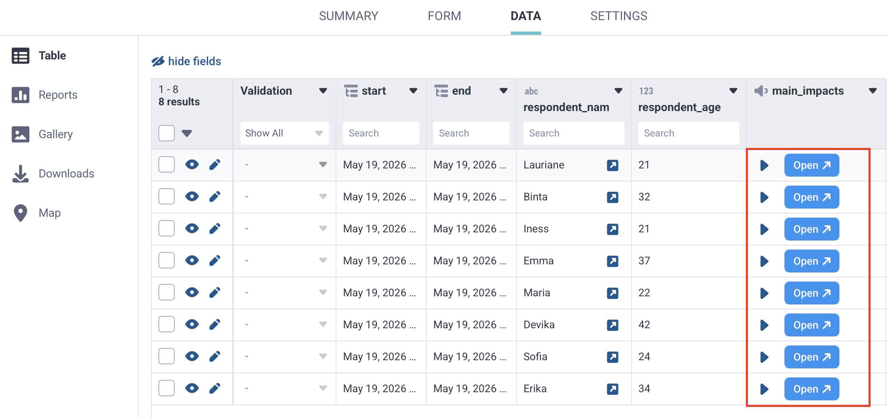
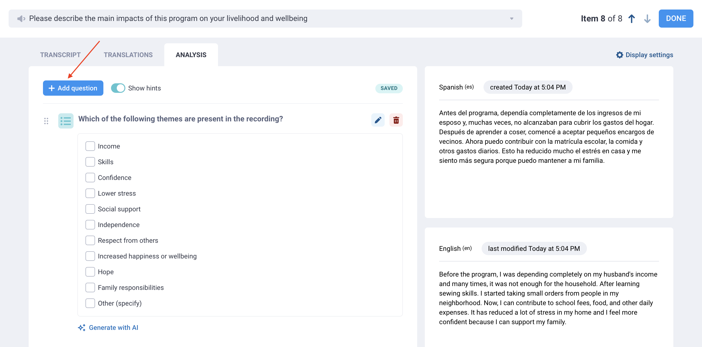
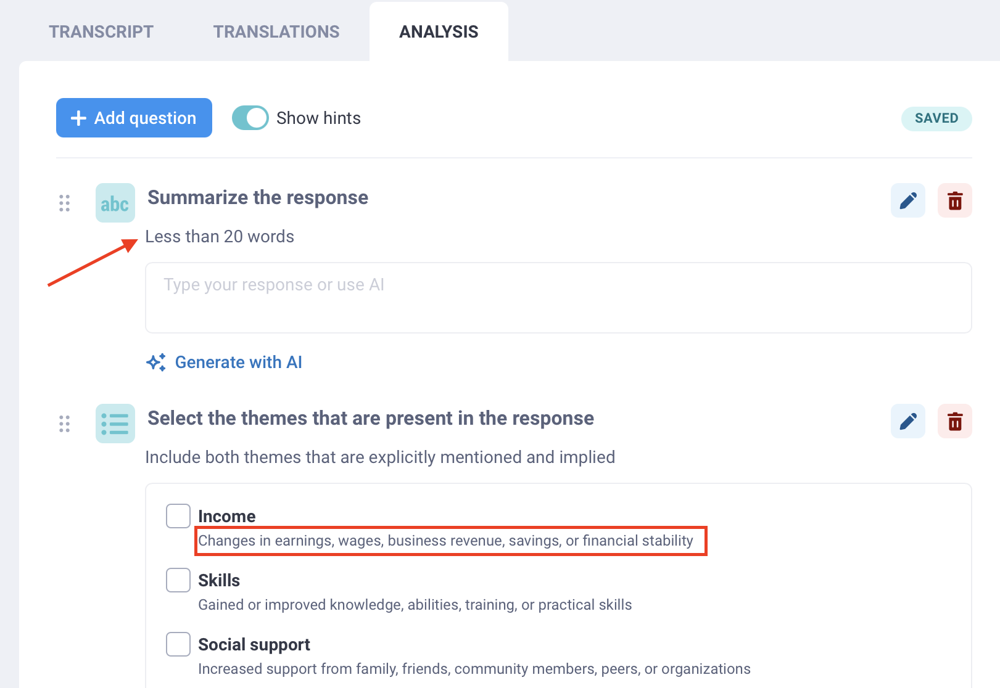
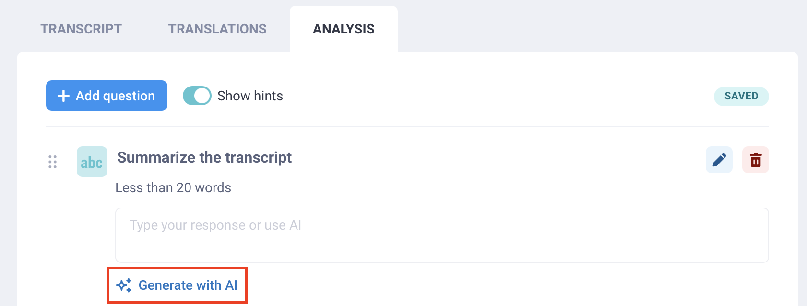
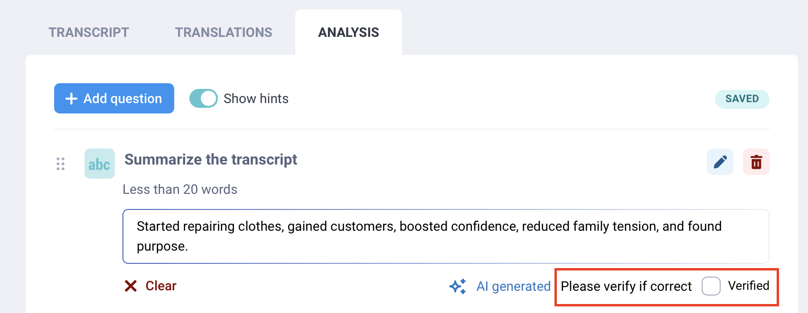
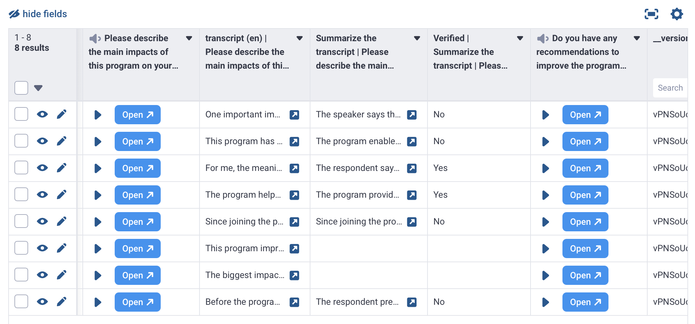
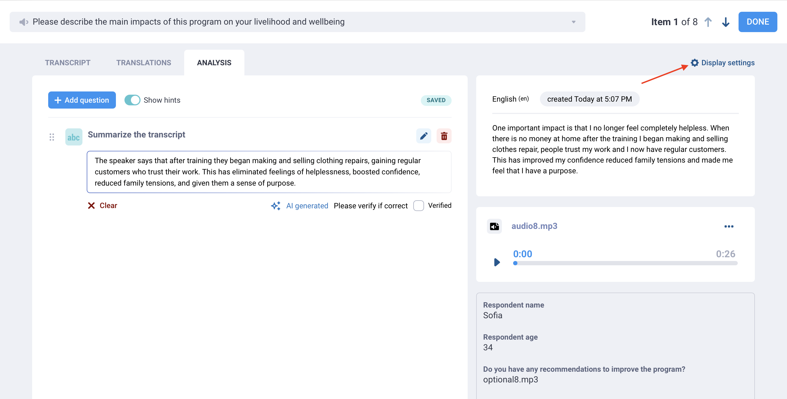
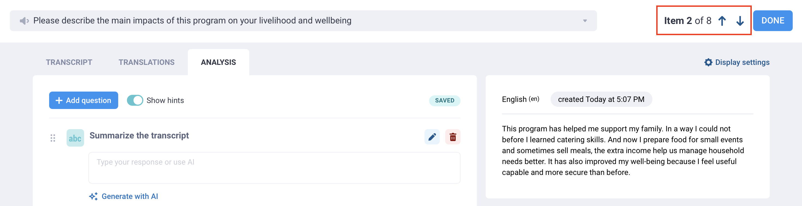
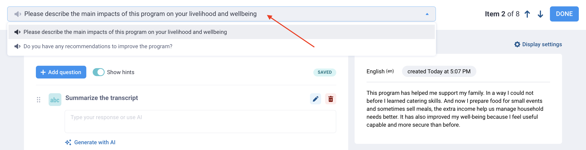

# Qualitative analysis of audio responses in KoboToolbox
**Last updated:** <a href="https://github.com/kobotoolbox/docs/blob/3d800e00d14000ecaa30ed97fcbf03a9feee65eb/source/qualitative_analysis.md" class="reference">3 May 2024</a>

<iframe src="https://www.youtube.com/embed/Ud65hNS_cuo?si=aFfCfExpyn3MZVAs" style="width: 100%; aspect-ratio: 16 / 9; height: auto; border: 0;" title="YouTube video player" frameborder="0" allow="accelerometer; autoplay; clipboard-write; encrypted-media; gyroscope; picture-in-picture; web-share" allowfullscreen></iframe>

Qualitative analysis helps turn open-ended responses into clear, usable insights. This is especially valuable in research and emergency response, where important context can be missed in quantitative data alone.

With KoboToolbox, you can analyze responses to open-ended audio questions directly inside the user interface. Using qualitative analysis questions, you can summarize, categorize, and describe each response, then save those results as new columns in your dataset. You can either **analyze data manually** or **using artificial intelligence (AI)**.

This article explains how to create analysis questions, analyze responses manually or with AI, review and verify results, customize display settings, and move between responses during analysis.

## Prerequisites for qualitative analysis

Before using the qualitative analysis features, make sure the following requirements are met:
- Your form must include at least one [Audio question](https://support.kobotoolbox.org/photo_audio_video_file.html) or have [background audio recording](https://support.kobotoolbox.org/recording-interviews.html#recording-interviews-with-background-audio-recordings) enabled. 
- Your project must include at least one submission with audio files.
- For **automated analysis**, audio files must first be [transcribed](https://support.kobotoolbox.org/transcription-translation.html) because the analysis is generated from the original audio transcript.
    - For **manual analysis**, transcribing your audio files before you begin is recommended but not required.

<strong>Note:</strong>
   Qualitative analysis is currently available only for audio responses, including background audio recordings. It is not yet supported for text or other response types. 

## Creating analysis questions

To create qualitative analysis questions, open your project's audio analysis interface:

1. Open your project and go to **DATA > Table.**
2. Click **Open** in the cell of the audio response you want to analyze.
3. Open the **ANALYSIS** tab.

Once you have reached the **ANALYSIS** tab, you can add analysis questions to generate insights from each audio response:

1. Click **Add question.**
2. Select the [question type](https://support.kobotoolbox.org/qualitative_analysis.html#analysis-question-types) you want to use (e.g., **Text** or **Single choice**).
3. Enter a label for the analysis question (e.g., "Summarize the response" or "Select the themes that are mentioned in the response").  
    - This title becomes the column name in your dataset.
4. Add answer choices if relevant.

Each analysis question you create will appear in the **ANALYSIS** tab for other responses to the same audio question.

<strong>Note:</strong>
You can also <a href="https://support.kobotoolbox.org/qualitative_analysis.html#adding-hints">add hints</a> to analysis questions or answer choices, for example to add information from a codebook or instructions for coders. 

### Analysis question types

The following question types are available for analysis questions:

| Question type | Description | 
|:----|:----|
| <i class="k-icon k-icon-tag"></i> Tags | Add keywords or themes to describe the audio response. |
| <i class="k-icon-qt-text"></i> Text | Add an open text response, such as a summary, notes, or overall impression. |
| <i class="k-icon-qt-number "></i> Number | Record a number, such as the number of times a theme is mentioned. |
| <i class="k-icon-qt-select-one"></i> Single choice | Select one option from a list, such as the main theme or perceived level of satisfaction. |
| <i class="k-icon-qt-select-many"></i> Multiple choice | Select one or more options from a list, such as themes or barriers mentioned in the response. |
| <i class="k-icon-qt-note"></i> Note | Add instructions or section labels to organize the analysis workspace. |

Each field you add becomes a new column in your dataset when you download your data, except for **Note** fields.

### Adding hints to analysis questions

Hints can help make your analysis more consistent, whether responses are reviewed by human coders or generated with AI. When creating analysis questions, use hints to explain how each question should be answered.

You can add hints to both analysis questions and option choices.

For example, you can use hints to include:

- A full codebook or coding framework
- Definitions for tags, categories, or themes
- Examples of how to apply each answer choice
- Instructions for handling unclear or incomplete responses
- Any guidance you would normally give to a human coder
- Prompt-style instructions for AI-generated analysis

Hints can be **especially useful when using AI**, because they give the AI more context about how to interpret the audio response and how the analysis should be structured. 

Hints do not have a word limit, so you can include detailed instructions when needed. We recommend keeping hints clear and specific so they are easy for both team members and AI tools to follow.

<strong>Note:</strong>
    If your hints are very long, such as detailed instructions for AI-generated responses, you can disable the <strong>Show hints</strong> button at the top of the <strong>ANALYSIS</strong> window to hide them.

## Analyzing your data

Once you have created analysis questions, you can start analyzing responses manually or use AI to generate a response:

- **For manual analysis:** Manually enter a response for each analysis question.
- **For automated analysis:** Click **Generate with AI** under each analysis question.

After generating automated analysis responses, you can review the responses and edit them if needed.

<strong>Note:</strong>
A response that has been generated with AI will include the mention <strong>AI-generated</strong> underneath the question.    

### Reviewing and verifying responses

For both manual and AI-generated analysis, you can review each response and mark it as verified. This can help with quality control, whether you are checking coding across a team or confirming that an AI-generated response is accurate.

To verify a response, check the **Verified** box below it. If you leave the box unchecked, the analysis result will still be saved, but your team will be able to see that it has not yet been reviewed. 

### Viewing and exporting analysis data

When you finish analyzing your audio files, each analysis field is saved as a new column in your dataset. Your dataset will also include a **Verified** column with **Yes** or **No** values. 

You can [export](https://support.kobotoolbox.org/export_download.html) your data with these analysis fields included for further review, synthesis, or reporting. For example, you can use them to track how often specific themes appear across your transcripts, or to create a codebook based on the most recurring **Tags**.

<strong>Note:</strong>
When you export your data, an additional column is included to indicate the <strong>analysis source</strong>, showing whether the analysis was completed manually or generated with AI.

### Customizing the display settings

By default, the display panel on the right side of the **ANALYSIS** screen shows the audio recording, the original transcript, and responses to other questions.

You can change the display to include the information that best supports your analysis. For example, if you are working in multiple languages, you may want to show a [translation](https://support.kobotoolbox.org/transcription-translation.html) or hide the original transcript.

To change the display:

1. Click **Display settings** in the top right corner.
2. Select the information you want to show.

You can choose to show or hide:

- The audio recording
- Responses to other questions in the form
- The original transcript
- Transcript translations

If the recording has not been transcribed, only the audio recording and submission data will be available.

<strong>Note:</strong>
To learn more about transcription and translation of audio responses in KoboToolbox, see <a href="https://support.kobotoolbox.org/transcription-translation.html#">Transcription and translation of audio responses</a>.

### Switching to a different question or transcript

You can analyze only one audio response at a time, but you can move easily between responses and questions.

To switch to the next or previous submission, use the arrows to the left of the **DONE** button.

To switch to a different audio question within the same submission, use the drop-down menu at the top of the screen and select the question you want to analyze. You will be able to add **new analysis questions** for this audio question.

## Usage limits for AI-generated analysis

Community Plan users can make up to 25 AI-generated analysis requests for free. Each time you click **Generate with AI**, it counts as one request.

If you need more AI-generated analysis requests, you can [upgrade](https://www.kobotoolbox.org/pricing/) to a plan with a higher quota or [purchase](https://support.kobotoolbox.org/account_settings.html#add-ons) an **Automatic analysis requests add-on**. ​​You can always continue using the manual analysis features with no usage limit.

## Data privacy and model training

To ensure privacy and reliability when analyzing open-ended interview transcripts, KoboToolbox securely hosts an open-source AI model (**gpt-oss-120b**) within our own server environment rather than sending data to a commercial AI provider. Your data is **never shared with an external third-party AI company**, and you retain full control over your information.

Open-source models provide greater transparency into how data is processed. Transcripts submitted for analysis are **never used to train, retain, or improve** the underlying AI model.

Compared to commercial AI providers, which frequently update models behind the scenes and may apply filtering that can affect the analysis of complex or sensitive topics, **open-source models offer greater stability and consistency** throughout the lifecycle of a project. This helps provide a more neutral and predictable baseline for qualitative research.

Our AI analysis features have been extensively tested against both human coders and more than 40 commercial and open-weight AI models to ensure high quality and reliable results.

