# Using the KoboToolbox question library
**Last updated:** <a href="https://github.com/kobotoolbox/docs/blob/04d161b3ce12a8f18d4145536cbba7c2fa3149ae/source/question_library.md" class="reference">20 Mar 2026</a>

The KoboToolbox **question library** allows you to save, reuse, and share questions across multiple forms. Instead of recreating commonly used questions and choices, you can store them in the library and quickly insert them into new forms.

The question library can store **individual questions, question blocks,** and **full form templates.** You can also organize your content using **collections** to group related items by project, theme, country, or organization.

Using the question library helps maintain consistency across projects, streamlines the form design process, and makes it easier to share standardized content with other members of your team. You can access the question library from the left-side menu of the KoboToolbox website.

<strong>Note:</strong> The KoboToolbox question library can contain both public and private content. This article focuses on <strong>My Library</strong>, where you can save, organize, reuse, and share your own questions, question blocks, and form templates. To learn more about making library content publicly available, see <a href="https://support.kobotoolbox.org/using_public_collections.html#">Public collections in the KoboToolbox library</a>.

This article covers the following topics: 
- Adding questions to the question library and using them in your forms
- Adding templates to your question library and creating forms from templates
- Working with collections to organize your content

## Adding questions to the question library

### Adding questions from the Formbuilder

When building a form in the [KoboToolbox Formbuilder](https://support.kobotoolbox.org/formbuilder.html), you can save any question to your question library by clicking <i class="k-icon-folder-plus"></i> **Add Question to Library** in the question’s right-side menu.

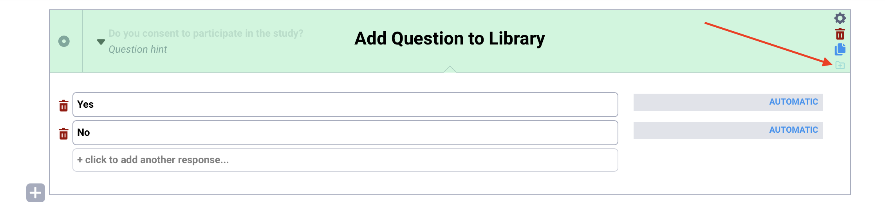

This approach preserves all components of your question, including answer choices, [translations](https://support.kobotoolbox.org/language_dashboard.html), [question options](https://support.kobotoolbox.org/question_options.html), [skip logic](https://support.kobotoolbox.org/skip_logic.html), and [validation criteria](https://support.kobotoolbox.org/validation_criteria.html).

<strong>Note:</strong> When adding a question to your library, a copy of the question is saved, and changes made to the original question do not affect the saved version.

You can also add a [group of multiple questions](https://support.kobotoolbox.org/group_repeat.html) to the question library by clicking <i class="k-icon-folder-plus"></i> **Add Question to Library** at the group level. The group is saved as a **question block.**

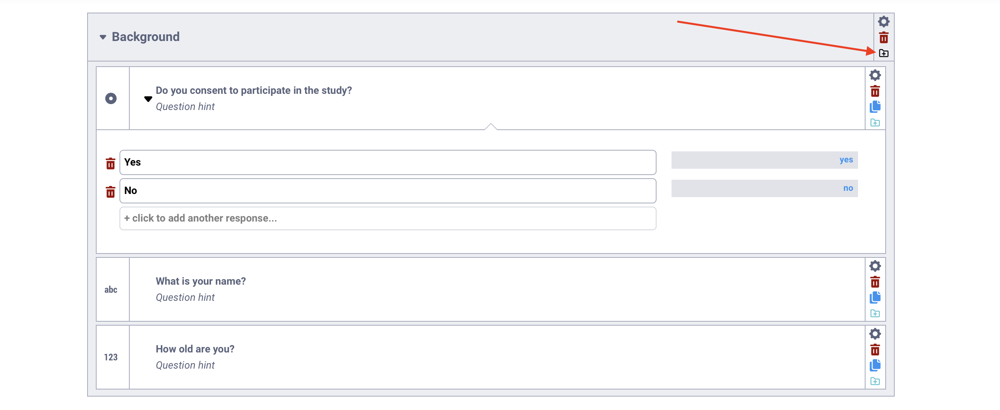

### Adding questions from the library

You can also create library questions directly from the question library:

1. Click <i class="k-icon-library"></i> **Library** in the left-side menu to open the library.
2. Click **NEW** in the top left corner.
3. Select <i class="k-icon-block"></i> **Question Block**. This opens the KoboToolbox Formbuilder, where you can add the question or group of questions you want to save.
4. Click **Create** in the top right corner to save the question block to your library.

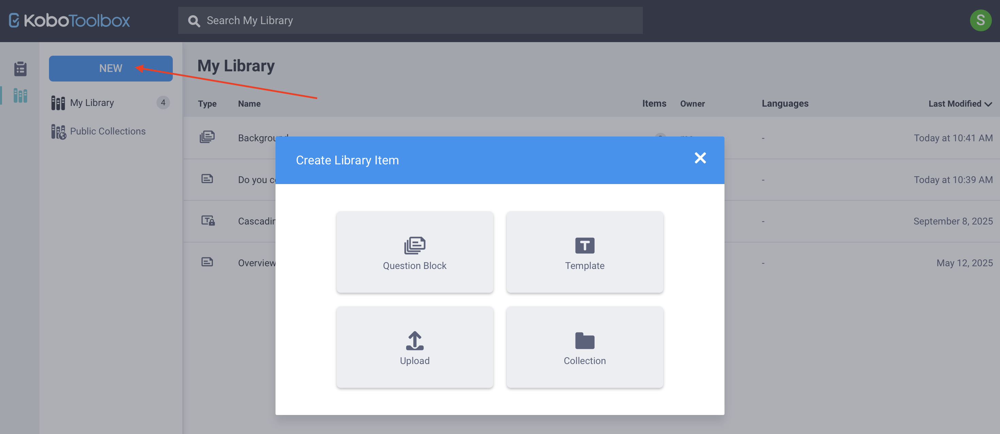

You can upload questions or question blocks from an [XLSForm](https://support.kobotoolbox.org/edit_forms_excel.html) by clicking <i class="k-icon-upload"></i> **Upload** under **Create Library Item** and uploading an XLSForm. 

### Managing questions in the question library

In the **My Library** view, you can see all saved questions and question blocks. For each item, you can view details such as the number of questions included, the owner, available languages, and the date it was last modified.

For each saved item, you can hover over it to:

- <i class="k-icon-edit"></i> **Edit** the question(s) in the Formbuilder
- <i class="k-icon-tag"></i> **Add tags** to help organize and categorize items for easier searching
- <i class="k-icon-user-share"></i> **Share** it with other users, assigning permissions to view, edit, or manage the item
- <i class="k-icon-duplicate"></i> **Clone** it to create a duplicate that you can modify independently
- <i class="k-icon-more"></i> Click **More actions** to manage [translations](https://support.kobotoolbox.org/language_dashboard.html), download the item as XLS or XML, or delete it

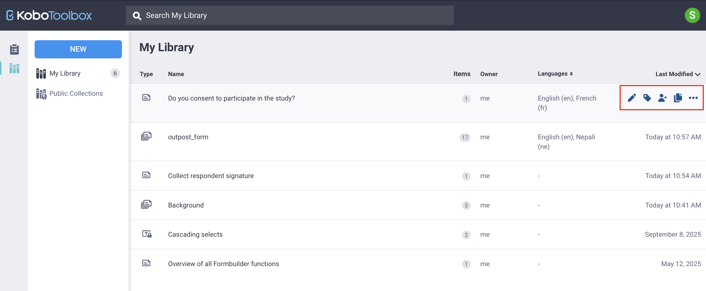

You can also click on any saved item to view its full details, including all questions contained within a question block.

## Adding questions to a form from the question library

Once you have added questions to your library, you can use them in future forms. To use library questions in your form:

1. Open your form in the [KoboToolbox Formbuilder](https://support.kobotoolbox.org/formbuilder.html).
2. Click <i class="k-icon-library"></i> **Add from Library** in the top right corner.
3. Select the question or question block you want to add, then drag and drop it into the desired location in your form.
4. If your question library contains many items, you can use the **Search** function to quickly locate the question or block you need.

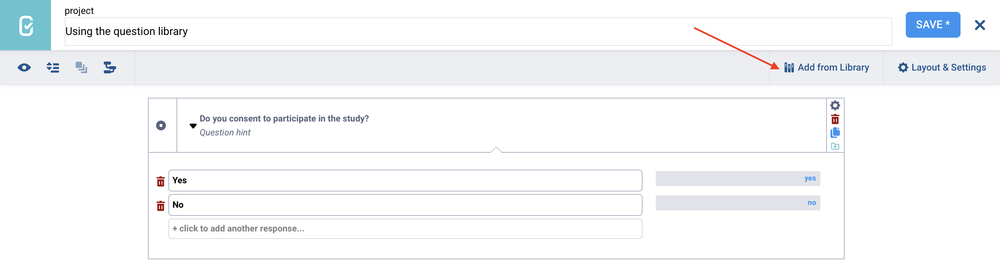

<strong>Note:</strong> When you add a question from your question library to a form, any changes you make in the form will not affect the original version saved in the library.

## Adding templates to your question library

<iframe src="https://www.youtube.com/embed/k-2jnfd3DrE?si=wR1zkjMjgM2Dq9mT" style="width: 100%; aspect-ratio: 16 / 9; height: auto; border: 0;" title="YouTube video player" frameborder="0" allow="accelerometer; autoplay; clipboard-write; encrypted-media; gyroscope; picture-in-picture; web-share" allowfullscreen></iframe>

In addition to saving individual questions or question blocks, you can create full form templates that can be converted into KoboToolbox projects. Templates are useful for standardizing complete forms that can be reused across teams, projects, or countries.

<strong>Note:</strong>  A <strong>question block</strong> is a group of questions that can be inserted anywhere in a form, while a <strong>template</strong> contains a full form that can become a project.

### Creating a template

You can create a template either from your question library or from an existing KoboToolbox form.

From your **question library**, you can:

- Click **NEW > <i class="k-icon-template"></i> Template.** You will be taken to the Formbuilder to design the form after entering the template details.
- Click **NEW > <i class="k-icon-upload"></i> Upload**, upload an XLSForm, and select **Upload as template.**

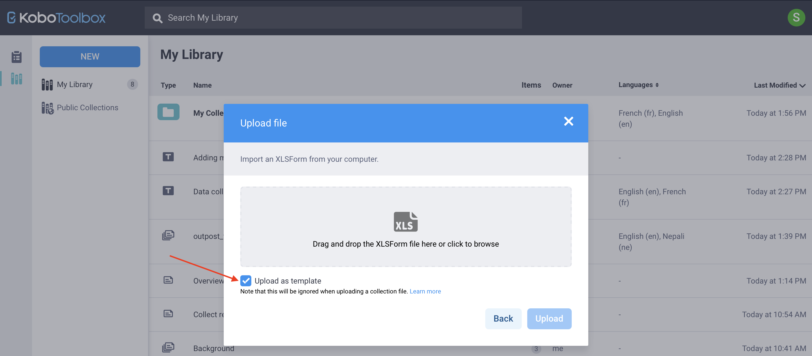

<strong>Note:</strong> If you are using XLSForm, you can create locked templates that restrict other users from editing specific parts of the form. To learn more, see <a href="https://support.kobotoolbox.org/library_locking.html">Library locking with XLSForm</a>.

To create a template from an **existing KoboToolbox form:**

1. Open the project’s **FORM** page.
2. Click <i class="k-icon-more"></i> **More actions** in the top right corner.
3. Select <i class="k-icon-template"></i> **Create template.**

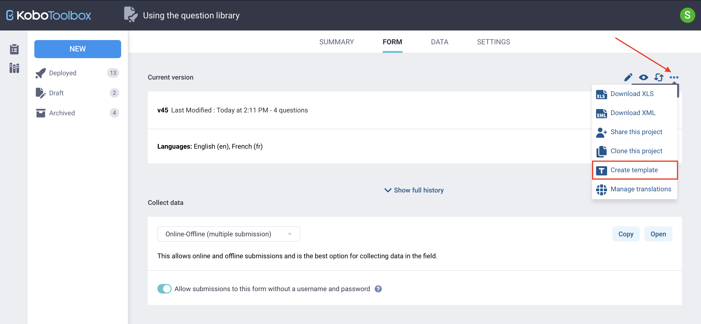

From the **My Library** page, you can manage templates in the same way as questions or question blocks. You can share them with other users, add tags, edit details, or delete them.

### Creating a project from a template

You can use a template to create a new form project from your question library or from your **Projects home page.**

From the **question library:**

1. Hover over the template and click <i class="k-icon-projects"></i> **Create project** on the right.
2. Enter a name for the new project.

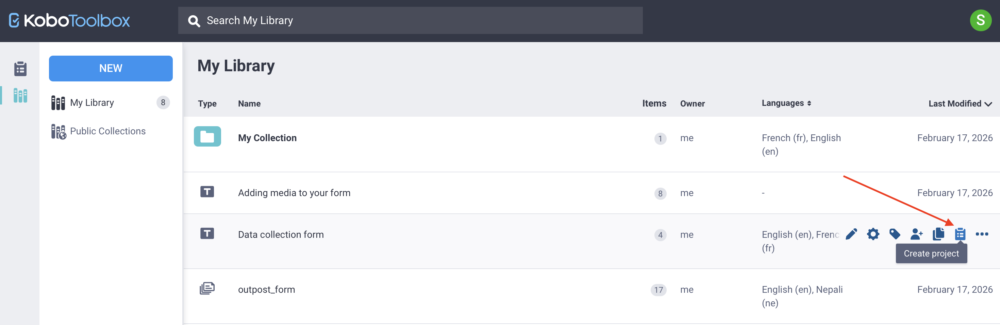

From the **Projects home page:**

1. Click **NEW** and select <i class="k-icon-template"></i> **Use a template.**
2. Choose a saved template and click **Next.**
3. Enter the project details and click **Create project.**

In both cases, a new KoboToolbox project will be created that you can edit and deploy. 

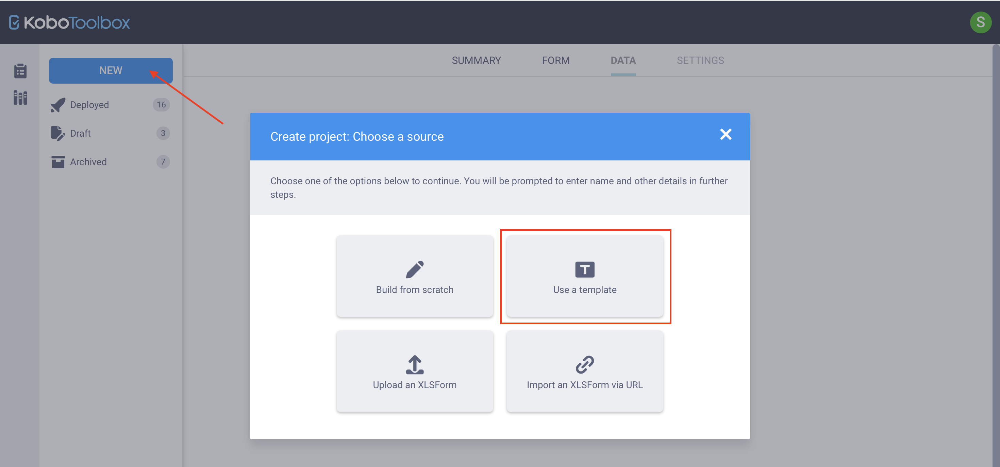

<strong>Note:</strong> Editing a project created from a template does not modify the original template.

## Using collections in the question library

<iframe src="https://www.youtube.com/embed/EfnyQh-awqk?si=7Hhb499SgsEL9pg4" style="width: 100%; aspect-ratio: 16 / 9; height: auto; border: 0;" title="YouTube video player" frameborder="0" allow="accelerometer; autoplay; clipboard-write; encrypted-media; gyroscope; picture-in-picture; web-share" allowfullscreen></iframe>

A **collection** is a group of questions, question blocks, and/or templates organized together because they relate to the same project, theme, country, or other shared context. Collections help you structure and manage reusable content in your question library.

### Creating a collection

To create a collection:

1. From your question library, click **NEW** and select <i class="k-icon-folder"></i> **Collection.**
2. Enter a name and, if desired, add a short description, organization, primary sector, and country. These fields are optional.
3. Add tags to help categorize and organize your collection.
4. Click **Create.**

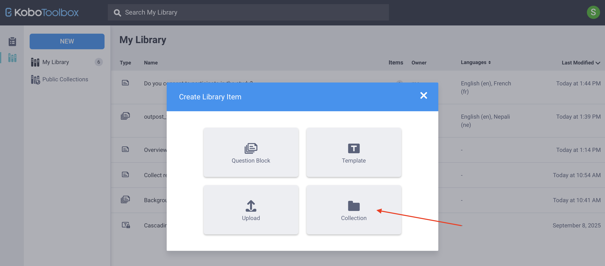

<strong>Note:</strong> If you want to import a large number of questions or question blocks into your library as a single collection, you can do so using an <a href="https://support.kobotoolbox.org/edit_forms_excel.html">XLSForm</a>. To learn more, see <a href="https://support.kobotoolbox.org/import_collection.html">Importing library collections using XLSForm</a>.

After creating the collection, you will be taken to the collection’s main page, which will display the message: “There are no assets to display.”

### Adding items to a collection

You can add questions, question blocks, or templates to a collection in several ways:

- From the **collection page:**
    - Click **NEW > <i class="k-icon-block"></i> Question Block** to create a new question or block in the Formbuilder and save it to the collection.
    - Click **NEW > <i class="k-icon-template"></i> Template** to create a template and save it to the collection.
- From **My Library**, hover over an existing item, click <i class="k-icon-more"></i> **More actions**, and choose the name of your collection under <i class="k-icon-folder-in"></i> **Move to.**

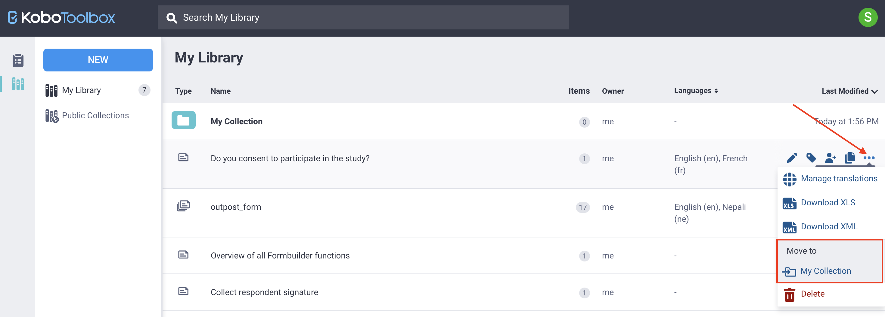

<strong>Note:</strong> You cannot create nested collections. If you create a collection while inside another collection, it will be saved as a separate collection.

To remove an item from a collection, click <i class="k-icon-more"></i> **More actions** in the item’s row and select <i class="k-icon-folder-out"></i> **Remove from collection.**

### Managing collections

You can manage your collection from the **My Library** page by hovering over it and selecting the available options to <i class="k-icon-edit"></i> modify its details, <i class="k-icon-tag"></i> add tags, <i class="k-icon-user-share"></i> share it with other users, or <i class="k-icon-trash"></i> delete it. You can also perform these actions directly from the collection’s page.

<strong>Note:</strong> Deleting a collection permanently deletes all items contained within it. 

To **make a collection public**, open the collection and click the <i class="k-icon-globe-alt"></i> **Make public** button in the top right corner. Note that the **name, organization,** and **sector** fields must be completed before a collection can be made public.

 To learn more about public collections, see <a href="https://support.kobotoolbox.org/using_public_collections.html">Public collections in the KoboToolbox library</a>.

