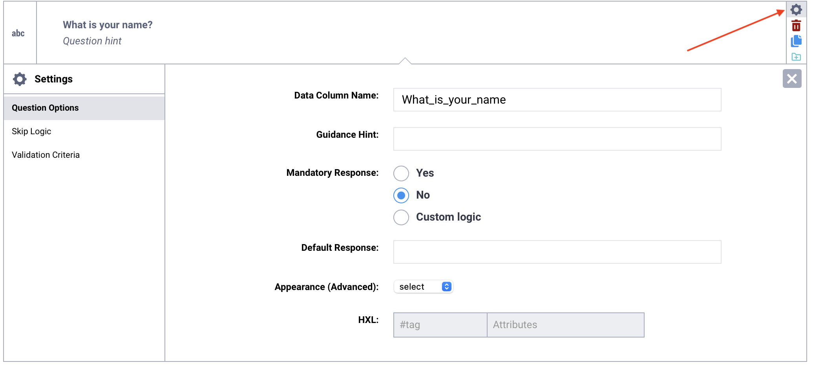
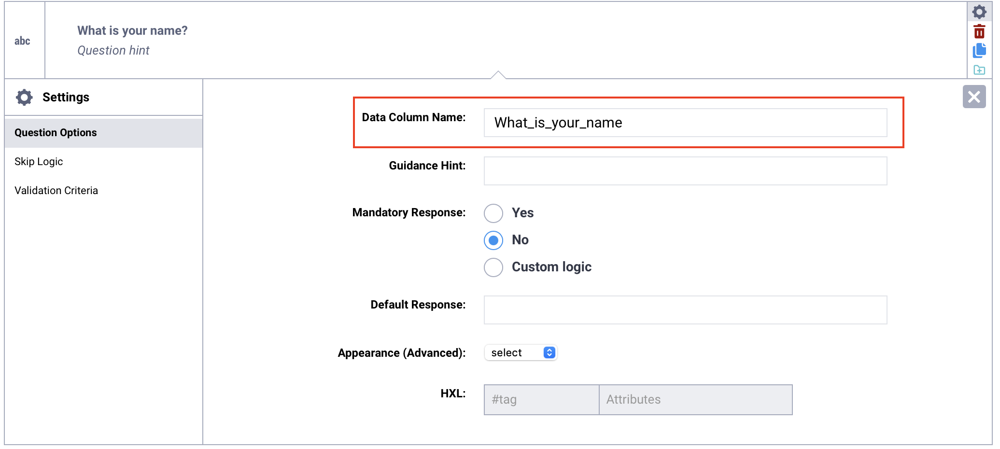
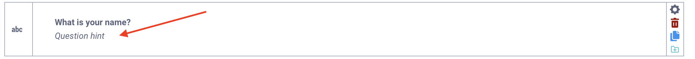
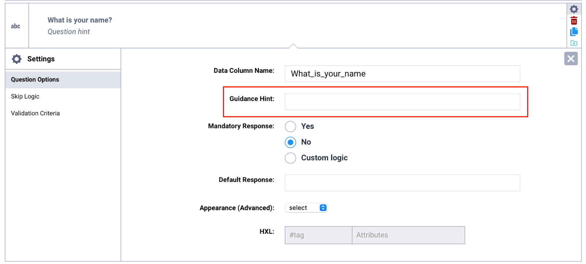
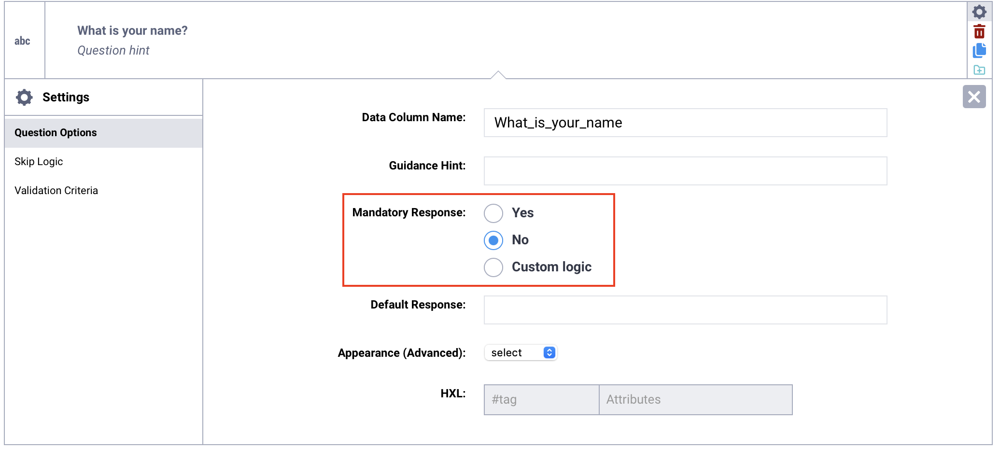
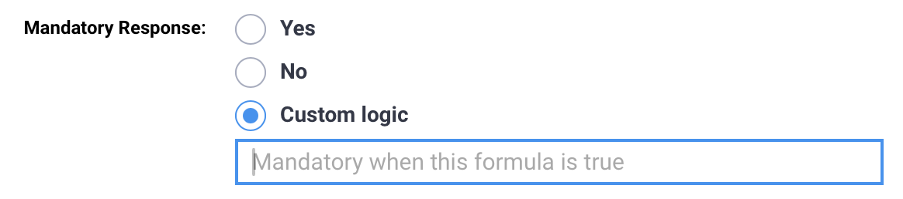
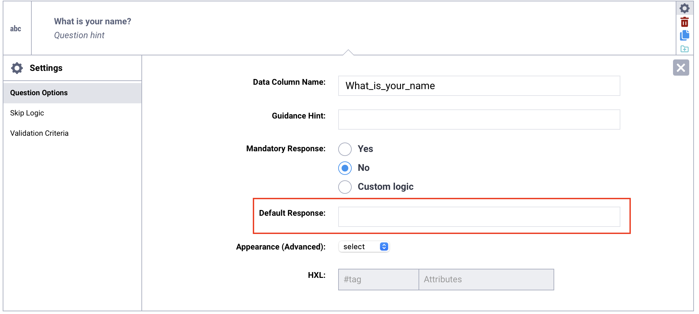
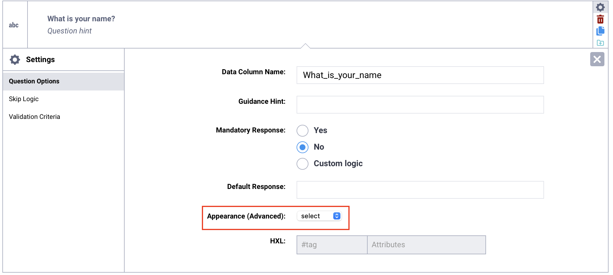
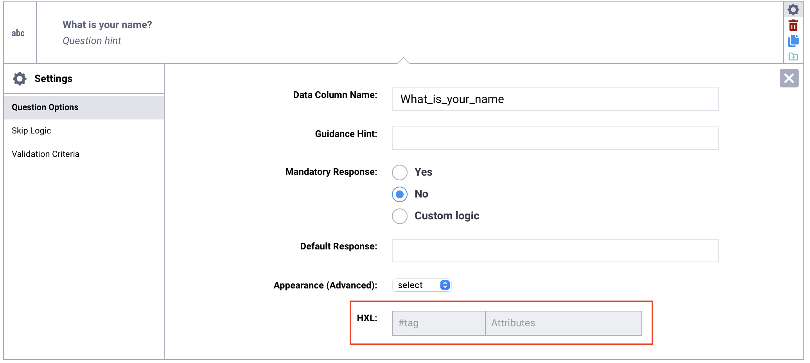

# Question options in the Formbuilder
**Last updated:** <a href="https://github.com/kobotoolbox/docs/blob/f7a7fa3d5b55b406b4b6cdb7f75cddc7b986067d/source/question_options.md" class="reference">21 Mar 2026</a>

After adding a question to your form, you can customize **how it behaves and appears by adjusting its question options.** These settings allow you to control various question options, from variable naming and required responses to advanced display features and HXL tagging.

This article explains how to access question options in the Formbuilder, outlines the available settings, and provides guidance on how and when to use each option effectively.

## Accessing question options in the Formbuilder

To access question options in the Formbuilder:

1. Click <i class="k-icon-settings"></i> **Settings** in the menu on the right side of the question.
2. This opens the **Question Options** tab, where you can configure additional settings for the selected question.

## Available options in the Formbuilder

The following options are available for questions added in the Formbuilder:

| Options | Description |
|:---|:---|
| Question Hint | Text displayed below the question label to provide <a href="https://support.kobotoolbox.org/question_options.html#question-hint">additional instructions</a> or clarification for respondents. |
| Data Column Name | The <a href="https://support.kobotoolbox.org/question_options.html#data-column-name">unique identifier</a> for a question, used in form logic and as the column header in the exported dataset. |
| Guidance Hint | Additional <a href="https://support.kobotoolbox.org/question_options.html#guidance-hint">notes or instructions</a> intended for enumerators or form developers, not displayed by default during data collection. |
| Mandatory Response | A setting that determines whether a question <a href="https://support.kobotoolbox.org/question_options.html#mandatory-response">must be answered</a> before the respondent can continue or submit the form. |
| Default Response | A predefined answer that <a href="https://support.kobotoolbox.org/question_options.html#default-response">automatically populates</a> a question and can be changed during data collection. |
| Appearance (Advanced) | An optional setting that modifies how a question is <a href="https://support.kobotoolbox.org/question_options.html#appearance-advanced">displayed</a> or behaves in the form. |
| HXL | A standardized hashtag used to <a href="https://support.kobotoolbox.org/question_options.html#hxl">tag questions</a> according to the Humanitarian Exchange Language (HXL) framework to support data interoperability and processing. |
| Accepted Files | Specifies which <a href="https://support.kobotoolbox.org/photo_audio_video_file.html#restricting-accepted-file-types">file types</a> can be uploaded for a **File** question by listing the allowed file extensions, separated by commas. |
| Parameters | Additional settings available for certain question types that allow you to customize behavior, such as <a href="https://support.kobotoolbox.org/select_one_and_select_many.html#randomizing-option-choices">randomizing answer choices</a> or limiting the <a href="https://support.kobotoolbox.org/photo_audio_video_file.html#lowering-image-sizes">maximum image size</a>. |
| Choices File | Allows users to select which <a href="https://support.kobotoolbox.org/external_file.html#setting-up-the-question-in-the-formbuilder">external file</a> will be used as the source of options for **Select One from File** and **Select Many from File** questions. |

<strong>Note:</strong> For additional customization and advanced options, <a href="https://support.kobotoolbox.org/xlsform_with_kobotoolbox.html#downloading-an-xlsform-from-kobotoolbox">download your form as an XLSForm</a> and add <a href="https://support.kobotoolbox.org/question_options_xls.html">question options</a> directly in the spreadsheet.

## Data Column Name

The **Data Column Name** is the unique identifier for each question in your form. It serves as the variable name used in [form logic](https://support.kobotoolbox.org/form_logic.html#question-referencing) and becomes the column header in your exported dataset.

Every question must have a unique data column name. In the Formbuilder, it is automatically generated from the question label, but you can customize it as needed. Defining clear and consistent names before deploying your form helps ensure that your dataset follows a logical naming convention.

### Important considerations for data column names

If you keep the **automatically generated data column name**, it will update automatically whenever you change the question label. This can cause problems if you have already set up form logic in XLSForm code using the previous data column name, or if you have started collecting data.

If a question’s data column name changes after data collection has begun, KoboToolbox will treat it as a new variable. This will result in two separate columns in your dataset.

For this reason, it is recommended to **define and finalize the data column name for each question before deploying your form** and collecting data. If you intentionally make substantial changes to a question and want it to function as a new variable, you can update the data column name accordingly.

Data column names must follow these rules:

- Use only letters, numbers, and underscores.
- The first character must be a letter.
- Each name must be unique within the form.

<strong>Note:</strong> Data column names are used when referencing answers in <a href="https://support.kobotoolbox.org/form_logic.html#question-referencing">form logic</a>. For example, you can include a previous response in another question’s label using the format <code>${data_column_name}</code>. This format is used in labels, skip logic, calculations, and validations. Data column names are case-sensitive.

## Question Hint

**Question hints** are used to provide additional information for respondents or enumerators directly in the form. They are always visible and displayed below the question label.

## Guidance Hint

**Guidance hints** are used to provide additional information during form development, enumerator training, or data collection. They are not displayed by default.

### Displaying guidance hints in KoboCollect

In Enketo web forms, guidance hints appear in a collapsible **More Details** section. In KoboCollect, they are hidden by default, but you can [change your project settings](https://support.kobotoolbox.org/kobocollect_settings.html#form-management-settings) to always display them or show them in a collapsible section. 

To display guidance hints in KoboCollect, follow the steps below:

1. Tap the **Project icon** in the top right corner of your screen.
2. Tap **Settings**.
3. Under **Form management**, select **Show guidance for questions.**
4. Choose a display option: **No, Yes - always shown**, or **Yes - collapsed.**

<strong>Note:</strong> Guidance hints are always displayed in printed forms.

## Mandatory Response

By default, questions in a form are optional. Setting the **Mandatory Response** to **Yes** makes it required for the respondent to answer. This can be useful for ensuring submissions are complete and avoiding missing data.

If a respondent does not answer a required question, they will not be able to proceed to the next page or submit the form. The default required message “This field is required” will be displayed. 

<strong>Note:</strong> Skip logic conditions take precedence over <strong>Mandatory Response</strong> settings, meaning that if a required question is hidden by skip logic, it is no longer mandatory to answer. 

### Setting custom logic for mandatory responses

Custom form logic can be used to make a question required or optional based on a previous response. To implement custom logic for mandatory responses:

1. Select **Custom logic** next to **Mandatory Response**.
2. In the text box, enter the XLSForm formula that determines whether the question will be required or not.

    To learn more about condition-based required logic, see <a href="https://support.kobotoolbox.org/required_logic_xls.html">Adding required logic in XLSForm</a>.

## Default Response

A **default response** populates a question with a predefined answer based on a common or expected response. The default response will be recorded as the final answer when the form is submitted **unless modified by the respondent** during data collection. 

<strong>Note:</strong> Although default responses can make data collection more efficient by prepopulating the form with expected or common responses, they also risk introducing bias or errors in the data, and should be used with caution.

### Default response format

The format of the default response depends on the question type and the data being collected:

| Question type | Default response format |
|:---|:---|
| Number | Number |
| Text | Text (without quotation marks) |
| Select One | Choice <a href="https://support.kobotoolbox.org/question_types.html#setting-xml-values-for-option-choices">XML value</a> |
| Select Many | Choice <a href="https://support.kobotoolbox.org/question_types.html#setting-xml-values-for-option-choices">XML values</a>, separated by a space if there are multiple |
| Date | Date in the YYYY-MM-DD format. |

## Appearance (Advanced)

Question appearances allow you to modify how a question is displayed and, in some cases, how respondents interact with it. Some appearances are supported only in Enketo web forms, while others work only in KoboCollect.

Available appearances vary by question type. Refer to the relevant support article for each question type to see all supported appearances.

## HXL

HXL, or **Humanitarian Exchange Language**, is a [standardized system](https://hxlstandard.org/) for tagging data using hashtags (#). It is widely used by organizations to improve information sharing during humanitarian responses and other crisis situations.

Applying HXL tags to your questions helps make your data more interoperable across systems and organizations. It also supports more efficient data processing and analysis.

In KoboToolbox, you can assign one HXL tag per question and optionally include attributes. When you export your data as an XLS file with XML values and headers selected, an additional row containing the HXL tags will appear directly below the variable names in your dataset.

Using HXL tags is especially helpful when your data will be shared with partners or integrated into other humanitarian data systems.

