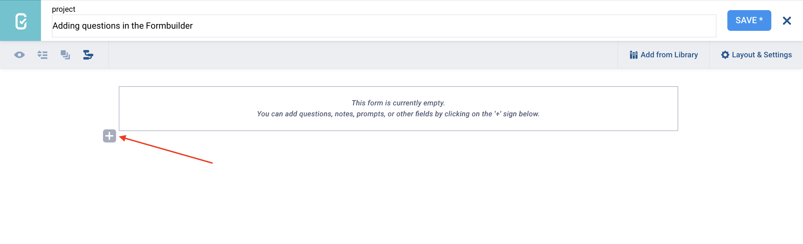
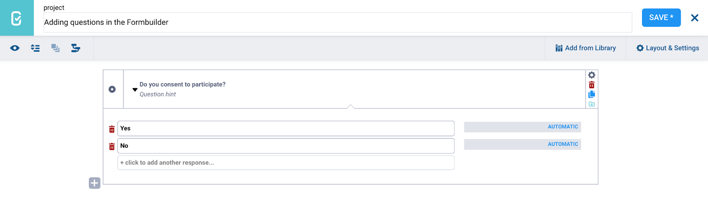

# Adding questions in the Formbuilder
**Last updated:** <a href="https://github.com/kobotoolbox/docs/blob/35c2ef4865450c612c41e9e784bd674a9f99756a/source/question_types.md" class="reference">20 Mar 2026</a>

The KoboToolbox Formbuilder allows you to easily add questions to your form as you build your survey or questionnaire. 

This article explains how to add questions to your form, define answer choices where applicable, and provides an overview of the available question types in the Formbuilder to support effective form design.

## Adding a question

To add a question to your form:

1. Click the <i class="k-icon-plus"></i> button. 
2. Enter your question label.
3. Click **+ ADD QUESTION.**
4. Choose the [question type](#question-types-in-the-formbuilder). 

<strong>Note:</strong> Once the question type has been selected, it cannot be changed in the Formbuilder. To change the question type of an existing question, delete the question and create a new question with the same label.

### Setting data column names

After adding a question to your form, it is strongly recommended to define a **Data Column Name** in the question **Settings.** The data column name is used to identify the question throughout the form logic and in the exported dataset. 

By default, KoboToolbox creates the data column name for you by removing spaces and capital letters from the question label. For example, if the question label is “Respondent name”, the data column name will be `respondent_name`.

    To learn more about data column names, see <a href="https://support.kobotoolbox.org/question_options.html#data-column-name">Question options in the Formbuilder</a>.

## Adding option choices

When adding Select One or Select Many questions to your form, you will be prompted to enter option choices. 

- You can enter as many option choices as you want. 
- To reorder the list of choices, click and drag an item to the desired position.
- Click the <i class="k-icon-trash"></i> trash can icon next to a choice label to delete it.

<strong>Note:</strong> Managing long choice lists in the Formbuilder can be time-consuming. If your form includes many options or the same choice list used in multiple questions, it is often easier to create and manage these lists using XLSForm instead. To learn more, see <a href="https://support.kobotoolbox.org/option_choices_xls.html#">Managing option choices in XLSForm</a>.

### Setting XML values for option choices

Next to each choice option, you will see a field labeled **AUTOMATIC.** This field contains the [XML value](https://support.kobotoolbox.org/glossary.html#xml-value) for that option.

The XML value is a short, internal name that KoboToolbox uses to save and identify the selected option in your data. By default, KoboToolbox creates the XML value for you by removing spaces and capital letters from the option label. For example, if the option label is “Option 1”, the XML value will be `option_1`.

In some cases, you may want to set your own XML value. This can be helpful if the option label is very long or if you want to use a clearer or more consistent name. To do this, click **AUTOMATIC** and replace it with your own custom value.

<strong>Note:</strong> It is strongly recommended to define XML values for all choices when using non-Latin scripts, such as Chinese, Arabic, or Nepali, to ensure your data is stored and exported correctly.

## Question types in the Formbuilder

The following question types are available in the Formbuilder:
| Question type                                        | Description                                                                                                                                    |
|:-----------------------------------------------------|:-----------------------------------------------------------------------------------------------------------------------------------------------|
| <i class="k-icon-qt-select-one"></i> Select One              | Allows respondents to [select one option](https://support.kobotoolbox.org/select_one_and_select_many.html) from a predefined list.                                                                                |
| <i class="k-icon-qt-select-many"></i> Select Many             | Allows respondents to [select multiple options](https://support.kobotoolbox.org/select_one_and_select_many.html) from a predefined list.                                                                          |
| <i class="k-icon-qt-text"></i> Text                    | Provides a [text box](https://support.kobotoolbox.org/text_questions.html) to collect open-ended responses.                                                                                          |
| <i class="k-icon-qt-number"></i> Number                  | Allows respondents to input [whole numbers](https://support.kobotoolbox.org/number_decimal_range.html).                                                                                                     |
| <i class="k-icon-qt-decimal"></i> Decimal                 | Allows respondents to [input numbers](https://support.kobotoolbox.org/number_decimal_range.html) that may contain decimal points.                                                                           |
| <i class="k-icon-qt-date"></i> Date                    | Captures a specific [calendar date](https://support.kobotoolbox.org/date_time.html), including year, month, and day.                                                                             |
| <i class="k-icon-qt-time"></i> Time                    | Captures a [specific time](https://support.kobotoolbox.org/date_time.html) in hours and minutes.                                                                                                 |
| <i class="k-icon-qt-date-time"></i> Date & time             | Captures both [a date and a time](https://support.kobotoolbox.org/date_time.html) in a single combined response.                                                                                 |
| <i class="k-icon-qt-point"></i> Point                   | Records a [single GPS location](https://support.kobotoolbox.org/gps_questions.html).                                                                                                                 |
| <i class="k-icon-qt-line"></i> Line                    | Records [multiple GPS points](https://support.kobotoolbox.org/gps_questions.html) that form a line.                                                                                                  |
| <i class="k-icon-qt-area"></i> Area                    | Records [multiple GPS points](https://support.kobotoolbox.org/gps_questions.html) that form an enclosed area.                                                                                        |
| <i class="k-icon-qt-photo"></i> Photo                   | Allows respondents to [upload images](https://support.kobotoolbox.org/photo_audio_video_file.html) or take photos (when using the [KoboCollect app](https://support.kobotoolbox.org/glossary.html#kobocollect)).                                                           |
| <i class="k-icon-qt-audio"></i> Audio                   | Allows respondents to [upload an audio file](https://support.kobotoolbox.org/photo_audio_video_file.html) or record audio.                                                                                    |
| <i class="k-icon-qt-video"></i> Video                   | Allows respondents to [upload videos](https://support.kobotoolbox.org/photo_audio_video_file.html) or record videos (when using the [KoboCollect app](https://support.kobotoolbox.org/glossary.html#kobocollect)).                                                         |
| <i class="k-icon-qt-barcode"></i> Barcode / QR Code       | Scans a [QR code](https://support.kobotoolbox.org/photo_audio_video_file.html) to collect embedded information using the device's camera (when using the [KoboCollect app](https://support.kobotoolbox.org/glossary.html#kobocollect)).                                    |
| <i class="k-icon-qt-file"></i> File                    | Allows respondents to [upload files](https://support.kobotoolbox.org/photo_audio_video_file.html), such as text files, spreadsheets, and PDF files.                                                           |
| <i class="k-icon-qt-note"></i> Note                    | [Provides information](https://support.kobotoolbox.org/note_questions.html) to the respondent without requiring any input.                                                                            |
| <i class="k-icon-qt-acknowledge"></i> Acknowledge             | A [single checkbox](https://support.kobotoolbox.org/select_one_and_select_many.html) that respondents can select to acknowledge their agreement with a statement.                                                  |
| <i class="k-icon-qt-rating"></i> Rating                  | Allows respondents to [rate different items](https://support.kobotoolbox.org/select_one_and_select_many.html#setting-up-rating-questions) using a common scale.                                                                               |
| <i class="k-icon-qt-question-matrix"></i> Question Matrix         | Creates a [group of questions](https://support.kobotoolbox.org/matrix_response.html) that display in a matrix format, whereby each cell within the matrix represents a separate question.               |
| <i class="k-icon-qt-ranking"></i> Ranking                 | Allows respondents to [rank items](https://support.kobotoolbox.org/select_one_and_select_many.html#setting-up-ranking-questions) in order of preference.                                                                                       |
| <i class="k-icon-qt-calculate"></i> Calculate               | Automatically performs [calculations](https://support.kobotoolbox.org/calculate_questions.html) within a form based on responses to previous questions.                                                    |
| <i class="k-icon-qt-hidden"></i> Hidden                  | Stores [predefined values](https://support.kobotoolbox.org/form_logic.html#storing-constants-in-your-form) that are not visible to the respondent.                                                                               |
| <i class="k-icon-qt-range"></i> Range                   | Allows respondents to [select a numeric value](https://support.kobotoolbox.org/number_decimal_range.html#setting-up-range-questions) within a specified range.                                                                         |
| <i class="k-icon-qt-external-xml"></i> External XML            | Connects the KoboToolbox project to [other projects](https://support.kobotoolbox.org/dynamic_data_attachment_formbuilder.html) in order to dynamically retrieve data.                                                      |
| <i class="k-icon-qt-select-one-from-file"></i> Select One from File    | Allows respondents to select one option [from a predefined list](https://support.kobotoolbox.org/external_file.html), stored in an external CSV file.                                                |
| <i class="k-icon-qt-select-many-from-file"></i> Select Many from File   | Allows respondents to select multiple options [from a predefined list](https://support.kobotoolbox.org/external_file.html), stored in an external CSV file.                                          |

<strong>Note:</strong> Select One from File and Select Many from File question types only appear as options in the Formbuilder if an external choice file has been <a href="https://support.kobotoolbox.org/upload_media.html">uploaded</a> to KoboToolbox.

