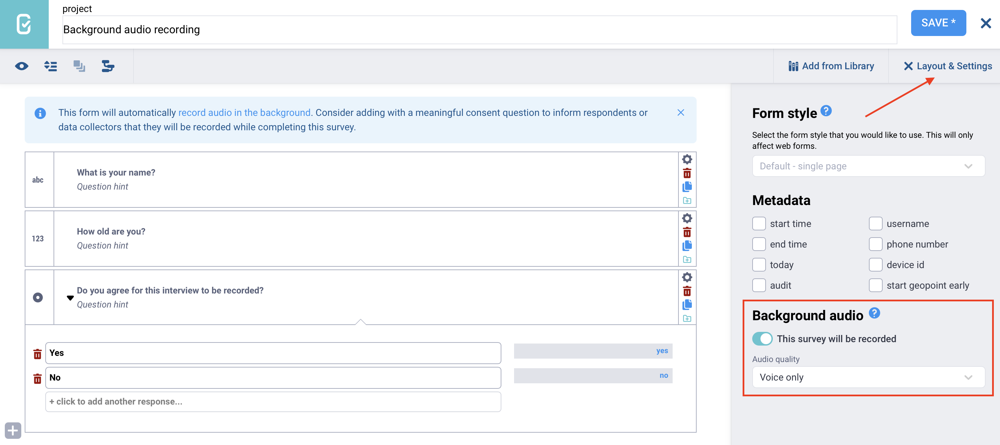
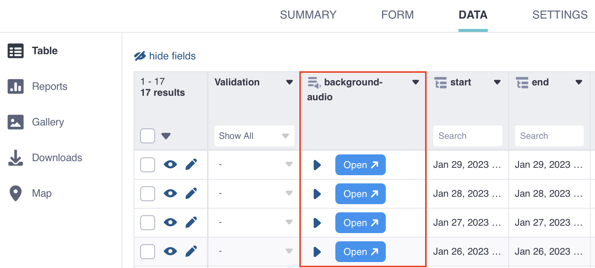

# Recording interviews with background audio recording
**Last updated:** <a href="https://github.com/kobotoolbox/docs/blob/9bfb1ff3173b1066ec53b03456936b53cdd1a068/source/recording-interviews.md" class="reference">28 Jan 2026</a>

Background audio recording **captures an entire interview in the background** while a form is open. The recording is stored as audio data within form submissions.

This feature enhances qualitative research by preserving interviews in full detail. Researchers can revisit recordings to capture nuance, validate findings, find exact quotes, and strengthen their analysis.

Background audio recording also supports data quality assurance. Supervisors and project managers can review recordings to understand how enumerators conducted interviews, monitor adherence to survey protocols, and keep backup copies of conversations used for transcription.

This article covers the following topics:
- Enabling background audio recording in the Formbuilder
- Implementing background audio recording in XLSForm
- Configuring audio quality
- Data collection with background audio recordings
- Managing background audio data

<strong>Note:</strong> To learn about collecting short audio responses instead of a full background recording, see <a href="https://support.kobotoolbox.org/photo_audio_video_file.html">Media questions in KoboToolbox</a>. 

## Enabling background audio recording in the Formbuilder

If you are designing your survey in the Formbuilder, follow these steps to enable background audio recording:

1. In the **FORM** page, click <i class="k-icon-edit"></i> **Edit** to open the Formbuilder. 
2. On the left hand side, click <i class="k-icon-close"></i> **Layout & Settings.**
3. In the **Background audio** section, click “Enable audio recording in the background.” 
    - Once enabled, the button text will change to “This survey will be recorded.”
4. If needed, change the audio quality in the **Audio quality** dropdown menu. 
    - For an overview of audio quality settings, see [Configuring audio quality](#configuring-audio-quality). **Voice only** is the default and lowest audio quality.

When recording background audio, consider adding a note to inform respondents or data collectors that the survey will be recorded.

## Implementing background audio recording in XLSForm

If you are designing your survey in [XLSForm](https://support.kobotoolbox.org/getting_started_xlsform.html), follow these steps to enable background audio recording:
1. In the `type` column of the `survey` worksheet, enter `background-audio`.
2. In the `name` column, enter a short name. This will be the name of the variable that contains the resulting audio file.  
3. The `label` is optional for this question, as it is not displayed inside the form.
4. If needed, adjust the audio quality in the `parameters` column. 
    - For an overview of audio quality settings, see [Configuring audio quality](#configuring-audio-quality). `voice-only` is the default and lowest audio quality.
      
**survey worksheet**

| type             | name       | label | parameters       |
|:-----------------|:-----------|:------|:----------------|
| background-audio | recording  |       | quality=normal  |
| survey | 

## Configuring audio quality

Audio quality affects the size of the file that is stored on the server. Users of the [Community Plan](https://www.kobotoolbox.org/pricing/) are limited to 1GB of free file storage. Therefore, it is advisable to manage the file sizes of the audio files you collect by choosing an appropriate quality setting. The table below provides an overview of audio quality settings and their corresponding file sizes.

| Quality      | XLSForm parameters   | Extension | Encoding | Bit rate    | Sample rate | File size       |
|:------------ |:------------------ |:---------|:--------|:-----------|:------------|:---------------|
| Normal       | quality=normal      | .m4a     | AAC     | 64 kbps    | 32 kHz      | ~ 30 MB/hour    |
| Low          | quality=low         | .m4a     | AAC     | 24 kbps    | 32 kHz      | ~ 11 MB/hour    |
| Voice only   | quality=voice-only  | .amr     | AMR     | 12.2 kbps  | 8 kHz       | ~ 5 MB/hour     |

The default **Voice only** setting is suitable for quiet interview settings. For recordings with multiple speakers or some background noise, the **Low** quality setting is more appropriate. The **Normal** setting offers the highest audio quality but uses the most storage space.

## Data collection with background audio recordings 

Background audio can be recorded using the [KoboCollect Android app](https://support.kobotoolbox.org/kobocollect_on_android_latest.html) as well as in [Enketo web forms](https://support.kobotoolbox.org/enketo.html).

In Enketo, a disclaimer will appear at the beginning of the form informing respondents that background audio is being recorded. In both Enketo and KoboCollect, a microphone icon showing the recording's duration will be visible at the top of the form while background audio is actively recording.

<strong>Note:</strong> When background audio recording is active on a form <strong>in KoboCollect</strong>, <a href="https://support.kobotoolbox.org/photo_audio_video_file.html">Audio question types</a> are deactivated, as it is not possible to record audio using both features simultaneously in KoboCollect. 

### Ethical considerations

When collecting data, it is essential to obtain informed consent from respondents before recording background audio. Users should carefully consider the ethical implications of audio recordings and ensure that participants are aware of how their data will be used, stored, and shared. Kobo strongly encourages compliance with all applicable data protection and privacy regulations in the jurisdiction where data collection takes place.

## Managing background audio data

Background audio recordings are treated very similarly to audio files collected in the survey. This means you can: 
- View background audio recordings in the data table, under **DATA > Table.**
- [Transcribe, translate](https://support.kobotoolbox.org/transcription-translation.html), and [analyze](https://support.kobotoolbox.org/qualitative_analysis.html) background audio files.
- [Delete](https://support.kobotoolbox.org/managing_media_responses.html#deleting-media-files) background audio files.
- [Download background audio files](https://support.kobotoolbox.org/managing_media_responses.html#downloading-media-files) from the data table or as a ZIP file under **DATA > Downloads > Media Attachments (ZIP).**

## Troubleshooting

  
<strong>Background audio recording not working</strong>

  Your device must have a built-in audio recorder for this feature to work. If your device does not include one, you can download <a href="https://play.google.com/store/apps/details?id=com.media.bestrecorder.audiorecorder&pcampaignid=web_share">Voice Recorder</a> from the Google Play Store.

 

  
<strong>Not enough storage on device</strong>

  Before starting data collection, make sure your device has enough storage space to save background audio recordings. 

 

  
<strong>Editing submissions with background audio recording</strong>

  If you edit a form that includes background audio from the KoboToolbox platform, the initial recording will not be replaced. A message at the top of the form will say “This submission has a background audio recording.”

 

  
<strong>Forms with background audio recording saved as drafts</strong>

  If a form with background audio recording is saved as a draft in <strong>Enketo</strong>, only the initial recording will be retained. The recording will not resume or be replaced when the draft form is reopened.   
If a form with background audio recording is saved as a draft in <strong>KoboCollect</strong>, recording will resume when the draft form is reopened. Both recordings will be stored together in a single file.

 

  
<strong>Running out of KoboToolbox storage</strong>

  Background audio files can be large and may cause your account to exceed its storage limit (1 GB for free accounts). If you need more space, you can <a href="https://www.kobotoolbox.org/pricing/">upgrade your plan</a> or purchase a <strong>storage add-on</strong> in <strong>Account Settings > Add-ons.</strong>

 

  
<strong>Unable to download large audio files</strong>

  If large or long audio files fail to download as Media Attachments (ZIP), see <a href="https://support.kobotoolbox.org/managing_media_responses.html#downloading-media-files">Downloading media files</a> for guidance on retrieving large media files.

