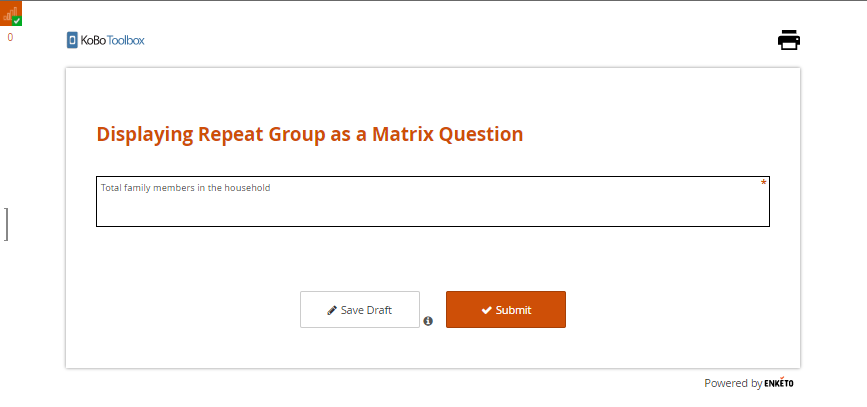
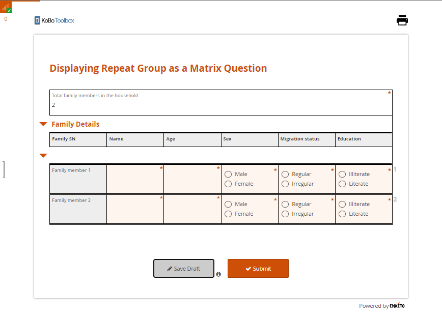

# Designing Repeat Group as a Matrix Question

While collecting data, the variables (questions) in a repeat group are displayed vertically. In certain cases, you may wish to have them in a horizontal view, as displayed in a matrix question. Achieving this directly through the Formbuilder is not yet possible. However, the same can be done through an XLSForm, by using the `Grid Theme` layout setting. This support article illustrates how to design a repeat group as a matrix question.

## Prerequisite reading:

To better understand this article, it is recommended that you review the following documents before reading further:

**Support Article:** [Grouping Questions and Repeating Groups](https://support.kobotoolbox.org/group_repeat.html)  
**Support Article:** [Question Matrix Response Type](https://support.kobotoolbox.org/matrix_response.html)  
**XLSForm Site:** [XLSForm.org](https://xlsform.org/en/)  
**Enketo Blog:** [Grid Theme](https://blog.enketo.org/gorgeous-grid/)

## Designing your survey tab:

The first sheet your XLSForm requires is the *survey* tab. This sheet will require eight column headers (*type*, *name*, *label*, *required*, *relevant*, *appearance*, *repeat_count*, *calculation*). 

| type                 | name  | label                                                  | required | relevant | appearance            | repeat_count | calculation   |
|----------------------|-------|--------------------------------------------------------|----------|----------|-----------------------|--------------|---------------|
| integer              | FM    | Total family members in the household                  | TRUE     |          |                       |              |               |
| begin_group          | FD    | Family Details                                         |          | ${FM}>0  | w6                    |              |               |
| note                 | FD_N  | Family SN                                              |          |          | w1                    |              |               |
| note                 | FD_C1 | Name                                                   |          |          | w1                    |              |               |
| note                 | FD_C2 | Age                                                    |          |          | w1                    |              |               |
| note                 | FD_C3 | Sex                                                    |          |          | w1                    |              |               |
| note                 | FD_C4 | Migration status                                       |          |          | w1                    |              |               |
| note                 | FD_C5 | Education                                              |          |          | w1                    |              |               |
| end_group            |       |                                                        |          |          |                       |              |               |
| begin_repeat         | FI    | Family   Information |          | ${FM}>0  | w6                    | ${FM}        |               |
| calculate            | C1    |                                                        |          |          |                       |              | position (..) |
| note                 | FI_N  | Family member ${C1}                                    |          |          | w1                    |              |               |
| text                 | FI_C1 | Name                 | TRUE     |          | w1 no-label           |              |               |
| integer              | FI_C2 | Age                  | TRUE     |          | w1 no-label           |              |               |
| select_one sex       | FI_C3 | Sex                  | TRUE     |          | w1 horizontal-compact |              |               |
| select_one migration | FI_C4 | Migration   status   | TRUE     |          | w1 horizontal-compact |              |               |
| select_one education | FI_C5 | Education          | TRUE     |          | w1 horizontal-compact |              |               |
| end_repeat           |       |                                                        |          |          |                       |              |               |
| survey               |       |                                                        |          |          |                       |              |               |

*Row 2*, which captures *Total family members in the household* is optional. We are using this question to set the maximum number of times the “Family Information” group is repeated (by the total number of people in the household). If you opt not to have this row, you should also not need to set the *relevant* column and the *repeat_count* column as shown.

*Row 3 to 10*, are here to display the variables as a matrix header.

*Row 11 to 19*, are here to display the repeat group variables as a matrix layout. *Row 12* is here to automatically generate the family members SN for the repeat group.

## Designing your choices tab:

The second sheet your XLSForm requires is the *choices* tab. This sheet will require three column headers (*list_name*, *name*, *label*). 

| list_name | name | label      |
|-----------|------|------------|
| sex       | 1    | Male       |
| sex       | 2    | Female     |
| migration | 1    | Regular    |
| migration | 2    | Irregular  |
| education | 1    | Illiterate |
| education | 2    | Literate   |
| choices   |      |            |

All these column headers are mandatory *(which depends on the question type used in the survey tab)*. 

## Designing your settings tab:

The third sheet your XLSForm requires is the *settings* tab. This sheet will require two column headers (*form_title*, *style*). 

| form_title                                     | style                        |
|------------------------------------------------|------------------------------|
| Displaying Repeat Group as a   Matrix Question | theme-grid no-text-transform |
| settings                                       |                              |

The first column header *(form_title)* is optional (but still good to include it). The second column header *(style)* is mandatory. 

## Data entry screen as seen in Enketo:

*This is the screen you should see when nothing is entered.*

*This is the screen you should see when you are about to fill-up the household details of 2 household members.*

You can access the XLSForm that was used in this article <a download href="./_static/files/repeat_group_as_matrix/repeat_group_as_matrix_question.xls"><b>here</b></a>.

## Troubleshooting:

* The matrix question only works with **Enketo**, also known as **web forms**. It is not supported with `KoboCollect Android App`.
* The matrix table may get distorted if you fail to set the layout to **Grid-theme**. For details, you could also go through our support article **[Using Alternative Enketo Web Form Styles](https://support.kobotoolbox.org/alternative_enketo.html)**.