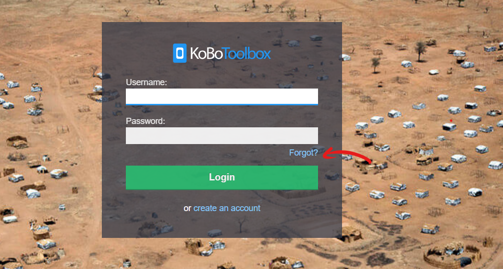

# Resetting Passwords

KoBoToolbox allows you to reset your password in the case where you have forgotten it.

To reset your password

* Go to [kf.kobotoolbox.org](kf.kobotoolbox.org) if you created your account on the **HHI server** (for Researchers, Aid Workers and Everyone Else). If you used the **UN OCHA server** (Unlimited use for Humanitarian Organizations), go to [kobo.humanitarianresponse.info](kobo.humanitarianresponse.info)

* Click **Forgot?** on the login form

* Enter your email address

* Click **Reset Password**

KoBoToolbox sends out password reminder emails immediately after you request to reset it. If you have requested to reset your password and you didn't receive an email with the password reminder link, please try the following:

* Check if our password reset email landed in your spam or junk mail folder, as it might have been placed there by your email provider.
* Check if you created your account with a different email address - simply click on the 'Forgot' link again and enter your alternative email address.
* It might also be that you are requesting to reset your password on the wrong server. Check the URL on your address bar to ensure you are on the server where you had created your account on (whether the HHI server [https://kf.kobotoolbox.org] or the UN OCHA server [https://kobo.humanitarianresponse.info])

If you still have not received the email with the reset link please send an email to [support@kobotoolbox.org](mailto:support@kobotoolbox.org) with your username, the email address you used to sign up, and which server you created your account on.
