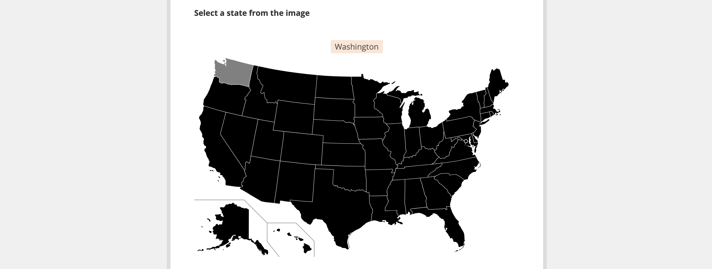

# Selecting options from an image
**Last updated:** <a href="https://github.com/kobotoolbox/docs/blob/e9d3dc39c03678b6ae014a7510bff548f4be3248/source/select_from_image.md" class="reference">21 Mar 2026</a>

Selecting options from an image allows respondents to tap or click directly on **specific areas of an SVG file** instead of choosing from a text list. This feature works in both Enketo web forms and the KoboCollect Android app.

You might use this feature to:

- Select a location from an image of a room or facility
- Select a body part from a diagram of the human body
- Select damaged areas from a photo of a building after a disaster

This article explains how to create a selectable SVG image and configure your XLSForm so respondents can choose options directly from the image.

## Creating your selectable image

To create an image with selectable regions, you must use an **SVG (Scalable Vector Graphics)** file.

 To learn more about SVG files, see <a href="https://developer.mozilla.org/en-US/docs/Web/SVG">SVG documentation</a>. We recommend using <a href="https://inkscape.org/">Inkscape</a>, a free and open source vector graphics editor, for creating and editing SVG files. 

Each selectable area in the image must include an `id` attribute. These `id` values must exactly match the corresponding `name` values in the `choices` sheet of your XLSForm, so they should follow the same [naming conventions](https://support.kobotoolbox.org/option_choices_xls.html#best-practices-for-defining-choice-names).

To create your selectable image file:

1. Create or edit a `.svg` file.
2. Add `id` attributes to each element you want to be selectable.
3. Save the file.

<strong>Note:</strong> In Enketo web forms, only SVG <code>&lt;path&gt;</code> elements are supported as selectable areas. Other SVG shapes, such as rectangles or circles, may not work as expected. KoboCollect supports additional SVG primitives.

## Setting up your XLSForm

To allow respondents to select options from your image in XLSForm:

1. In the `survey` worksheet, add a `select_one` or `select_multiple` question.
2. Add an `appearance` column and enter `image-map`.
3. Add an `image` column and enter the exact name of the SVG file.
4. In the `choices` worksheet, add the list of choices.
    - The `name` column must exactly match the `id` values in your SVG file.

**survey sheet**

| type | name | label | appearance | image |
|:---|:---|:---|:---|:---|
| select_one body | body_part | Which body part hurts the most? | image-map | body.svg |
| survey |

**choices sheet**

| list_name | name | label |
|:---|:---|:---|
| body | leg | Leg |
| body | arm | Arm |
| body | head | Head |
| choices |

## Uploading the SVG file to KoboToolbox

After creating your SVG file and referencing it in your XLSForm, you will need to upload it to your project.

To upload media files:

1. Log in to your KoboToolbox account.
2. Open your project.
3. Go to **SETTINGS > Media.**
4. Upload the SVG file. Ensure the file name matches exactly what is written in the `image` column of your XLSForm.
5. Deploy or redeploy your form to apply the changes.

To learn more about uploading media files, see <a href="https://support.kobotoolbox.org/upload_media.html">Uploading media files to a project</a>.

