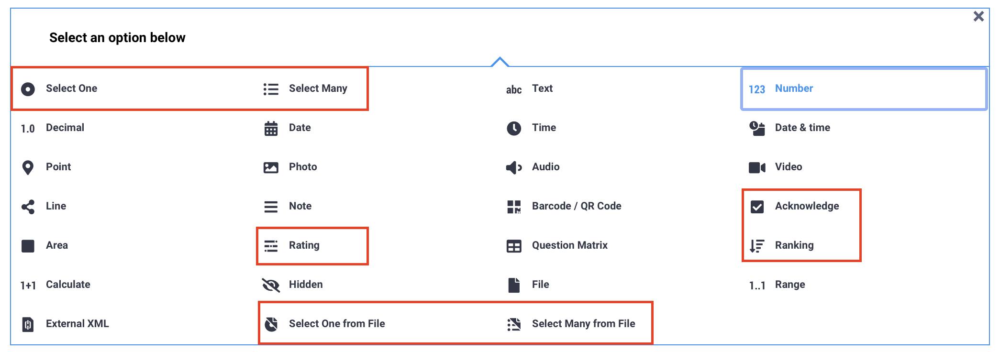
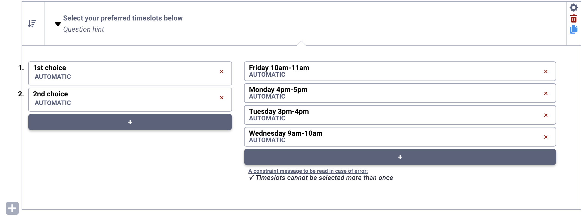
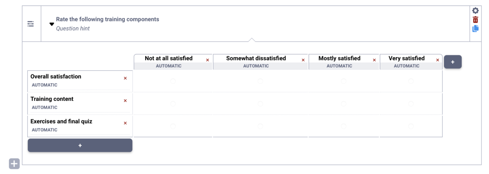
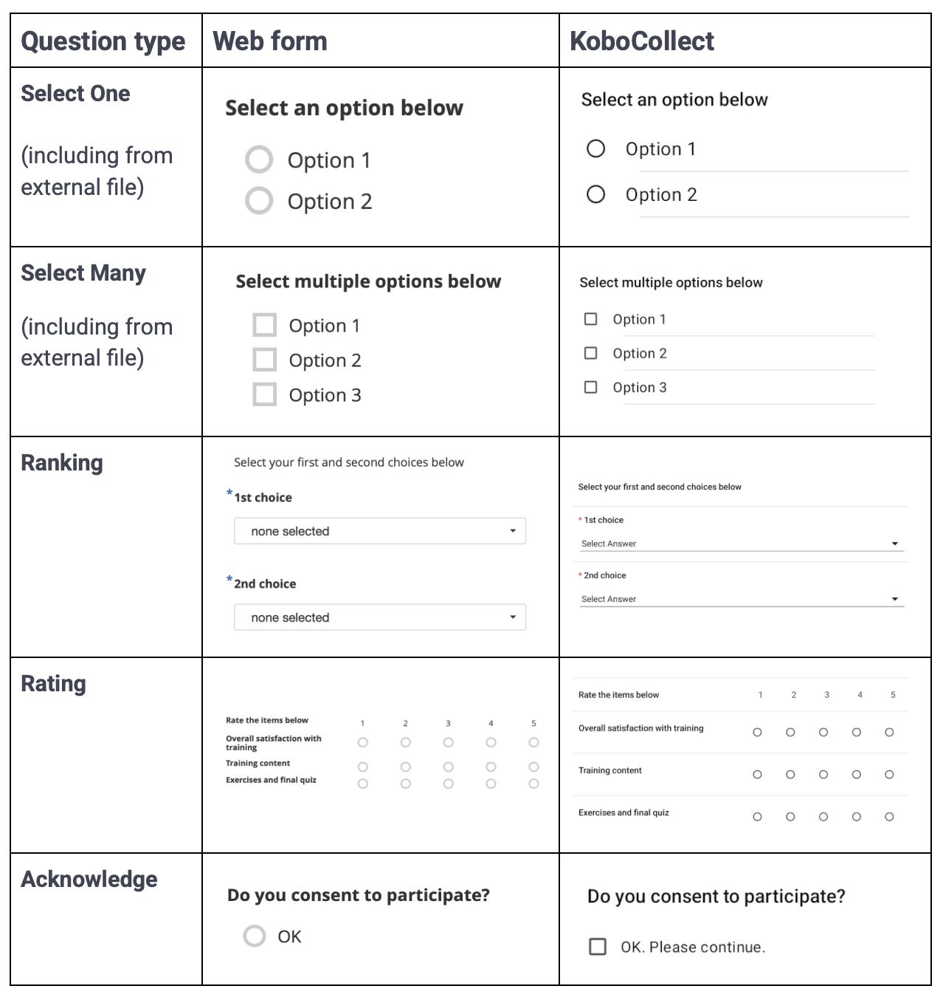
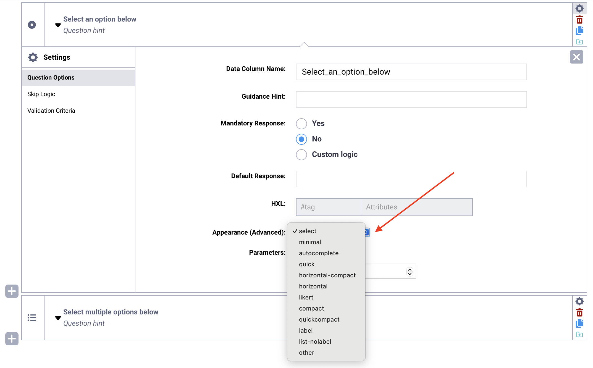
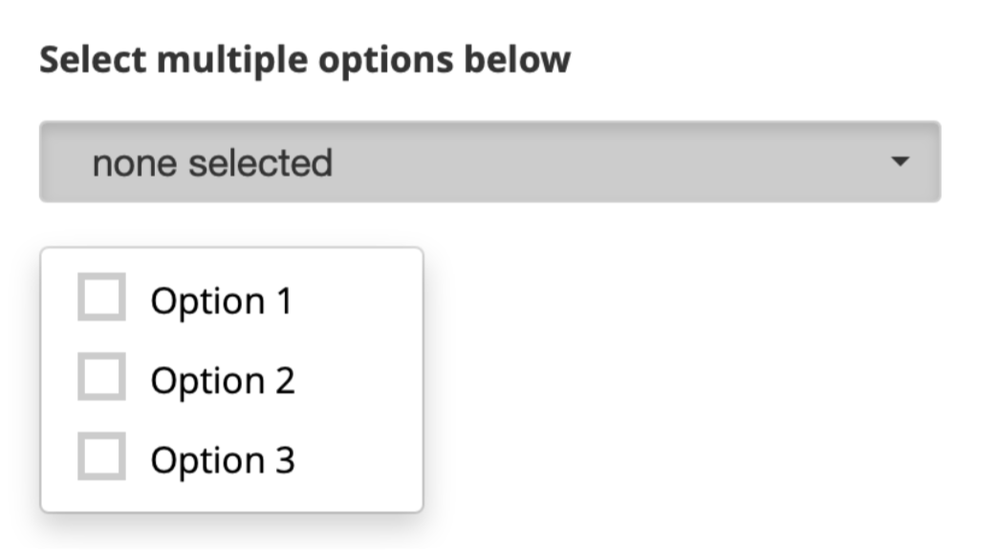
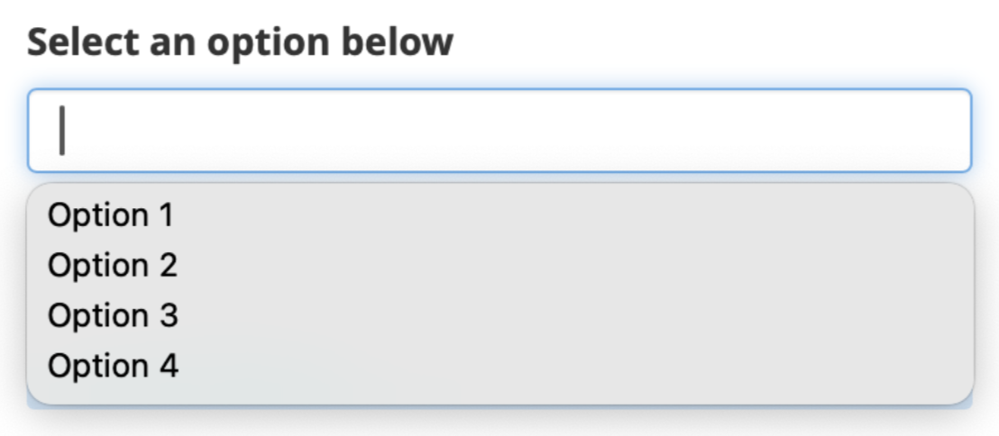
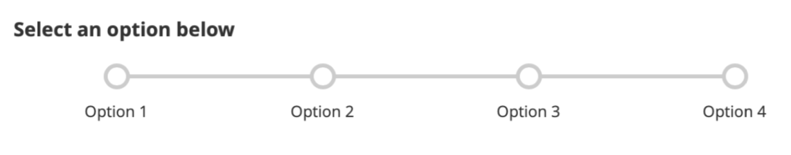
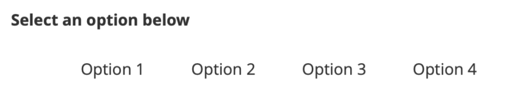

# Select questions in KoboToolbox
**Last updated:** <a href="https://github.com/kobotoolbox/docs/blob/020b9ff9826ed0f5e225a139ad24a71c56930441/source/select_one_and_select_many.md" class="reference">4 Jan 2026</a>

Select questions allow respondents to **choose from predefined response options.** They are useful for standardizing answers, improving data quality, and making data easier to clean, analyze, and compare. 

Depending on your needs, select questions can be used to choose one or multiple options, acknowledge a statement, rank items in order, rate items using a common scale, or select options from an external file.

This article lists the different select questions available in KoboToolbox, explains how to add select questions in the Formbuilder, describes the available appearance options, and outlines key considerations when using these question types.

## Select question types

The following question types are available in the Formbuilder for respondents to select options:

| Question type | Description |
|:---|:---|
| <i class="k-icon-qt-select-one"></i> Select One | Allows respondents to select one option from a predefined list. |
| <i class="k-icon-qt-select-many"></i> Select Many | Allows respondents to select multiple options from a predefined list. |
| <i class="k-icon-qt-ranking"></i> Ranking | Allows respondents to rank items or options in a choice list. |
| <i class="k-icon-qt-rating"></i> Rating | Allows respondents to evaluate multiple items using the same response scale. |
| <i class="k-icon-qt-acknowledge"></i> Acknowledge | Allows respondents to acknowledge their agreement with a statement. |
| <i class="k-icon-qt-select-one-from-file"></i> Select One from File | Allows respondents to select one option from a predefined list, stored in an external CSV file. |
| <i class="k-icon-qt-select-many-from-file"></i> Select Many from File | Allows respondents to select multiple options from a predefined list, stored in an external CSV file. |

 To learn more about Select One from File and Select Many from File question types, see <a href="https://support.kobotoolbox.org/external_file.html">Selecting options from external files in the Formbuilder</a>.

## Adding a select question in the Formbuilder

To add a select question to your form:

1. Click the <i class="k-icon-plus"></i> button. 
2. Enter your question label.
3. Click **+ ADD QUESTION.**
4. Choose the appropriate question type. 
6. Enter the option choices for the select question.

    To learn more about managing options choices for select questions in the Formbuilder, see <a href="https://support.kobotoolbox.org/question_types.html#adding-option-choices">Adding questions in the Formbuilder</a>.

### Setting up Ranking questions

**Ranking** questions are used to ask respondents to place items in order of preference, importance, or sequence.

After adding a **Ranking** question in the Formbuilder, configure the following components:

1. **Question label**: The overall instruction for the ranking task, such as “Select your first and second choices in order of preference.”
2. **Number of ranks**: By default, the question includes only a 1st choice. Click the <i class="k-icon-plus"></i> sign below the first rank to add additional ranks. You can also edit the label for each rank.
3. **Items to rank**: The list of items respondents will rank. Click the <i class="k-icon-plus"></i> sign below the last item to add more options.
4. **Constraint message**: Each item can be selected only once. If a respondent selects the same item more than once, an error message appears stating “Items cannot be selected more than once.” You can edit this default error message below the items list.

<strong>Note:</strong> You can include more items than ranks, but the number of ranks cannot exceed the number of items.

### Setting up Rating questions 

**Rating** questions are used when you have multiple **Select One** questions that share the same set of response options, such as a scale from “Strongly disagree” to “Strongly agree.”

After adding a **Rating** question in the Formbuilder, configure the following components:

- **Question label**: The overall instruction for the question set, such as “Rate the following on a scale of 1 to 5.”
- **Rows**: The individual items, statements, or questions that respondents will rate. Click on the <i class="k-icon-plus"></i> sign at the bottom of the table to add rows.
- **Columns**: The response options that make up the rating scale, such as “Strongly disagree” to “Strongly agree.” Click on the <i class="k-icon-plus"></i> sign to the right of the table to add columns.

## Appearances of select questions

The table below displays the default appearances for select type questions:

<strong>Note:</strong> The <strong>Ranking</strong> and <strong>Rating</strong> question types are available only in the KoboToolbox Formbuilder. If you are building forms using XLSForm, the appearance and behavior of the <code>rank</code> question type will differ from the Formbuilder version. To create a <strong>Rating</strong> question in XLSForm, add select questions with the <code>label</code> and <code>list-nolabel</code> <a href="https://support.kobotoolbox.org/appearances_xls.html#select-question-types">appearances</a>.

### Advanced appearances

You can apply advanced appearances to **Select One, Select Many, Select One from File** and **Select Many from File** questions to modify how they display and behave in your form. 

To add an advanced appearance:

1. Open the question settings by clicking <i class="k-icon-settings"></i> **Settings** to the right of the question. This will take you to the **Question Options** tab.
2. In **Appearance (Advanced)**, choose the desired appearance. 
    - If the appearance is not listed, select **other** and type the name of the appearance in the text box, exactly as written below.

The following advanced appearances are available for **Select One, Select Many, Select One from File** and **Select Many from File** questions:

| Appearance | Description | Compatibility |
|:---|:---|:---|
| `minimal` | Displays choices in a drop-down menu.  | Enketo and KoboCollect |
| `autocomplete` | Adds a search bar at the top of the option list.   | Enketo and KoboCollect (combine with `minimal` appearance) |
| `likert` | Displays answer choices as a Likert scale (**Select One** only).  | Enketo and KoboCollect |
| `compact` | Displays choices side-by-side with minimal padding and without visible choice boxes. The number of choices per row may vary based on the length of each option label.   | Enketo and KoboCollect |
| `quick` | Auto-advances the form to the next question after an answer is selected (**Select One** only).   | KoboCollect only |
| `quickcompact` | Displays choices side-by-side with minimal padding and without choice boxes, and auto-advances to the next question after an answer is selected (**Select One** only).   | KoboCollect only |
| `horizontal` | Displays choices in evenly sized columns, with the same number of choices in each row.   | Enketo only. Use `columns` instead for compatibility with KoboCollect. |
| `columns` (other) | Displays choices in evenly sized columns, with the same number of choices in each row.   | Enketo and KoboCollect. |
| `horizontal-compact` | Displays choices in columns with visible choice boxes. The number of columns may vary by row, depending on the length of each option label. | Enketo only. Use `columns-pack` instead for compatibility with KoboCollect. |
| `columns-pack` (other) | Displays choices in columns with visible choice boxes. The number of columns may vary by row, depending on the length of each option label. | Enketo and KoboCollect |
| `columns-n` (other) | Displays available choices in the specified number (n) of columns. | Enketo and KoboCollect |
| `label` | Displays choice labels without the choice boxes. | Enketo and KoboCollect |
| `list-nolabel` | Displays the answer choice boxes without the labels. | Enketo and KoboCollect |

## Best practices for using select questions

The following guidance highlights important considerations when using select questions in your form.

### Acknowledge questions

The **Acknowledge** question type allows respondents to indicate agreement with a statement using a single checkbox. However, this question does not distinguish between respondents who actively disagree and those who skip the question, which may affect data quality. In addition, the default label of the Acknowledge choice cannot be edited.

If you need more flexibility in labeling response options, or if you want to include a clear “No” option, use a **Select One** question instead.

### Defining XML values for choices

It is strongly recommended to define XML values for all choices in select questions before deploying your form. XML values ensure consistency in your dataset and prevent issues during export and analysis.

 To learn more about defining XML values, see <a href=https://support.kobotoolbox.org/question_types.html#setting-xml-values-for-option-choices">Adding questions in the Formbuilder</a>.

### Adding an “Other, specify” response

If predefined choices do not cover all possible responses, you can add an “Other” option followed by a [Text question](https://support.kobotoolbox.org/text_questions.html) that allows respondents to specify their answer. Use skip logic to display the Text question only when the “Other” option is selected.

    For more information, see <a href="https://support.kobotoolbox.org/skip_logic.html#">Adding skip logic in the Formbuilder</a>.

### Randomizing option choices

For **Select One** and **Select Many** questions, you can randomize the order of option choices by going to the question **Settings > Question Options > Parameters** and selecting **randomize.**

You can also set a **seed**, which ensures that the randomization follows a consistent pattern. Using a seed allows the same randomized order to be reproduced when needed, such as when reviewing submissions or testing the form, while still reducing order bias during data collection.

    To learn more about question options, see <a href="https://support.kobotoolbox.org/question_options.html">Question options in the Formbuilder</a>.

### Exporting options for Select Many questions

When exporting data for **Select Many** questions, you can choose how responses are structured in your dataset. You can choose to:

- Export all selected options in a single column
- Export each option as a separate column
- Export both formats

    For more information, see <a href="https://support.kobotoolbox.org/advanced_export.html#export-options-for-multiple-select-questions">Advanced options for exporting data</a>.

