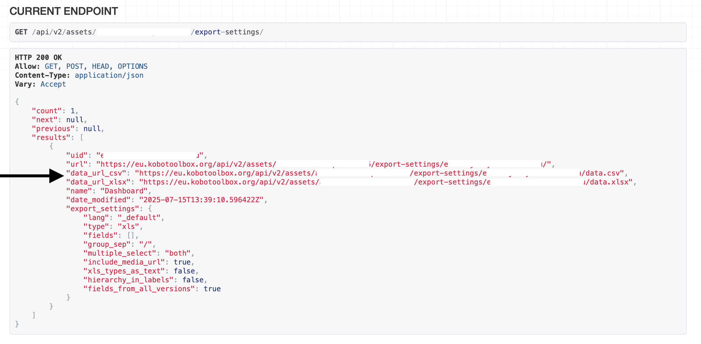

# Using the API for synchronous exports
**Last updated:** <a href="https://github.com/kobotoolbox/docs/blob/c8c238efa59b04f403f13c150b018e1807c66d5c/source/synchronous_exports.md" class="reference">28 Oct 2025</a>

<a href="es/synchronous_exports.html">Leer en español</a> | <a href="fr/synchronous_exports.html">Lire en français</a> | <a href="ar/synchronous_exports.html">اقرأ باللغة العربية</a>

KoboToolbox offers two primary methods for accessing your data: asynchronous and synchronous exports. The standard asynchronous method involves [manually downloading data files](https://support.kobotoolbox.org/export_download.html) containing all submissions up to the time of download. In contrast, synchronous exports enable automatic integration of your KoboToolbox data with external applications such as Microsoft Power BI, Excel, or Google Sheets.

With synchronous exports, your data updates automatically as new submissions are received, eliminating the need for manual refreshing. This method provides a CSV or XLSX file, configured with your predefined export settings, which can include question labels, languages, filters, and repeat group data. 

    <strong>Note:</strong> This article focuses on synchronous exports, which is one of two primary ways to use the KoboToolbox API. The other is the JSON API, designed for custom scripts and real-time automations, delivering raw, record-by-record JSON data. Unlike synchronous exports, the JSON API does not include advanced export features such as question labels or support for multiple languages.

This article covers the following steps:

- Generating a named export
- Retrieving the synchronous export link
- Connecting your data to an external application & authentication
  
## Generating a named export

To generate synchronous exports, you must first create a named export for your project by following these steps:

1. In your KoboToolbox project, navigate to the **DATA > Downloads** tab.
2. Adjust the [export settings](https://support.kobotoolbox.org/export_download.html) as needed. 
3. Click **Advanced options** to [customize the data](https://support.kobotoolbox.org/advanced_export.html) for export.
4. Choose **Save selection as…** and provide a name for your export.
5. Click **Export** to save these settings.

## Retrieving the synchronous export link

To retrieve the synchronous export link, you will need the following:

- **Project asset UID:** A unique ID for each KoboToolbox project, found in the project's URL.
- **Server URL:** The URL of the server you are using (`kf.kobotoolbox.org` for the Global Server,  `eu.kobotoolbox.org` for the European Union Server, or `[your organization].kobotoolbox.org` for private servers).

    For more information about retrieving the server URL and project asset UID, see <a href="https://support.kobotoolbox.org/api.html">Getting started with the API</a>.

To retrieve the export link, follow these steps:

1. Open a new browser tab.
2. Replace your **server URL** and **project asset UID** in the following URL: `https://[server_url]/api/v2/assets/[project_asset_uid]/export-settings/`.
3. Open the webpage corresponding to the modified URL.
4. Scroll to the **CURRENT ENDPOINT** section.
5. Find the export setting that matches the named export you created in the first step.
6. Locate the `data_url_csv` and `data_url_xlsx` links, which are your project's synchronous export links.
7. Copy the link that best suits your needs (CSV or XLSX file).

    <strong>Note:</strong> Repeat groups are exported as separate sheets in Excel files and are not included in CSV exports. If your project contains repeat groups, use the <code>data_url_xlsx</code> link.

## Connecting your data to an external application

After retrieving the synchronous export link, you can connect your data to your preferred external application. The method for integrating the synchronous export link will vary by application.

    To learn how to connect your data to Power BI to create custom dashboards, see <a href="https://support.kobotoolbox.org/pulling_data_into_powerbi.html">Connecting KoboToolbox to Power BI</a>. 
      
    To learn how to connect your data to Microsoft Excel, see <a href="https://support.kobotoolbox.org/pulling_data_into_excelquery.html">Connecting KoboToolbox to Microsoft Excel</a>.

### Authentication

Many external applications can connect to your KoboToolbox data. However, not all support **authenticated requests**, which are requests that carry credentials (e.g., the API key or username and password) so the server can verify the caller’s identity. If the external application does not support authenticated requests, it will only be able to reach resources that have been made **publicly accessible** through an anonymous export link.

To connect your project without authentication (e.g., to Google Sheets), you will need to ensure the "Anyone can view submissions made to this form" setting is checked in **SETTINGS > Sharing**.

    For more information about project sharing, see <a href="https://support.kobotoolbox.org/project_sharing_settings.html">Sharing projects with project-level settings</a>.

For projects with sensitive or private data, the "Anyone can view submissions made to this form" option should remain unchecked. In these cases, consider using only applications that support authenticated requests.

When using applications that support authenticated requests, such as Power BI, you will be asked for basic authentication with your username and password or for a token (also called API Key) to access the data. Your API Key is located in your **ACCOUNT SETTINGS** under the **Security** tab.

    For more information about the API Key, see <a href="https://support.kobotoolbox.org/api.html">Getting started with the API</a>.

## Limitations

To maintain server reliability, synchronous exports have the following limitations:

- **Data refresh interval:** Data in synchronous exports update every 5 minutes. Export requests made within this 5-minute window will not include new submission data received within the 5-minute interval.
- **Export completion time:** Exports must complete within 120 seconds. Projects with a large number of submissions or questions may fail. To avoid this, add a query constraint in the export settings to limit submissions or filter out unnecessary questions. Refer to this [Community Forum post](https://community.kobotoolbox.org/t/how-to-download-data-between-two-dates-from-date-to-date/25569/4) for guidance.

