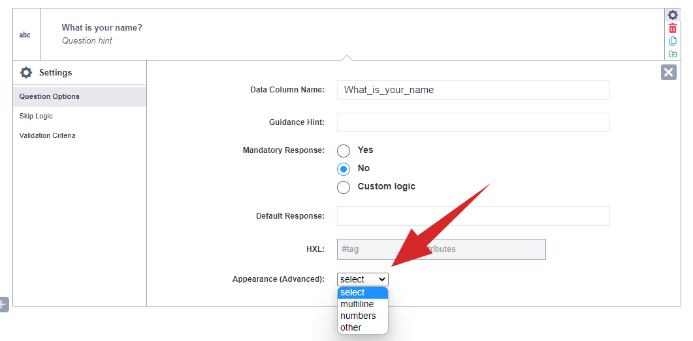
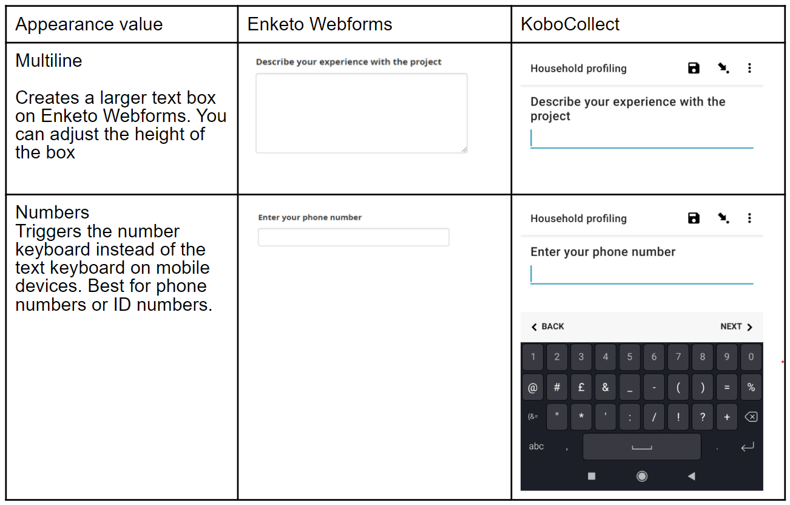

# Text and Note question types

The "Text" question type is best used for questions that require undefined or
open-ended responses, such as names, feedback or descriptions.

Notes do not allow for any kind of response, instead they can be used to add
instructions, or any additional information to make the survey clearer or easier
to navigate. For instance, you can use a 'Note' question type to inform the
respondent or enumerator about what the next section of questions contains,
provide background context for why the survey is being done,
[displaying various kinds of media](media.md), or
[displaying the results of hidden calculations](responses_inside_question.md).

## How to set them up

Setting up text or note questions is very similar:

-   In the formbuilder, click the <i class="k-icon k-icon-plus"></i> button to
    add a new question.
-   Type the question text. For example, What is your name?. Then click Add
    Question (or press Enter).
-   Choose the question type ("Text" or "Note")

## Appearance in web forms and KoboCollect

### Default appearance

  The default text box in Enketo Webform accepts only one line of text. However,
  in KoboCollect, the text field expands as you type. You can also add line
  breaks to form paragraphs

### Advanced appearances for "Text" questions

You can change the appearance of "Text" questions under the Question options
page of the Question settings.

## Considerations when using "Text" questions

For the sake of data quality, it is advisable to use
["Select one" or "Select many" question types](select_one_and_select_many.md)
when you can easily predefine a list of the text responses. Limiting responses
to a list facilitates later data processing and analysis.

Additionally, it ensures that you avoid spelling mistakes resulting in multiple
versions of the same response. As a result, your data cleaning and analysis
becomes much more manageable.

List of responses in "Select one" and "Select many" questions can also include
an option for "other," which you can set up to require a user to fill in the
other response in a separate "Text" question to capture responses that are not
on the list as outlined in the support article
[User-Specified "Other" Responses for Multiple-Choice Questions](user_specified_other.md).

The use of the "Text" question type must be limited to genuinely open-ended
questions where you can not easily per-define a list of responses.

## "Text" questions in "skip", "validation", and "required" logic

When you define a question as "Text" type, it is open-ended. This means
respondents or enumerators can type in any answer. Although this makes "skip",
"validations" and "required" logic a bit challenging, it is still possible to
implement them using what is known as "Regular Expressions" or RegEx in short.

With RegEx, you can implement validation logic, such as limiting the length of
text responses or only allowing responses that are in capital letters. It is
then also possible to make a question required when a preceding text question
contains a particular word or when it is of a certain length.

To learn more about implementing RegEx,
[read the support article "Restricting Text Responses With Regular Expressions"](restrict_responses.md)
