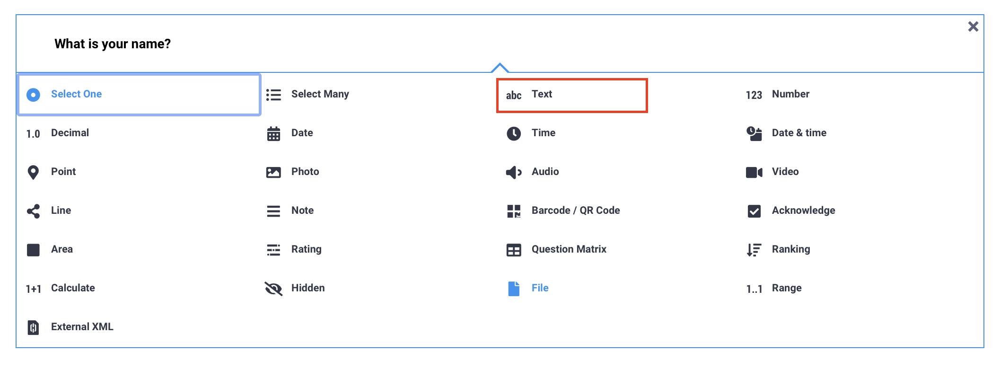
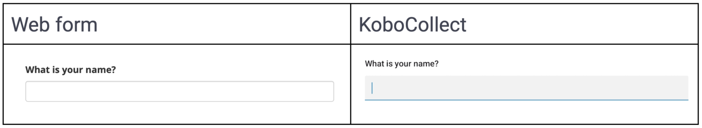
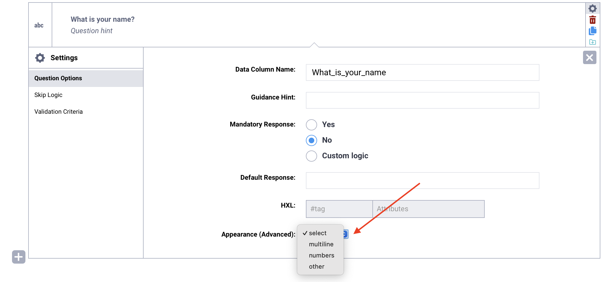
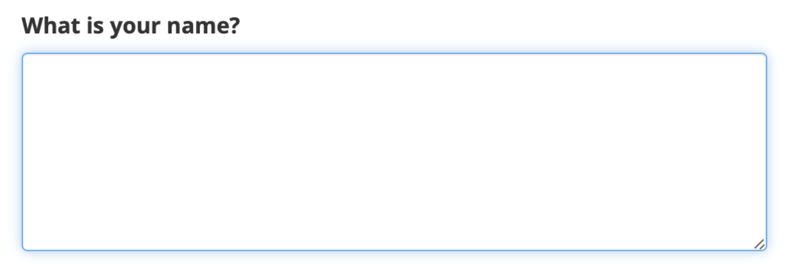
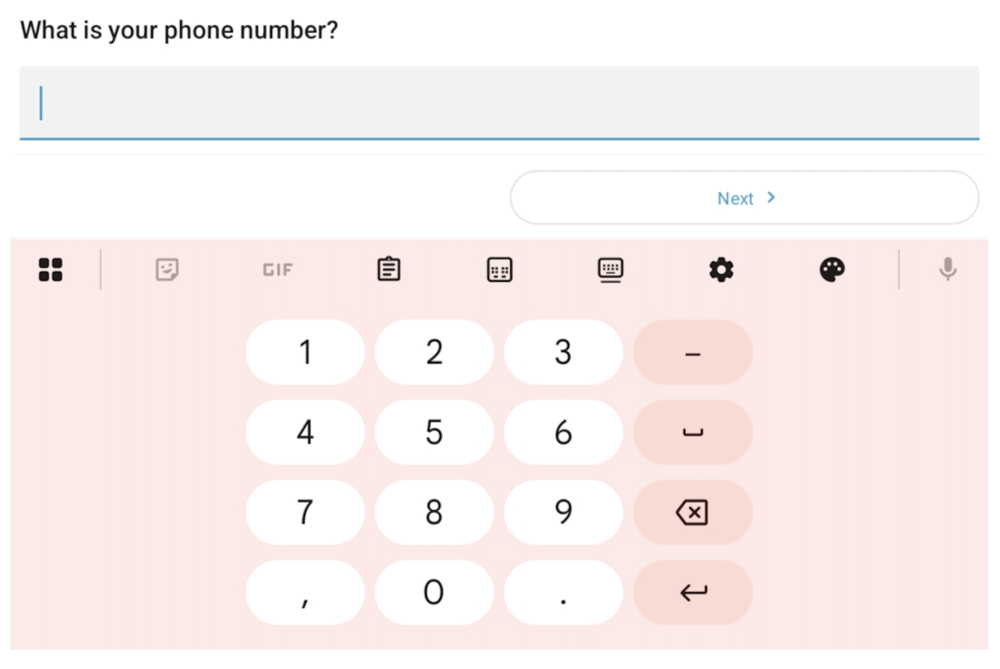

# Text questions in KoboToolbox
**Last updated:** <a href="https://github.com/kobotoolbox/docs/blob/6f05aaa00b0eaf39e8ec1db4a6529a491fb1c551/source/text_questions.md" class="reference">23 Apr 2026</a>

The **Text** question type in KoboToolbox allows respondents to enter open-ended responses in their own words. It is best used when the range of possible answers is not predefined, such as when collecting names, descriptions, explanations, or general feedback. 

This article explains how to add a text question in the Formbuilder, describes the available appearance options, and outlines key considerations to keep in mind when using this question type.

<strong>Note:</strong> Text questions can accept up to 1 MB of text. This is equivalent to approximately 300 pages. 

## Adding a text question in the Formbuilder

To add a text question to your form:

1. Click the <i class="k-icon-plus"></i> button. 
2. Enter your question label.
3. Click **+ ADD QUESTION**. 
4. Choose the <i class="k-icon-qt-text"></i> **Text** question type. 

## Appearances of text questions

By default, text questions appear as a single-line text box.

- In [web forms](https://support.kobotoolbox.org/data_through_webforms.html), the text box remains the same size regardless of how much text is entered. It does not support line breaks.
- In [KoboCollect](https://support.kobotoolbox.org/data_collection_kobocollect.html), the text box expands as you type and supports line breaks, allowing respondents to enter paragraphs.

### Advanced appearances 

You can apply advanced appearances to text questions to modify how they display and behave in your form.

To add an advanced appearance:
1. Open the question settings by clicking <i class="k-icon-settings"></i> **Settings** to the right of the question. This will take you to the **Question Options** tab.
2. In **Appearance (Advanced)**, choose the desired appearance. 
    - If the appearance is not listed, select **other** and type the name of the appearance in the text box, exactly as written below.

The following appearances are available for text questions:

| Appearance | Description | Compatibility |
|:---|:---|:---|
| `multiline` | Displays a larger text box for longer text responses.  | Web forms and KoboCollect |
| `numbers` | Displays a numeric keyboard instead of a text keyboard (e.g., to collect phone numbers).   | KoboCollect only |
| `url` (other) | Displays a clickable URL (web forms) or **Open URL** button (KoboCollect) under the question text and makes the question read-only. Enter the URL in the question's **Default Response** setting.  | Web forms and KoboCollect |
| `masked` (other) | Masks text entered by the respondent (e.g., a password or confidential information).  | KoboCollect only |

<strong>Note:</strong> Use the <code>numbers</code> appearance when entering numeric values that should be stored as text. This is especially important for values that begin with a zero, such as phone numbers or bank account numbers, to ensure the leading zero is preserved.

## Best practices for using text questions

Text questions should be used for open-ended responses, when you cannot provide a predefined list of answer options. If you are able to define a fixed set of responses, consider using **Select One** or **Select Many** question types instead. Limiting responses can improve data quality and make cleaning, processing, and analysis easier.

  For more information, see <a href="https://support.kobotoolbox.org/select_one_and_select_many.html">Select questions in KoboToolbox</a>.

### Using text questions in form logic

Because text responses are open-ended, applying [skip logic](https://support.kobotoolbox.org/skip_logic.html) or [validation criteria](https://support.kobotoolbox.org/validation_criteria.html) can be more complex.

You can use **regular expressions** to validate and control text input. For example, you can:

- Limit the number of characters in a response
- Restrict characters to numbers or capital letters
- Enforce a specific format, such as a unique ID

  For more information, see <a href="https://support.kobotoolbox.org/restrict_responses.html">Using regular expressions in XLSForm</a>.

You can also use **string functions** in calculations to manipulate text values, including to:

- Combine multiple strings of text together
- Convert lowercase characters to uppercase
- Extract a specific part of a string
- Return the character length of a string

  For more information, see <a href="https://support.kobotoolbox.org/functions_xls.html#functions-to-manipulate-strings">Functions to manipulate strings</a>.

