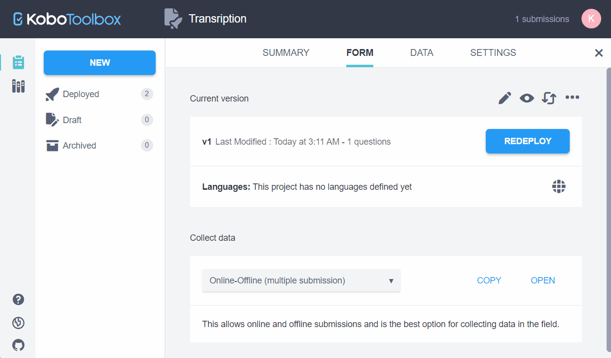
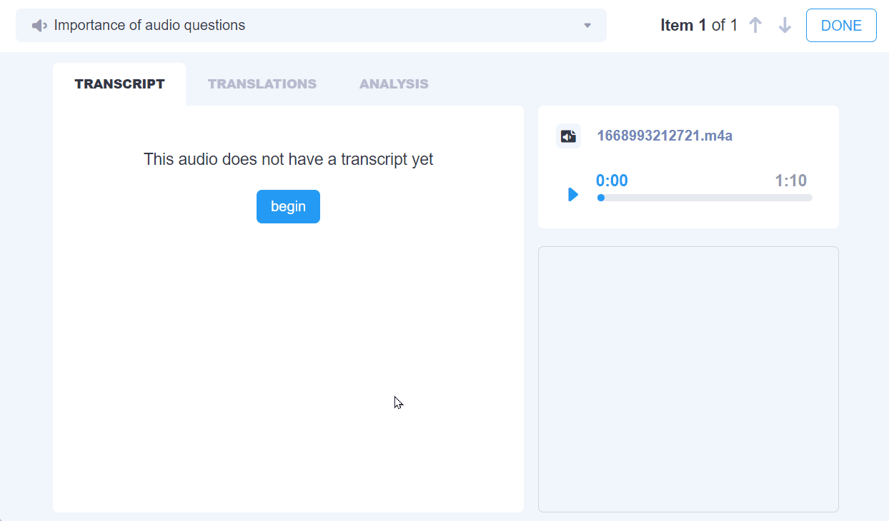
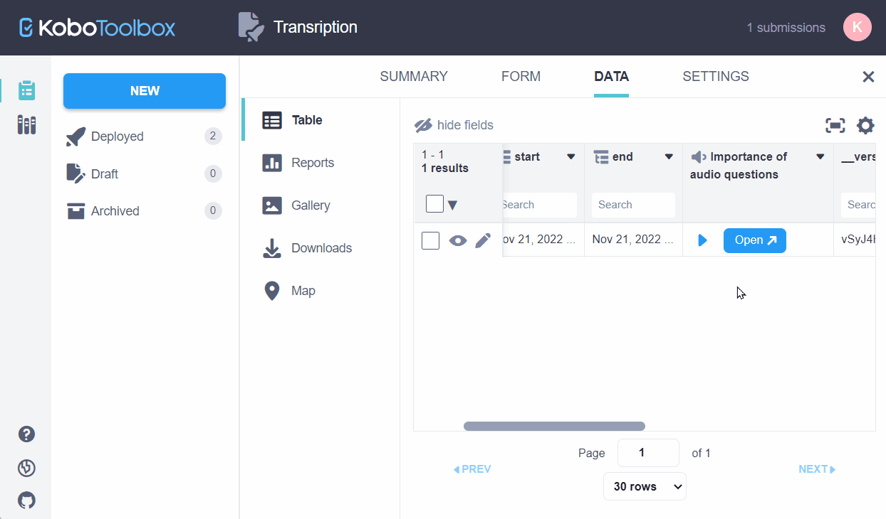

# Transcription
**Last updated:** <a href="https://github.com/kobotoolbox/docs/blob/2fc1b28d7de79dee5350778721bdc37831bf0287/source/transcription-translation.md" class="reference">3 May 2024</a>

KoboToolbox lets you transcribe audio files that you collect in your surveys.
Once a audio has been transcribed, you can then translate the transcripts into
different languages. The original transcript and all translated text is added as
new data columns in the data table and [can be downloaded](export_download.md)
alongside the survey data in the **Downloads** section.

## How to add transcriptions

- Open your project and navigate to **DATA>Table**
- Click the **Open** button next to the audio response you would like to
  transcribe.

- In the _TRANSCRIPT_ tab, click **begin**
- Select the original language of the audio file
- Click **transcribe** and begin your transcript
- While creating the transcript, regularly click the **save** button to ensure
  your work is safely stored
- When complete, click **DONE** or navigate to the next submission

You will be taken back to the data table view where you will now notice that a
new column containing the transcript has been added.

## How to add translations

- Open your project and navigate to **DATA>Table**
- Click the **Open** button next to the audio response you would like to
  translate.
- Click the _TRANSLATIONS_ tab and then **begin**
- Choose the language of the translation
- Click **translate** and begin your translation
- While creating the translation, regularly click the **save** button to ensure
  your work is safely stored
- When the translation is complete, you can add another translation, move to the
  next submission or click **DONE** to navigate back to the data table

  Audio files can only contain a single transcript but each transcript may have
  multiple translations.

## Language list

The new software features integrate ASR and MT capability provided by Google
Cloud Compute, which currently provides 72 languages for transcription
(including 138 regional variants) and 106 languages for translation. You can
also choose from a list of about 7,000 languages for doing manual transcription
or translation. This list was established using the ISO 639-3 comprehensive list
of languages, which is maintained by SIL International (filtered for "living
languages"). For any language that has ASR or MT, you are able to choose between
"manual" and "automatic" transcription or translation; for the remaining
languages only the manual method is available.

If you are unable to find a language in the list, please consider alternative
spellings. For now, all language names use their English names and spelling, for
example, Spanish rather than Español. For other languages, especially those
spoken by a smaller number of speakers, please consider whether there is an
alternative name of the language. For example, the Bura language spoken in
Northern Nigeria is listed as Bura-Pabir, but is also known to some people as
Bourrah, Babir, and other names.

  ASR and MT are not yet available to all users. We are currently looking for beta testers of this new feature who will get access to these automatic transcription and translation features. If you’d like to join our beta testing program, please <a class="reference" href="https://www.kobotoolbox.org/contact/?hs_ticket_category=asr_mt_access">send us a message with your username and server</a>, and what you'd like to use these features for. We are very much interested in feedback about these new features so thanks in advance for testing them!

