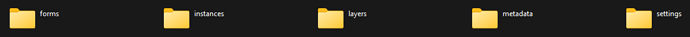
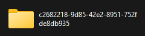
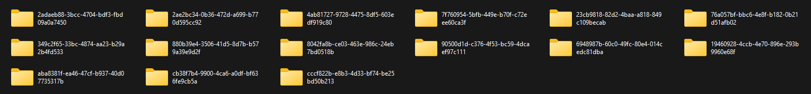

# Transferring forms and data manually from one android device to another
**Last updated:** <a href="https://github.com/kobotoolbox/docs/blob/7ec7ae3ebc83a6295452ada6cabd91aba2740463/source/transferring_forms.md" class="reference">14 Mar 2022</a>

There may be times when you are out in the field without internet connection,
but you still need to upload the latest version of the forms (i.e., the latest
deployed forms in the server) to your device. You might also be unable to upload
form submissions to the server due to a broken screen. In both scenarios, you
will need to manually transfer forms and/or submissions by using another device.
This support article will show you how to do this.

You will need the following items to follow the instructions outlined below:

-   An Android device that has the latest version of the deployed form. (It is
    recommended to get the latest version of the deployed form to the device by
    selecting the **Get Blank Form** from your **KoboCollect Android app**.)
-   An Android device that does not have the latest version of the form (or even
    no form at all).
-   Both the Android devices should have the KoboCollect app already installed.
-   Personal computer (desktop or laptop).
-   USB cable that connects the device and the personal computer.

**Step 1:** Open your personal computer (no internet connection is needed here).
A PC is necessary at this phase to copy the forms and data from one Android
device with the latest version of the form to another.

**Step 2:** Now, connect the Android device (with the latest form and data you
wish to transfer) to the PC using the USB cable.

**Step 3:** Then, follow the path illustrated below to extract the required
folders with the forms and data (depending on which app version is installed):

  In this example, we are connecting Galaxy S10+ (an Android device) to Windows
  11 that is why you are seeing <strong>This PC</strong> and
  <strong>Galaxy S10+</strong>. These may differ if you are using another OS and
  Android device.

-   For KoboCollect Android app version 2021.2 and greater:
    -   If KoboCollect Android app installed in phone memory:
        `This PC\Galaxy S10+\Phone\Android\data\org.koboc.collect.android\files\projects`
    -   If KoboCollect Android app installed in external memory:
        `This PC\Galaxy S10+\sdcard\Android\data\org.koboc.collect.android\files\projects`
-   For KoboCollect Android app (version greater than v1.26.0):
    -   If KoboCollect Android app installed in phone memory:
        `This PC\Galaxy S10+\Phone\Android\data\org.koboc.collect.android\files`
    -   If KoboCollect Android app installed in external memory:
        `This PC\Galaxy S10+\sdcard\Android\data\org.koboc.collect.android\files`
-   For KoboCollect Android app (version less than v1.26.0):
    -   If KoboCollect Android app installed in phone memory:
        `This PC\Galaxy S10+\Phone\odk`
    -   If KoboCollect Android app installed in external memory:
        `This PC\Galaxy S10+\sdcard\odk`

**Step 4:** Once you are in the **projects** folder, **files** folder, or the
**odk** folder _(depending on the KoboCollect Android app version you are
using)_, you should see a folder with a similar name (as shown below):

**Step 5:** Enter this folder and **COPY** all items (as shown in the image
below):

**Step 6:** Now, connect the other Android device that you wish to copy the data
to with the PC using the USB cable.

**Step 7:** Once again, follow the path illustrated below (depending on which
app version is installed):

-   For KoboCollect Android app version 2021.2 and greater:
    -   If KoboCollect Android app installed in phone memory:
        `This PC\Galaxy S10+\Phone\Android\data\org.koboc.collect.android\files\projects`
    -   If KoboCollect Android app installed in external memory:
        `This PC\Galaxy S10+\sdcard\Android\data\org.koboc.collect.android\files\projects`
-   For KoboCollect Android app (version greater than v1.26.0):
    -   If KoboCollect Android app installed in phone memory:
        `This PC\Galaxy S10+\Phone\Android\data\org.koboc.collect.android\files`
    -   If KoboCollect Android app installed in external memory:
        `This PC\Galaxy S10+\sdcard\Android\data\org.koboc.collect.android\files`
-   For KoboCollect Android app (version less than v1.26.0):
    -   If KoboCollect Android app installed in phone memory:
        `This PC\Galaxy S10+\Phone\odk`
    -   If KoboCollect Android app installed in external memory:
        `This PC\Galaxy S10+\sdcard\odk`

**Step 8:** Once you are in the **projects** folder, **files** folder, or the
**odk** folder _(depending on the KoboCollect Android app version you are
using)_, you should see a folder with a similar name (as shown below):

**Step 9:** Enter this folder and **PASTE** the copied items:

Once this is complete, open the **KoboCollect Android app** from the device
(where you have pasted the forms and data). You may now use this device to
continue with data collection and upload the submissions to the server.

  If the forms and data are not visible, you can try restarting your device.
  This might make the forms and data visible in the app.

## Troubleshooting:

-   While connecting the original Android device with the form and data you wish
    to copy to the PC, you may sometimes see not just one folder, but several
    folders (as shown in the image below):
    
    This is confusing and makes it challenging to select the correct project you
    wish to copy. Although time consuming, you will need to go through all the
    folders to identify the correct folder with the project you are looking for.
    You could also delete any other folders that are no longer needed. For
    instance, if a project has been removed from the app, it may still show up
    as a folder when the device is accessed through the computer. If you are
    sure a project is no longer relevant, deleting the folder will remove it
    completely.

-   Similarly, while connecting the Android mobile phone without the latest
    version of the form (or even no form at all) to the PC, you will sometimes
    see not just one folder but several folders (as shown in the image below):
    
    _If the device already has an older form version:_ You will need to identify
    the correct folder that has the project you are looking for. After
    identifying the correct folder, you should paste all the sub-folders which
    you have copied in here.

    _If the device does not have any form version at all:_ If your device does
    not have any form version, but you still see several folders, this could be
    from previous projects that were previously deleted in the app. As described
    earlier, removing a project from the app does not necessarily remove these
    folders. You can delete all unnecessary folders to clean up the space.
    Refresh your view by exiting the folder and returning to it (i.e. project
    folder, or files folder, or the odk folder depending on the KoboCollect
    Android app version you are using). You should now see a single folder. Once
    you have clicked on this folder, you can now paste all of the sub-folders
    that you copied previously (i.e. forms, instances, etc.).

    _If the KoboCollect app is freshly installed in the device:_ If you have
    freshly installed KoboCollect app in your device, you may not see any folder
    without first configuring the server settings, as outlined in the support
    article
    [Data Collection on KoboCollect App (Older Version)](kobocollect-android)
    and
    [Data Collection on KoboCollect App (Latest Version)](kobocollect_on_android_latest).

-   If you have copied the forms and data from one Android device to another and
    are ready to submit the submissions from the device to the server, but still
    have issues submitting them, you can refer to the server configuration
    suggestions that have been outlined in the support articles
    [Data Collection on KoboCollect App (Older Version)](kobocollect-android)
    and
    [Data Collection on KoboCollect App (Latest Version)](kobocollect_on_android_latest).
