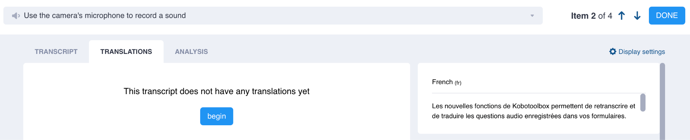
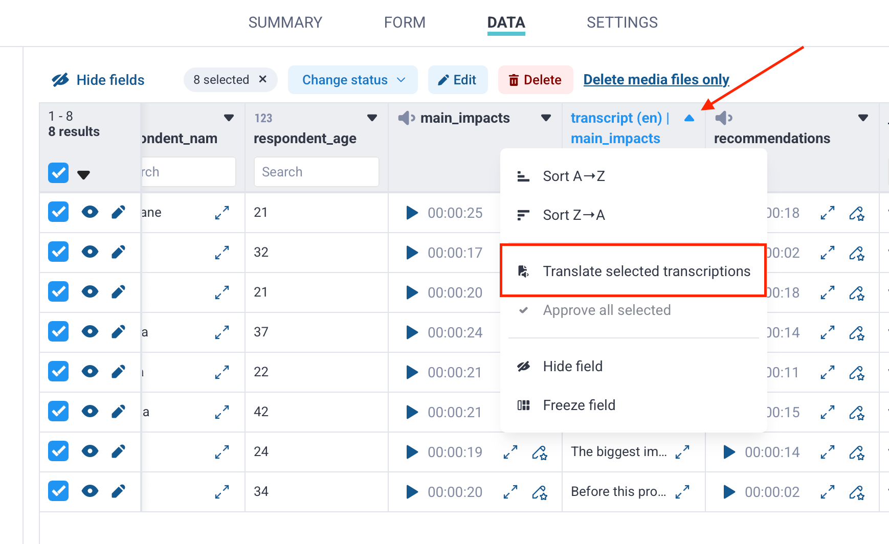

# Translating open-ended responses
**Last updated:** <a href="https://github.com/kobotoolbox/docs/blob/eaaa0a122cb15511b64a66babaa5dad10f6aa7a9/source/transcription-translation.md" class="reference">6 Oct 2026</a>

<iframe src="https://www.youtube.com/embed/Tjr6xHsoOlg?si=qvDHOuFpJXliBKu-" style="width: 100%; aspect-ratio: 16 / 9; height: auto; border: 0;" title="YouTube video player" frameborder="0" allow="accelerometer; autoplay; clipboard-write; encrypted-media; gyroscope; picture-in-picture; web-share" allowfullscreen></iframe>

KoboToolbox’s natural language processing tools include automatic translation using machine translation (MT), which can translate completed audio transcripts and responses to text questions into other languages for review and [analysis](https://support.kobotoolbox.org/qualitative_analysis.html).

You can translate individual **audio transcripts or text responses**, or process multiple submissions in bulk from the data table. This article explains how to translate text manually or automatically, review completed translations, and manage translation usage limits.

<strong>Note:</strong> Automatic translation is not available for all languages. For unsupported languages, you can add translations manually.

## Translating individual transcripts or text responses

To translate open-ended responses, your project must contain either:
- Audio responses with completed transcripts.
- Written responses collected through a **Text question.**

To translate an open-ended response:
1. Open your project and go to **DATA > Table.**
2. Click <i class="ti-outline ti-arrow-up-right"></i> **Open** next to the audio or text response you want to translate.
3. Go to the **TRANSLATIONS** tab and click **begin.**
    - Select the language you want to translate into.
    - If available, select **automatic</strong> to generate the translation automatically. Select **manual** to translate the transcript yourself.
    - If using automatic translation, click **create translation.**
4. Review the completed translation and make any necessary edits.
    - Use the original transcript and audio recording to check the translation as needed.
5. Click **Save.</strong>
6. When finished, click <i class="ti-outline ti-plust"></i> **new translation** to add another translation, use the arrows to move to another submission, or click **DONE** to return to the data table.

When you return to the data table, the translation appears in a new column and can be [downloaded](https://support.kobotoolbox.org/export_download.html) alongside your survey data. You can add multiple translations to the same transcript.

<strong>Note:</strong> Automatically generated translations must be saved to prevent data loss. Navigating away from the page without saving may result in losing the translation.

## Translating responses in bulk

You can automatically translate multiple audio transcripts at once from the data table.

<strong>Note:</strong> Bulk translation is not currently available for text responses, but this feature will be available in a future update.

To translate audio transcripts in bulk:
1. Open your project and go to **DATA > Table.**
2. Select the submissions you want to translate using the checkboxes on the left.
3. In the column containing the transcripts, click the arrow in the column header.
4. Select **Translate selected transcripts.**
5. Search for and select the target language.
6. Click **Create translation.**

Bulk translation runs in the background, so you can continue working in other parts of KoboToolbox while it is processing. Completed translations are added to a new column in the data table and marked as ready for review.

If the selected responses exceed your remaining translation limit, you may need to select fewer rows before starting the bulk translation.

## Reviewing and approving translations

Always review automatically generated translations before using them for analysis.

To review and approve an individual translation generated through bulk translation:
1. Click **Review.**
2. Make any necessary edits.
3. Save the translation and move to the next submission.

To approve multiple translations at once:
1. Select the relevant submissions using the checkboxes on the left.
2. In the translation column, click the arrow in the column header.
3. Click **Approve all selected.**

## Supported languages for translation

KoboToolbox supports machine translation (MT) for supported languages. MT capabilities are provided by Google Cloud Compute, which currently offers automatic translation in 129 languages.

<strong>Note:</strong> Text is sent to the external translation service only for the time required to process it. It is not stored by the service after processing or used to improve the service.

For manual translation, you can select from approximately 7,000 living languages based on the ISO 639-3 list maintained by SIL International.

When translating an audio transcript, make sure the correct original language was selected during transcription. If the transcript language does not match the selected language, automatic translations may be inaccurate.

If you cannot find a language in the list, try searching for an alternative spelling or name. Language names are listed in English. Some languages may also be listed under an alternative name.

For a full list of supported languages for automatic translation, see <a href="https://docs.google.com/spreadsheets/d/1_QDcORZd9qXgfq1OBb61U6ondYfjwmHXOv4XZPjxVVw/edit?usp=sharing">Languages supported for automatic transcription and translation.</a>

## Usage limits for automatic translation

Community Plan users can automatically **translate up to 6,000 characters** per month. Automatic translation counts towards this limit whether responses are **processed individually or in bulk.**

If you need additional translation capacity, you can [upgrade](https://www.kobotoolbox.org/pricing/) to a plan with a higher quota or purchase a Natural Language Processing (NLP) Package [add-on](https://support.kobotoolbox.org/account_settings.html#add-ons). You can also continue translating responses manually without a usage limit.

## Troubleshooting

    
<strong>Translation is not loading</strong>

    In some cases, an additional translation may remain on the loading screen after processing. Refresh the page, and the completed translation should appear.

