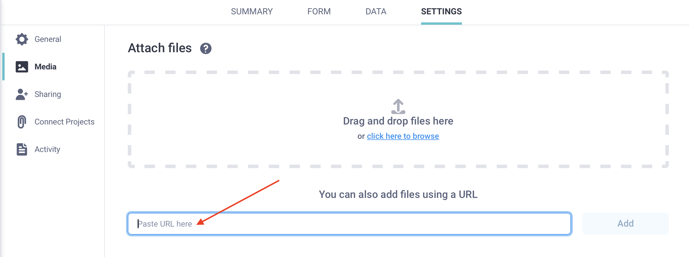

# Uploading media files to a project
**Last updated:** <a href="https://github.com/kobotoolbox/docs/blob/d9b44de6b0f7192771a9f7bf86edf271321f398b/source/upload_media.md" class="reference">27 Jan 2026</a>

KoboToolbox allows you to upload media files and external data files for use in forms during data collection. This article describes the supported file types and explains how to upload media and external data files to your project from your local device or via a URL.

  To learn more about project files and media, see <a href="https://support.kobotoolbox.org/project_files_media.html">Project files and media overview</a>.

## Supported file types

KoboToolbox allows you to upload the following files:
- **Media files**, such as images, audio recordings, and videos, to help respondents better understand questions and enhance your form.

  To learn how to include images, videos, or audio recordings in XLSForm, see <a href="https://support.kobotoolbox.org/media.html">Adding media to an XLSForm</a>.

- **External data files**, such as CSV or XML files, to manage large choice lists or support form logic. Using external files makes it easier to reuse and update datasets without editing the form itself, therefore reducing ongoing form maintenance and supporting consistent, high-quality data.

To learn how to attach external datasets to your form, see <a href="https://support.kobotoolbox.org/pull_data_kobotoolbox.html">Pulling data from an external CSV</a> and <a href="https://support.kobotoolbox.org/select_from_file_xls.html">Selecting options from an external file</a>.

The following files are currently supported for upload to KoboToolbox:
| Type  | File extensions |
|:-----|:----------------|
| Image | .jpeg, .png, .svg |
| Audio | .aac, .aacp, .flac, .mp3, .mp4, .mpeg, .ogg, .wav, .webm, .x-m4a, .x-wav |
| Video | .3gpp, .avi, .flv, .mov, .mp4, .ogg, .qtff, .webm, .wmv |
| File  | .csv, .xml, .zip, .geojson |

## Uploading files from your local device

After adding media references or external files to your form, you must upload those files to your project. This is done in your project’s **SETTINGS > Media** page.

To upload files and media from your local device:
1. Sign in to your [KoboToolbox account](https://www.kobotoolbox.org/sign-up/).
2. Open your project and go to the **SETTINGS** page.
3. Open the <i class="k-icon-file-image"></i> **Media** tab.
4. Upload the files used by your form. File names must exactly match the names referenced in the form.
5. Deploy or redeploy the form to apply the changes.

<strong>Note:</strong> The maximum file size for uploads is 100 MB. Files larger than this must be reduced in size before uploading.

## Uploading files via URL

<iframe src="https://www.youtube.com/embed/MBU77LUrflA?si=_BRYlIlojJGOqnuT" style="width: 100%; aspect-ratio: 16 / 9; height: auto; border: 0;" title="YouTube video player" frameborder="0" allow="accelerometer; autoplay; clipboard-write; encrypted-media; gyroscope; picture-in-picture; web-share" allowfullscreen></iframe>

You can also upload a file to KoboToolbox by providing a direct URL to the file. This can be useful if your file is hosted online, such as a CSV file stored in a GitHub repository.

To upload files and media via URL:
1. Sign in to your [KoboToolbox account](https://www.kobotoolbox.org/sign-up/).
2. Open your project and go to the **SETTINGS** page.
3. Open the <i class="k-icon-file-image"></i> **Media** tab.
4. Paste a valid URL under “You can also add files using a URL” (see requirements below). Click **Add.**
5. Deploy or redeploy the form to apply the changes.

<strong>Note:</strong> The file name at the end of the URL must match exactly the file name referenced in the form.

### URL requirements

The URL must meet both of the following requirements:

- The URL must end with a supported file extension (for example, `.png`, `.jpg`, or `.csv`).
- The URL must open the file directly in your browser, not a web page that contains the file. The URL will not work if it points to a page on a service like Google Drive, GitHub, or Dropbox.

<strong>Note:</strong> If the file is later unpublished or deleted, the file will stop working in KoboToolbox.

### Obtaining a direct URL for images

For images, use the image’s direct address from the source website.

To get a usable image URL:
1. Open the webpage that contains the image.
2. Right-click the image and select **Copy image address** (or the equivalent option in your browser).
    - Confirm the URL ends with an image extension (for example, `.png` or `.jpg`).
3. Paste the URL into your browser to confirm it opens the image directly.

### Obtaining a direct URL for CSV files

For `.csv` files, the URL must open the raw CSV content directly in your browser. A common approach is to host the CSV on GitHub and use the Raw link:

1. Upload or commit your `.csv` file to a GitHub repository.
2. Open the CSV file in GitHub.
3. Click **Raw**. The CSV content should be displayed directly in your browser.
4. Copy the URL from your browser address bar.

<strong>Note:</strong> Google Sheets published as a CSV is not supported for this workflow, because KoboToolbox does not accept the format produced by that approach.

If you update the CSV file at the same URL, KoboToolbox will **reflect the updated file after a short delay.** To retrieve updates more consistently, we recommend regularly redeploying the form.

### Referencing uploaded files in your form

Once the file is available in KoboToolbox, reference it the same way you would for other uploaded media or choice files:

- In `select_one_from_file` or `select_multiple_from_file` questions
- Inside the `pulldata()` function
- In media columns of your XLSForm (`image`, `audio`, `video`)

When referring to the uploaded files, use **only the file name and extension** at the end of the URL (for example, `choices.csv` or `photo.jpg`). Do not include the full URL in these fields.
