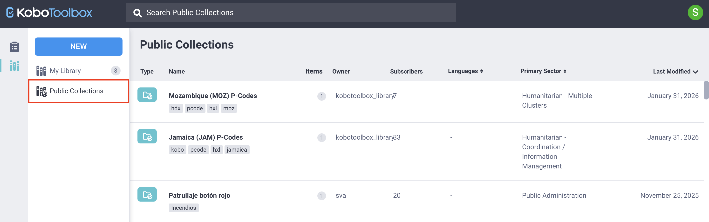
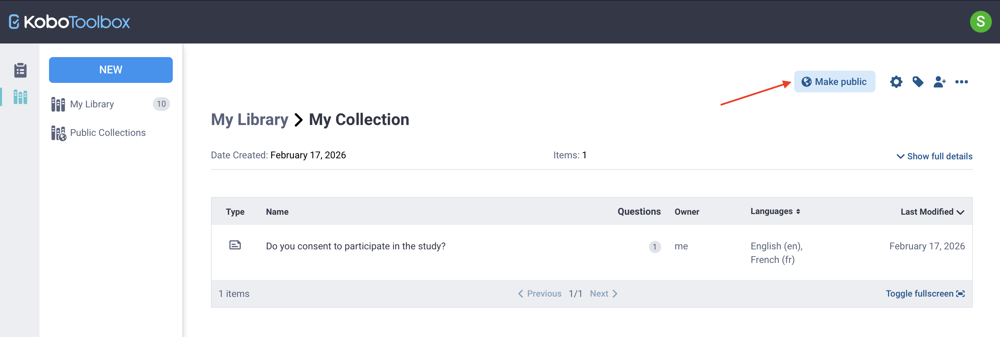
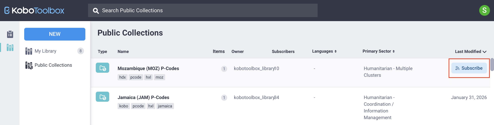
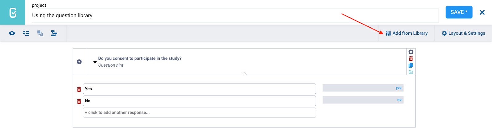
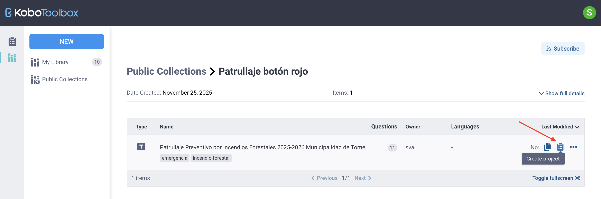
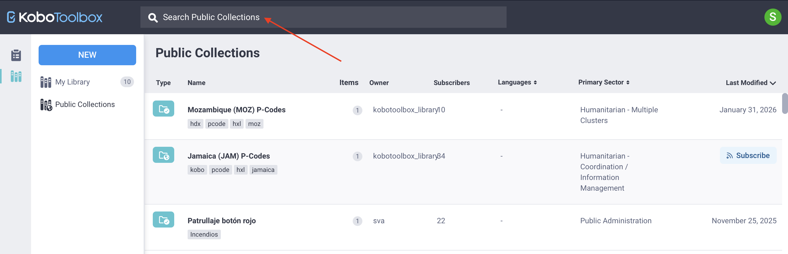

# Public collections in the KoboToolbox library
**Last updated:** <a href="https://github.com/kobotoolbox/docs/blob/04d161b3ce12a8f18d4145536cbba7c2fa3149ae/source/using_public_collections.md" class="reference">20 Mar 2026</a>

Public collections allow KoboToolbox users to share and reuse predefined survey questions, question blocks, and full templates. When a collection is made public, it becomes available to all users on the same KoboToolbox server. Public collections may include commonly used questions or question groups, such as demographic characteristics or other standard indicators.

By making content public, users contribute to a shared library that helps standardize surveys and promote widely used measures across the Kobo community.

This article explains how to locate, use, and create public collections in the KoboToolbox library. 

    To learn more about the KoboToolbox library, see <a href="https://support.kobotoolbox.org/question_library.html">Using the KoboToolbox question library</a>.

## Accessing public collections

To access public collections from your KoboToolbox account:

1. Click the <i class="k-icon-library"></i> **Library** icon in the left-side menu.
2. Open the <i class="k-icon-library-public"></i> **Public Collections** tab.

You will see a list of all public collections available on your server, as well as the collection owner, number of items, number of subscribers, available languages, primary sector, and date last modified.

<strong>Note:</strong> Public collections on the <a href="https://support.kobotoolbox.org/glossary.html#global-kobotoolbox-server">Global KoboToolbox Server</a> and the <a href="https://support.kobotoolbox.org/glossary.html#european-union-kobotoolbox-server">European Union KoboToolbox Server</a> may differ. Collections added to one server are only accessible from that same server.

To find a specific collection, you can browse the list, sort or filter the results, or use the search bar to enter keywords.

## Creating a public collection

To create a public collection, you must first create a collection in your question library. From the [question library](https://support.kobotoolbox.org/question_library.html):

1. Click **NEW** and select <i class="k-icon-folder"></i> **Collection.**
2. Enter a name, short description, organization, primary sector, and country. These fields are required to make a collection public.
3. Click **Create.**
4. [Add at least one asset](https://support.kobotoolbox.org/question_library.html#adding-items-to-a-collection) from your library to the collection.
5. Open the collection and click <i class="k-icon-globe-alt"></i> **Make public.**

To learn more about creating collections in your library, see <a href="https://support.kobotoolbox.org/question_library.html#using-collections-in-the-question-library">Using the KoboToolbox question library</a>.    

## Using public collections

To use assets from public collections in your own forms or projects, you can subscribe to collections, retrieve individual assets, or create new projects from public templates.

### Subscribing to a public collection

Subscribing to a public collection adds it to **My Library**, allowing you to easily access and use its questions, blocks, or templates in your own forms.

To subscribe to a public collection:

- Hover over the collection and click <i class="k-icon-subscribe"></i> **SUBSCRIBE** on the right, or
- Open the collection and click **SUBSCRIBE** in the detail view.

To remove a collection from your library, click <i class="k-icon-close"></i> **UNSUBSCRIBE.**

### Retrieving individual assets from a public collection

If you do not want to subscribe to an entire public collection but only need specific assets, you can clone or download them individually. To do so:

1. Open the collection that contains the asset you are interested in.
2. Hover over the asset.
3. Click <i class="k-icon-duplicate"></i> **Clone** to add it to your library, or select **More actions** to download it as an XLS or XML file.

### Using questions from a public collection

After adding questions from a public collection to your library, either by subscribing to the collection or cloning individual assets, you can reuse them in future forms from the Formbuilder.

<strong>Note:</strong> Only questions that have been added to <strong>My Library</strong> can be inserted into your forms using the Formbuilder. 

To use questions or question blocks from a public collection in your form:

1. Open the [KoboToolbox Formbuilder](https://support.kobotoolbox.org/formbuilder.html).
2. Click <i class="k-icon-library"></i> **Add from Library** in the top right corner.
3. Select the question or question block you want to add, then drag and drop it into the desired location in your form.
4. If your question library contains many items, you can use the **Search** function to quickly locate the question or block you need.

<strong>Note:</strong> When you add a question from your question library to a form, any changes you make in the form will not affect the original version saved in the library.

### Using templates from a public collection

You can also use a template from a public collection to create a new form project, either from your question library or from the **Projects home page.**

**From the question library**

You can create a project from a template in <i class="k-icon-library"></i> **My Library** if you have subscribed to the collection, or directly from <i class="k-icon-library-public"></i> **Public Collections**:

1. Open the public collection.
2. Hover over the template.
3. Click <i class="k-icon-projects"></i> **Create project** on the right.
4. Enter a name for the new project.

<strong>Note:</strong> You can create a project from a template in a public collection even if you have not subscribed to the public collection.

**From the Projects home page**

You can also create a project from a public template directly from the <i class="k-icon-projects"></i> **Projects home page**, provided you have subscribed to the collection:

1. Click **NEW** and select <i class="k-icon-template"></i> **Use a template.**
2. Choose a saved template and click **Next.**
3. Enter the project details and click **Create project.**

In both cases, a new KoboToolbox project will be created that you can edit and deploy.

<strong>Note:</strong> Editing a project created from a template does not modify the original template.

## Public collections advanced search

Within **Public Collections**, the search bar supports both simple and advanced queries. By default, if you enter a keyword without specifying a field, the system searches across multiple fields, including the name, owner username, description, question labels, tags, and UID. Searches are case-insensitive by default.

### Field-specific advanced search

If you want to narrow your results or search for specific fields within public collections, you can use the advanced search options described below.

Advanced search uses a structured format: `field__subfield__operator:value`.

- The `field` or `field__subfield` prefix defines the field you are searching (e.g., the collection name).
- The `operator` suffix defines how the value is matched.

<strong>Note:</strong> Use a double underscore to separate each element.

Examples of prefixes include:

| Prefix | Field being searched |
|:---|:---|
| <code>name</code> | Name of the survey, collection, question, block, or template |
| <code>owner__username</code> | Username of the asset owner |
| <code>settings__description</code> | Description field |
| <code>summary</code> | Question labels and available languages |
| <code>tags__name</code> | Assigned tags |
| <code>uid</code> | Unique identifier (UID) of the object |
| <code>settings__country__value</code> | Nested settings field, such as country value |

Examples of suffixes include:

| Suffix | Value type | Description |
|:---|:---|:---|
| <code>exact</code> | Text | Exact match (case-sensitive) |
| <code>contains</code> | Text | Field contains the value (case-sensitive) |
| <code>startswith</code> | Text | Field starts with the value (case-sensitive) |
| <code>iexact</code> | Text | Exact match (case-insensitive) |
| <code>icontains</code> | Text | Contains match (case-sensitive) |
| <code>istartswith</code> | Text | Starts with match (case-sensitive) |
| <code>exact</code> | Numeric | Exact number |
| <code>lt</code> | Numeric | Less than |
| <code>lte</code> | Numeric | Less than or equal to |
| <code>gt</code> | Numeric | Greater than |
| <code>gte</code> | Numeric | Greater than or equal to |

For example, `owner__username__icontains:team` searches for public collections where the owner’s username contains the word “team”, regardless of capitalization.

<strong>Note:</strong> If no suffix is added, <code>exact</code> is used by default. Adding <code>i</code> before a text operator makes it case-insensitive.

### Combining conditions

You can combine filters using **AND**, **OR**, and **NOT** for more precise results. 

For example, `owner__username__icontains:team AND tags__name__icontains:baseline` searches within the owner username field and the tags field. 
