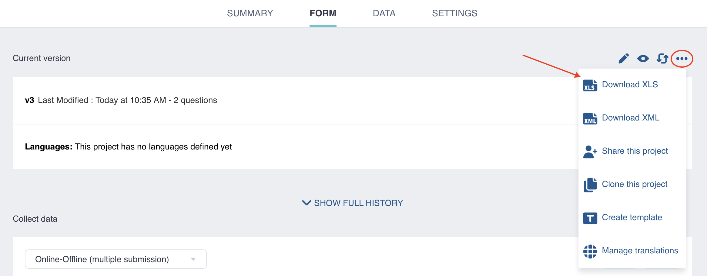
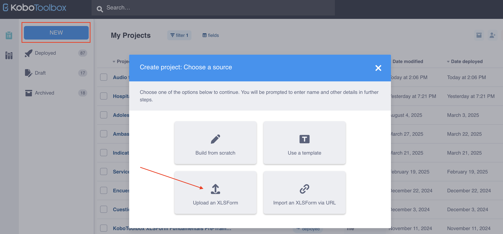
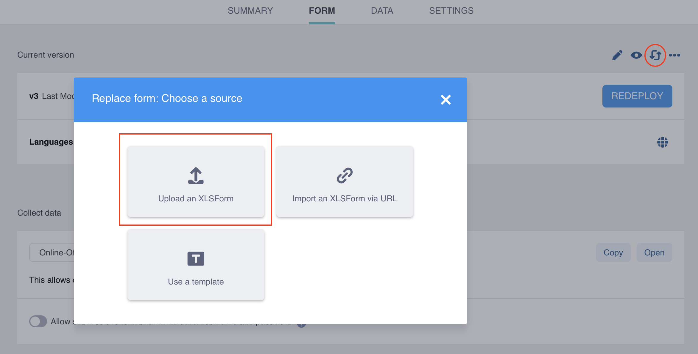
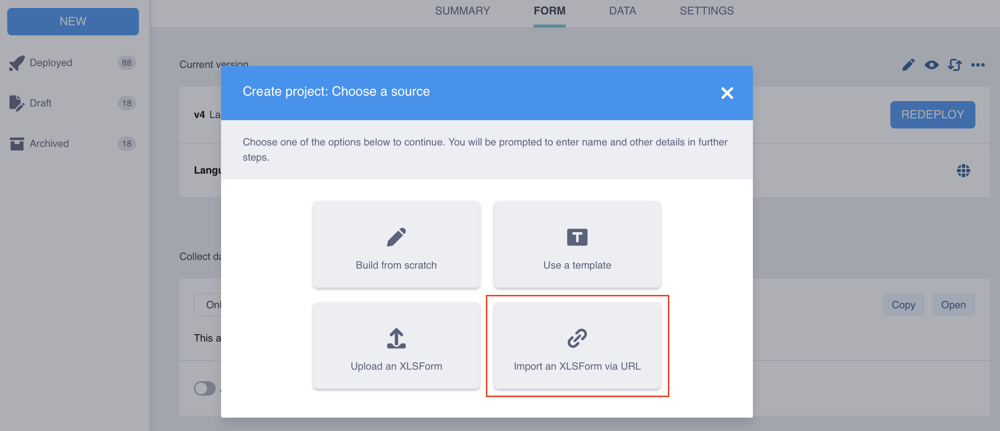

# Using XLSForm with KoboToolbox
**Last updated:** <a href="https://github.com/kobotoolbox/docs/blob/a4227085bc495cc72c9380430577b0e092d101bb/source/xlsform_with_kobotoolbox.md" class="reference">Oct 7, 2025</a>

XLSForm integrates smoothly with Kobo Toolbox for creating, previewing,
editing, and deploying forms for data collection. For example, you can start
building a form in the Kobo Toolbox Formbuilder, then download it as an
XLSForm for further customization. This provides a structured foundation,
useful for new projects or users with less form building experience.

Once customized, forms created in XLSForm can be uploaded to Kobo Toolbox
for review, modification, and deployment.

This article covers the following topics:
-   Downloading an XLSForm from Kobo Toolbox
-   Upload and previewing an XLSForm in Kobo Toolbox
-   Replacing an existing form with an XLSForm
-   Importing an XLSForm via URL
-   Testing and validating your XLSForm

## Downloading an XLSForm from KoboToolbox

When working in KoboToolbox, you may need to download your form as an
XLSForm to make changes more efficiently, such as duplicating many
questions, editing large option lists, adding translations, or using advanced
functionalities not available in the Formbuilder. Additionally, downloading your
form as an XLSForm allows you to build forms offline, share them as `.xlsx`
files for collaboration and version management, and share them with the
Kobo Toolbox support team or in the Community Forum to request assistance. 

Any form created using the KoboToolbox Formbuilder can be downloaded as
an XLSForm file:

1.  Go to the **FORM** page of your project in KoboToolbox.
2.  Click the <i class="k-icon k-icon-more"></i> **More actions icon**.
3.  Select <i class="k-icon k-icon-xls-file"></i> **Download XLS**.

## Uploading an XLSForm to KoboToolbox
Alternatively, you may need to create a new project from an XLSForm that you
have created from scratch or that has been shared with you.
To upload and preview an XLSForm to a new project in KoboToolbox:

1.  Go to the **Projects** home page in KoboToolbox and click **NEW**.
2.  Select **Upload an XLSForm** and upload your Excel file.
3.  Enter the project details and click **Create project**.
4.  Click the <i class="k-icon k-icon-view"></i> **Preview** button to preview
    your form.

## Replacing a form with an XLSForm
Once a project has been created, you can replace any existing form with an
updated XLSForm:

1.  Go to the **FORM** page of your project in KoboToolbox.
2.  Click <i class="k-icon k-icon-replace"></i> **Replace form** in the top right
    corner.
3.  Select **Upload an XLSForm** and upload your Excel file.

## Importing an XLSForm via URL
If you are using Google Sheets or storing the file in Dropbox, you can import
an XLSForm via a URL. The URL must be publicly accessible and should
initiate a file download when opened in a browser for the import to work.
XLSForms can also be imported from similar software, such as Excel Web and
OneDrive.

### Retrieving a link from Google Sheets
To obtain the correct URL for a Google Sheets spreadsheet:

1.  Click on **File > Share > Publish to the Web**.
2.  Under the **Web Page** dropdown menu, select **Microsoft Excel (.xlsx)**. Keep
    **Entire Document** selected in the first dropdown.
3.  Click **Publish**.
4.  Copy the resulting document link.

 
For more information, see <a href="https://support.google.com/docs/answer/183965?hl=en&co=GENIE.Platform%3DDesktop">Google Sheets documentation</a>.

### Retrieving a link from Dropbox
To obtain the correct URL for a spreadsheet stored in Dropbox:

1.  Copy the file link in Dropbox by clicking on <i class="k-icon k-icon-link"></i> **Copy link**.
2.  At the end of the link, replace the suffix ``$dl=0`` with ``$dl=1``. This will be the
    URL to import into Kobo Toolbox.

Once you have retrieved the file URL, you can import your XLSForm to
KoboToolbox:

1.  Go to the **Projects** homepage in Kobo Toolbox and click **NEW**.
2.  Select **Import an XLSForm via URL**.
3.  Paste your URL and click **Import**.
4.  Enter the project details and click **Create project**.

    <b>Note:</b> Changes made to a file in Dropbox or Google Sheets do not
    automatically update in Kobo Toolbox. You must re-import the XLSForm via
    URL and redeploy the form changes.

## Testing and validating your XLSForm
Validating, previewing, and testing your XLSForm is essential to ensuring its
structural integrity, functionality, and user experience. Each of these steps
help identify any errors or issues that might prevent the form from functioning
as intended.

| Step | Description |
| :--- | :--- |
| Validating | This involves uploading the form and checking for errors (e.g., spelling or capitalization mistakes, incorrect form logic expressions, incorrect question referencing, missing labels). Form error messages typically appear when uploading, deploying, or opening a form. |
| Previewing | This allows you to visualize the form as it will be displayed to respondents and verify that all elements function correctly before deployment (e.g., form layout, question and choice labels). |
| Testing | This involves entering data to test form functionality (e.g., checking question appearances, choice options, and form logic). Testing can be done in **PREVIEW** mode before deployment. |

Continuously validating and testing your XLSForm as you make changes will
simplify troubleshooting and help identify the cause of any issues. It is crucial
to ensure your form functions as expected before launching data collection.

There are several tools available to test your XLSForm, including the [Kobo Toolbox platform](https://www.kobotoolbox.org/sign-up/), [KoboCollect](https://play.google.com/store/apps/details?id=org.koboc.collect.android), and [ODK's XLSForm Online](https://getodk.org/xlsform/). When
previewing and testing your form, use the same platform that you will use for
data collection: [Enketo web forms](https://support.kobotoolbox.org/enketo.html), [KoboCollect](https://support.kobotoolbox.org/enketo.html), or both.

To learn more about setting up KoboCollect to preview and test your forms, see
<a href="https://support.kobotoolbox.org/kobocollect_on_android_latest.html">Getting started with KoboCollect</a>.

## Troubleshooting

<strong>Error message when uploading, previewing, or deploying XLSForm</strong>

    
If your XLSForm contains an error, an error message will appear, usually
indicating the exact row, question, or expression where the issue is located. After
correcting the error in your spreadsheet, you will need to upload the file again.

The following table:

| **Common error messages** | **Common explanation** |
| :--- | :--- |
| `The survey sheet is either empty or missing important column headers.` | Mandatory column headers are missing or misspelled. |
| `The survey element named 'name' has no label or hint.` | One of the questions in your form is missing a question label. |
| `FormLogicError: Could not evaluate: [expression], message: The string did not match the expected pattern.` | A form logic expression contains errors, such as incorrect question referencing syntax or a missing parenthesis. |
| `unable to deploy ODK Validate Errors: >> XForm is invalid` | A form logic expression contains errors, such as incorrect question referencing syntax or a missing parenthesis. |
| `There has been a problem trying to replace ${question with the XPath to the survey element named 'question'. There is no survey element with this name.` | You are referring to a question in your form that does not exist or is misspelled. Ensure you are using the **exact** question name in your form logic expressions. |
| `list_name` | The option list for a question has not been defined, or there is a typo in the `list_name`. |
| `Choice names must be unique for each choice list. If this is intentional, use the setting 'allow_choice_duplicates'.` | Duplicate choice names have been used within the same list of options. Remove the duplicated choice name(s), or allow choice duplicates in your <a href="https://support.kobotoolbox.org/form_settings_xls.html">form settings</a>. |
| `Unmatched begin statement: group (group)` | Question group is missing its corresponding `end_group` row. |
| `Can't find external_file.csv` | An <a href="https://support.kobotoolbox.org/pull_data_kobotoolbox.html">external attachment</a> linked to your form (e.g., when using `pulldata()` ) has not been uploaded to KoboToolbox. |
| `Can't find survey.xml` | <a href="https://support.kobotoolbox.org/dynamic_data_attachment.html">Dynamic data attachments</a> have not been properly set up in your project settings. |

 

<strong>Error when trying to import an XLSForm via URL</strong>

 
Check that the URL you are using is correct. When loaded into a browser, the URL should initiate a file download, not open a webpage.

 

<strong>Import via URL not loading undeployed version</strong>

 
If you imported a link and are not seeing the new form version, refresh your browser.

